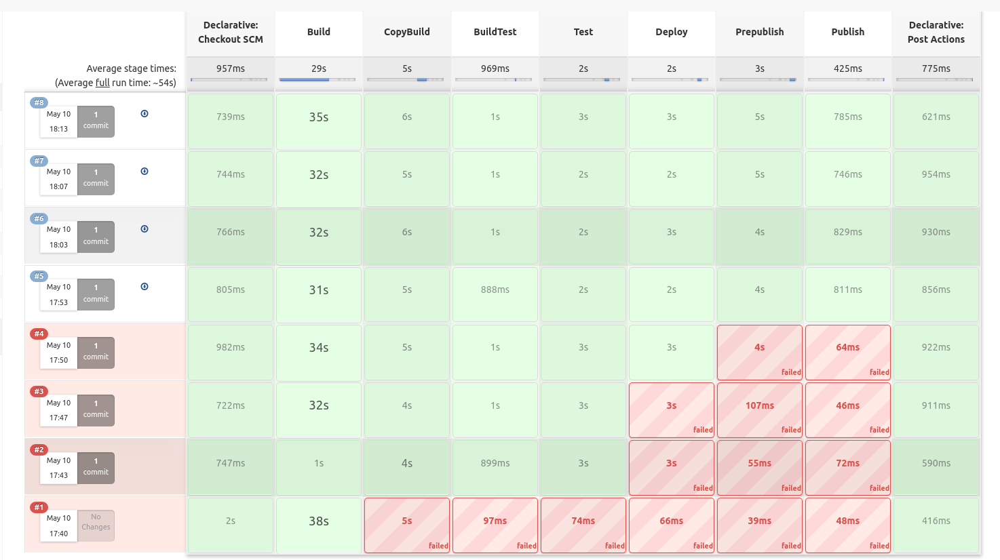
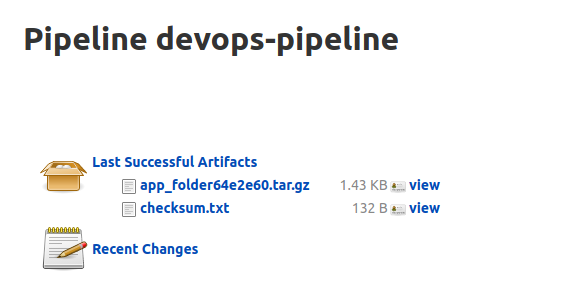

# Sprawozdanie Lab05
## Mateusz Kwiecień, Informatyka Techniczna 
### Realizacja laboratorium

1. Uruchomiono kontener z Jenkinsem tak jak na poprzednich laboratoriach, korzystając z komend

```
docker run \
  --name jenkins-docker \
  --detach \
  --privileged \
  --network jenkins \
  --network-alias docker \
  --env DOCKER_TLS_CERTDIR=/certs \
  --volume jenkins-docker-certs:/certs/client \
  --volume jenkins-data:/var/jenkins_home \
  --publish 2376:2376 \
  docker:dind \
  --storage-driver overlay2
```
2. Następnie wykonano fork z [repozytorium źródłowego](https://github.com/mrsarm/helloworld-c).

3. Wszystkie nowo stworzone pliki są umieszczone w [nowym repozytorium](https://github.com/mati-kw/helloworld-c).

4. Skopiowano do folderu pliki Dockerfile z poprzednich laboratoriów.

Dockerfile-build:
```
FROM ubuntu:latest

RUN apt-get update && apt-get -y install cmake
RUN apt-get -y install git 
RUN git clone https://github.com/mati-kw/helloworld-c.git

WORKDIR "/helloworld-c"
RUN cmake .
RUN make 
```

Dockerfile-test:
```
FROM docker_build_image
RUN out/test_say_hello
```

5. Następnie uruchomiono kontener z Jenkinsem oraz zalogowano się i zainstalowano dodatkowe wtyczki.

6. Stworzono także poniższy Jenkinsfile.

```
pipeline {
    agent any
    parameters{
        booleanParam(name: 'PROMOTE', defaultValue: false, description: 'should publish')
    }
    stages {
        stage('Build') {
            steps {
                script {    
                    env.GIT_COMMIT_REV = sh(returnStdout: true, script: "git log -n 1 --pretty=format:'%h'").trim()
                }
                sh "docker build --file dockerfile-build --tag docker_build_image:latest ."
                sh "docker volume create in_vol"
                sh "docker volume create out_vol"
            }     
        }
        stage('CopyBuild') {
            agent {
                docker {
                    image'docker_build_image:latest'
                    args '-v in_vol:/input  -v out_vol:/output  --user root'
                    reuseNode true
                    }
                }
            steps {
                sh 'rm -rf /input/*'
                sh 'rm -rf /output/*'
                sh 'cp -r /helloworld-c/*  /input/'
                sh 'cp -r  /helloworld-c/src /output/'   
                sh 'cp -r  /helloworld-c/test /output/'
                sh 'cp -r  /helloworld-c/CMakeLists.txt /output/'
                sh 'cp -r  /helloworld-c/out /output/'
                sh 'cp -r  /helloworld-c/build_cmake /output/'
                sh 'cp -r  /helloworld-c/instruction.txt /output/'
            }
        }
        stage('BuildTest') {
        
            steps {
                sh "docker build --file dockerfile-test --tag docker_test_image:latest ."
            }
        }
        stage('Test') {
             agent {
                docker {
                    image'docker_test_image:latest'
                    args '-v in_vol:/input  -v out_vol:/output  --user root'
                    reuseNode true
                    }
                }
            steps {
                sh 'cd /output && out/test_say_hello' 
     
            }
        }
        stage('Deploy') {
             agent {
                docker {
                    image'docker_test_image:latest'
                    args '-v out_vol:/output  --user root'
                    reuseNode true
                    }
                }
            steps {
                sh 'cd /output/out &&  ./helloworld' 
            }
        }
         stage('Prepublish') {
             agent {
                docker {
                    image'docker_test_image:latest'
                    args '-v in_vol:/input  -v out_vol:/output  --user root'
                    reuseNode true
                    }
                }
            steps {
                sh 'rm -rf app_folder'
                sh 'rm -rf checksum.txt'
                sh 'mkdir  app_folder'
                sh 'rm -f app_folder*.tar.gz'
                sh 'cp -r /output/src ./app_folder/' 
                sh 'cp /output/build_cmake/CMakeLists.txt ./app_folder/'
                sh 'cp /output/instruction.txt ./app_folder'
            }
        }
         stage('Publish') {
             when{
                 environment name: 'PROMOTE', value: 'true'
             }
            steps {

                sh 'tar -zcvf app_folder${GIT_COMMIT_REV}.tar.gz ./app_folder'
                sh 'cat app_folder${GIT_COMMIT_REV}.tar.gz | sha512sum > checksum.txt'
                archiveArtifacts artifacts: 'app_folder*.tar.gz', fingerprint: true   
                archiveArtifacts artifacts: 'checksum.txt', fingerprint: true      
            }
        }
    }
    post{
        always{
           
            sh 'docker rmi docker_test_image'   
            sh 'docker rmi docker_build_image'
        }
    }
}
```

7. Następnie w Jenkinsie wybrano opcję `pipeline from scm`, oraz wklejono link do nowopowstałego repozytorium z wszystkimi nowymi plikami.

8. Po poprawieniu błędów udało się stworzyć paczkę `.tar.gz`.





9. Dodano także krótką instrukcję obsługi.

```
Należy mieć pobrane narzędzie Cmake oraz kompilator c.

Po pobraniu paczki należy w "app_folder" wykonać
- cmake .
- make
- out/helloworld
```


