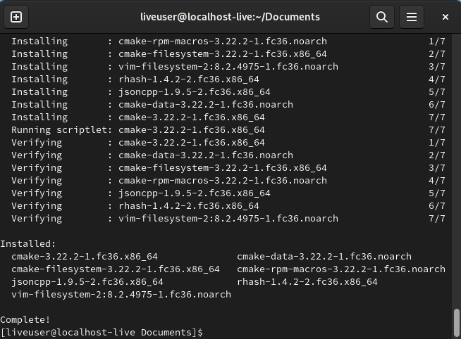
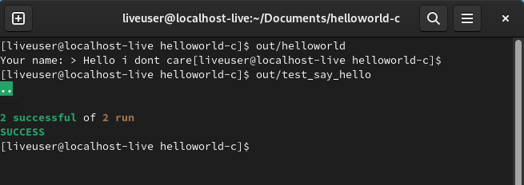
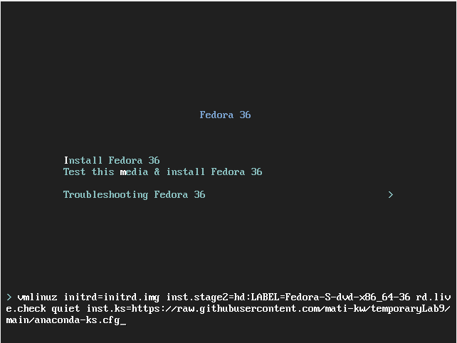
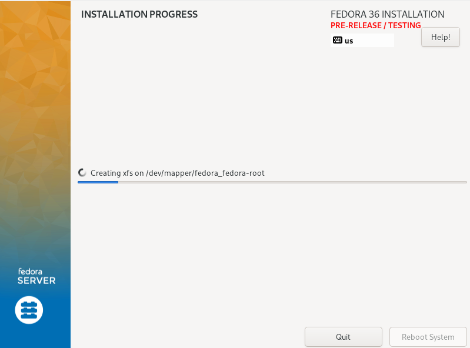
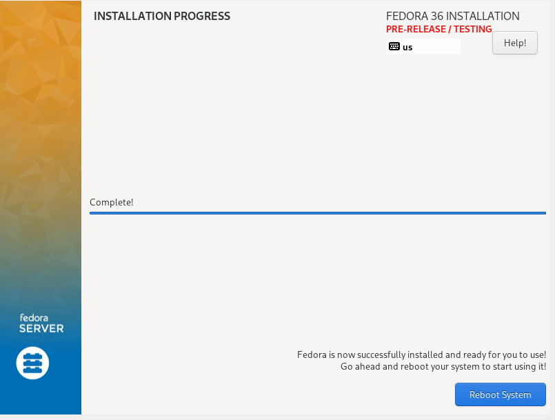

# Sprawozdanie Lab09
## Mateusz Kwiecień, Informatyka Techniczna 
### Realizacja laboratorium

1. Po pobraniu iso Fedory rozpoczęto instalację. (root password: siema123siema)(user: mateusz, password: mateusz)


2. Po procesie instalacji zainstalowano narzędzie git oraz cmake korzystając z poleceń:

```
sudo dnf -y update
sudo dnf -y install git
sudo dnf install cmake
```


3. Następnie sklonowano repozytorium.

```
git clone https://github.com/mati-kw/helloworld-c
```
4. Po instalacji poleceniami:
```
cmake .
make
```

uruchomiono testy:



5. Następnie skopiowano zawartość pliku anaconda-ks.cfg do repozytorium tymczasowego.

6. Kolejnym krokiem było zainstalowanie nowej maszyny korzystając z pliku. Wprowadzono w nim zniamy, dodano skrypt instalujący narzędzie git oraz program helloworld-c. Zawartość pliku anaconda wygląda następująco:

```
# Generated by Anaconda 36.16.2
# Generated by pykickstart v3.36
#version=F36
# Use graphical install
graphical
 
# Keyboard layouts
keyboard --vckeymap=us --xlayouts='us'
# System language
lang en_US.UTF-8
 
%packages
@^server-product-environment
 
%end
 
# Run the Setup Agent on first boot
firstboot --enable
 
# Generated using Blivet version 3.4.3
ignoredisk --only-use=sda
autopart
# Partition clearing information
clearpart --none --initlabel
 
# System timezone
timezone Europe/Warsaw --utc
 
# Root password
rootpw --iscrypted $y$j9T$tgisbrGiMGzmvel.mDYPcw8F$z96cT7nTs0ZElkNWtrqbP3v/JejZzobYhypGuYh82X0
user --groups=wheel --name=mateusz --password=$y$j9T$c3P63Jv5yLfE8tDfqkONl9WF$XunV9EGIreTAtTbnjRlLmiGoaYahAUshW2SPQKUTnh5 --iscrypted --gecos="mateusz"

# Repository
url --mirrorlist=http://mirrors.fedoraproject.org/mirrorlist?repo=fedora-$releasever&arch=x86_64
repo --name=updates --mirrorlist=http://mirrors.fedoraproject.org/mirrorlist?repo=updates-released-f$releasever&arch=x86_64

%post

    exec < /dev/tty3 > /dev/tty3
    sudo dnf -y update
    sudo dnf -y install git
    sudo dnf -y install cmake
    cd /home
    git clone https://github.com/mati-kw/helloworld-c
    cd helloworld-c/
    cmake .
    make
    out/test_say_hello
    
%end
```

7. W trakcie instalowania kliknięto `tab` oraz dodano odpowiednią ścieżkę do repozytorium



8. Instalacja rozpoczyna sie automatycznie bez potrzeby uzupełniania żadnych danych




9. Po klinknięciu przycisku reboot maszyna sie crashuje, mimo komunikatu poprawnego zainstalowania systemu. Spróbowano podobnie lecz stało się to samo.