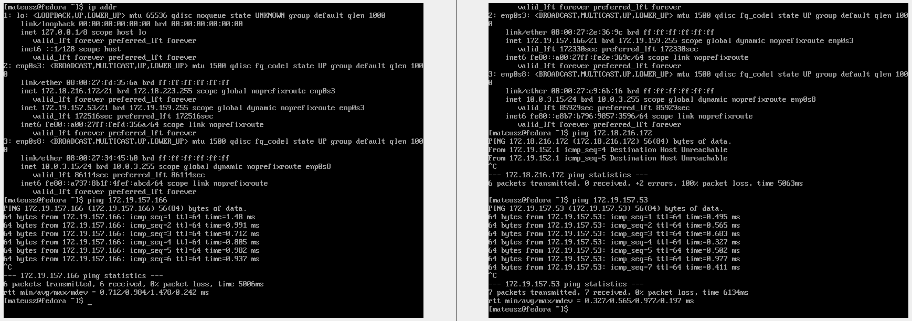
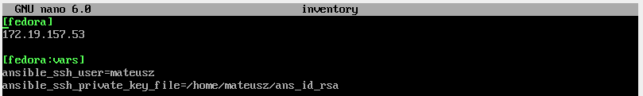
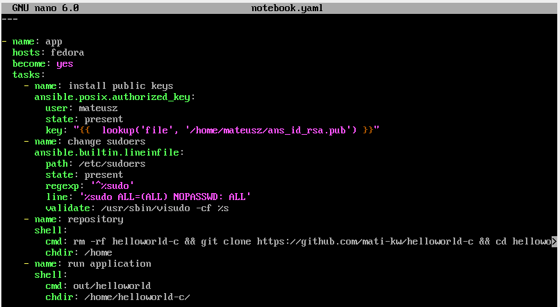
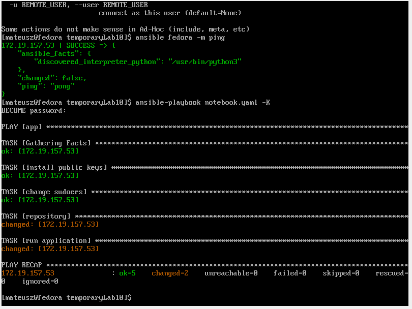

# Sprawozdanie Lab10
## Mateusz Kwiecień, Informatyka Techniczna 
### Realizacja laboratorium

1. Uruchomiono dwie maszyny z fedorą i na obydwóch zainstalowano narzędzia ssh. Przetestowano czy maszyny "widzą sie nawzajem" poleceniem `ping`

2. Stworzono następujący plik konfigurujący `ansible.cfg`.

3. Stworzono plik `inventory`, który określa docelowy adres IP, użytkownika oraz hasło. (na screenshocie widać plik już ze zmienioną opcją autentykacji na wygenerowany klucz ssh, w poprzedniej wersji ostatania linijka zawierała: `ansible_ssh_pass=mateusz`)

4. Wykonano operację ping do hosta fedory za pomocą `ansible fedora -m ping`

5. Stworzono playbook o nazwie `notebook.yaml`, zawiera on potrzebne informacje dotyczące połączenia po ssh oraz instrukcje klonowania repo i usuwania plików jeśli takie same już wcześniej istiały.

6. Poniżej widać efekt wykonania playbooka przy pomocy klucza

