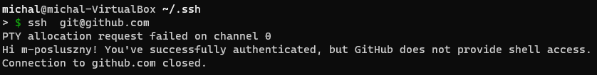
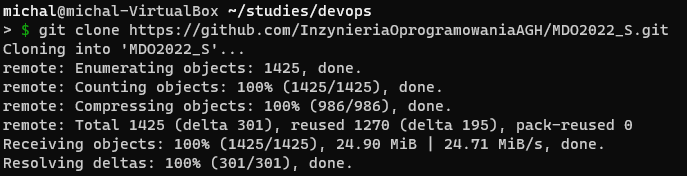
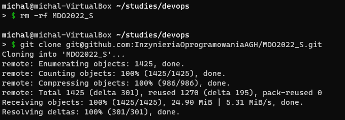
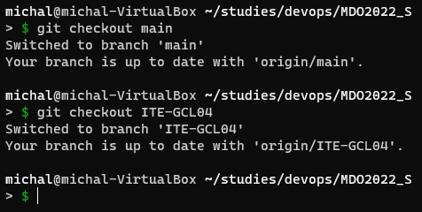
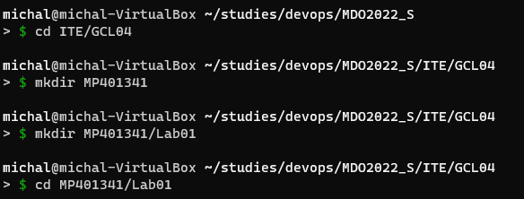
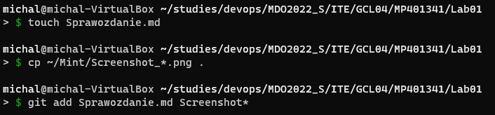

# Sprawozdanie Lab 1 - 09.03.2022

1.  Maszyna wirtualna została przygotowana przed zajęciami, miała skonfigurowany serwer ssh, zainstalowany program git i wygenerowane klucze ssh.
Aby sprawdzić poprawność działania wygenerowanych kluczy spróbowano wykonać połączenie z github.com. Serwer powiadomił o pomyślnej autentykacji i o braku możliwości użycia terminala. 
    >  ssh git@github.com

    

2.  Sklonowano repozytorium z wykorzystaniem protokołu https
    > git clone https://github.com/InzynieriaOprogramowaniaAGH/MDO2022_S.git

   

3.  Usunięto reporyztorium aby ponownie sklonować je z użyciem ssh
    > rm -rf MDO2022_S
    > git clone git@github.com:InzynieriaOprogramowaniaAGH/MDO2022_S.git
   
4. Sklonowano repozytorium z wykorzystaniem protokołu ssh
   > git clone https://github.com/InzynieriaOprogramowaniaAGH/MDO2022_S.git

   

5.  Zmieniono folder na folder repozytorium, a następnie wykonano checkout kolejno na branch main i branch ITE-GCL04
    > cd MDO2022_S
    > git checkout main
    > git checkout ITE-GCL04

   

6.  Utworzono gałąź o nazwie MP401341 i utworzono katalog o tej samej nazwie a w nim folder Lab01
    > git checkout -b MP401341
    > cd ITE/GCL04
    > mkdir MP401341
    > mkdir Lab01
    > cd MP401341/Lab01

   

7.  Rozpoczęto pracę od utworzenia pliku z sprawozdaniem, dodano zrzuty ekranu, dodano i scommitowano zmiany i wrzucono je na zdalnego brancha, co wymagało podpięcia brancha lokalnego do nowo utworzonego zdalnego
    >  touch Sprawozdanie.md
    >  cp ~/Mint/Screenshot_*.png .
    >  git add Sprawozdanie.md Screenshot*
    >  git commit -m "Part of assignment"

    

