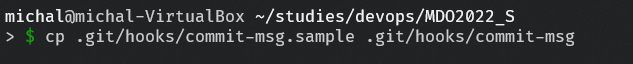
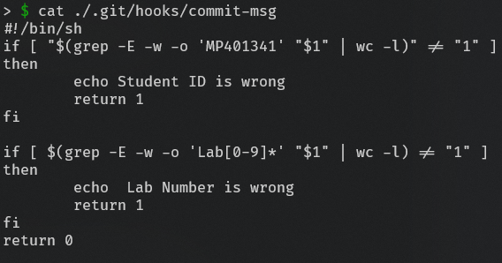

# Sprawozdanie Lab 2 - 17.03.2022

1. Wykorzystano przykład hooka commit-msg, w celu użycia usunięta rozszerzenie .sample 
    >  cp .git/hooks/commit-msg.sample .git/hooks/commit-msg
    
    

2. Zawartość hook'a commit-msg
    ```
    >#!/bin/sh  
    #!/bin/sh
    if [ "$(grep -E -w -o 'MP401341' "$1" | wc -l)" != "1" ]
    then
            echo Student ID is wrong
            return 1
    fi

    if [ $(grep -E -w -o 'Lab[0-9]*' "$1" | wc -l) != "1" ]
    then
            echo  Lab Number is wrong
            return 1
    fi
    return 0
    ```
    

3. Próbas zacommitowania części sprawozdania z złą nazwą