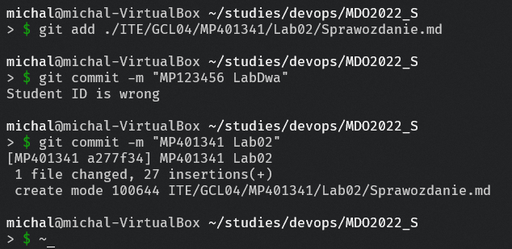
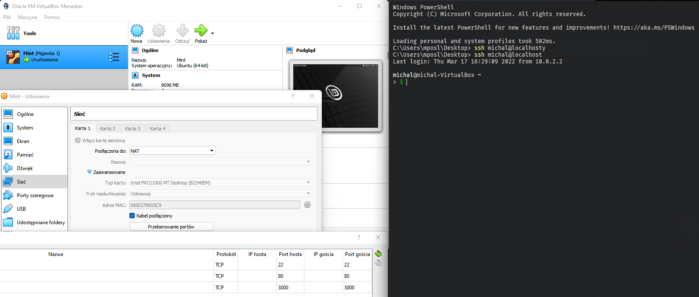
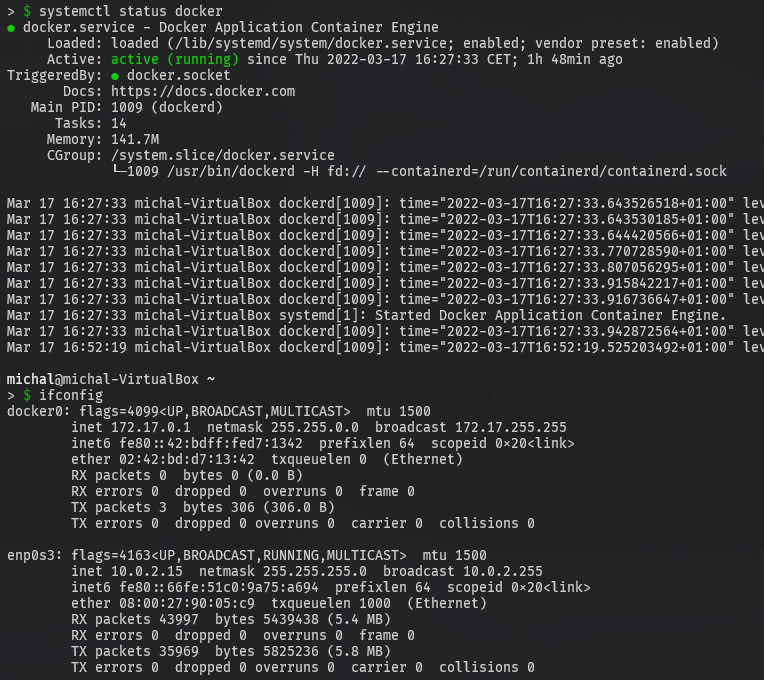

# Sprawozdanie Lab 2 - 17.03.2022

1. Wykorzystano przykład hooka commit-msg, w celu użycia usunięto rozszerzenie .sample 
    >  cp .git/hooks/commit-msg.sample .git/hooks/commit-msg
    
    

2. Zawartość hook'a commit-msg
    ```
    >#!/bin/sh  
    #!/bin/sh
    if [ "$(grep -E -w -o 'MP401341' "$1" | wc -l)" != "1" ]
    then
            echo Student ID is wrong
            return 1
    fi

    if [ $(grep -E -w -o 'Lab[0-9]*' "$1" | wc -l) != "1" ]
    then
            echo  Lab Number is wrong
            return 1
    fi
    return 0
    ```
    >  cat ./.git/hooks/commit-msg

    

3. Próba scommitowania części sprawozdania z złą nazwą, a następnie z popawką. Skrypt działa poprawnie.
    >  git add ./ITE/GCL04/MP401341/Lab02/Sprawozdanie.md  
    >  git commit -m "MP123456 LabDwa"  
    >  git commit -m "MP401341 Lab02"  

    
4. Serwer ssh był już skonfigurowany na wirtualnej maszynie co wykazano wykonując połączenie z systemu Windows na konto michal na hostname localhost. Dostęp do serwera odbywał się poprzez localhost'a ze względu na wykorzystanie przekierowania portu ssh
    > ssh michal@localhost

    
5. Docker był już zainstalowany na maszynie wirtualnej, fakt działania dockera został wykazany z własności poprzez działający serwis docker i istniejący interfejs sieciowy
    > systemctl status docker  
    > ifconfig

    
6. Utworzono konto na serwisie DockerHub

    