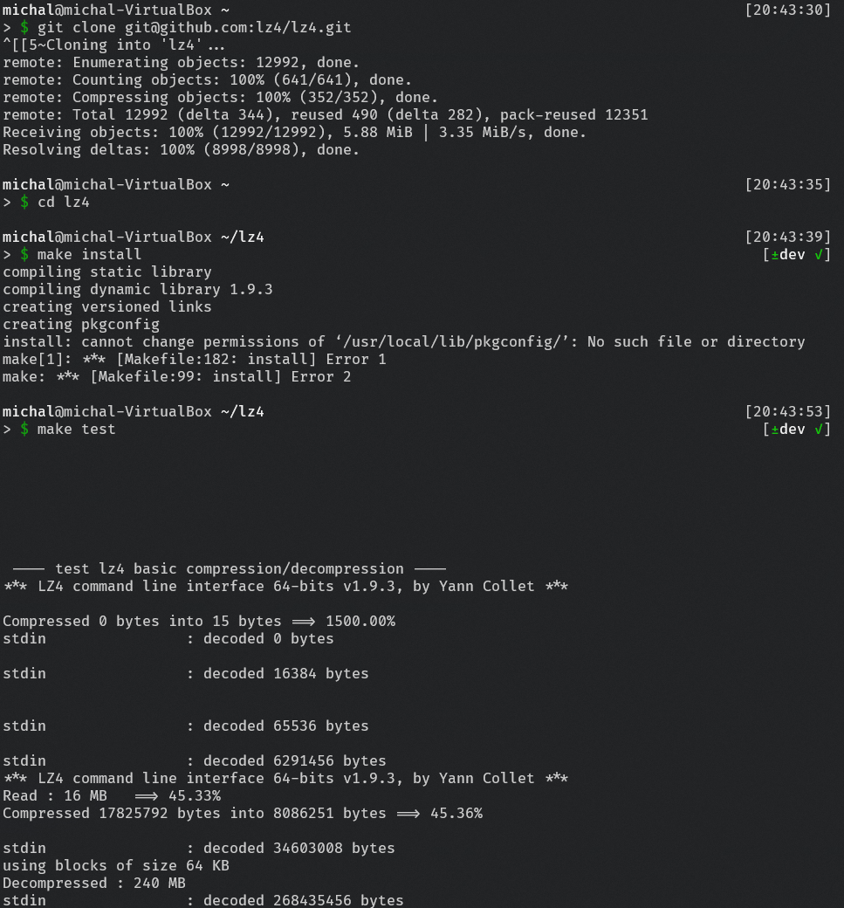
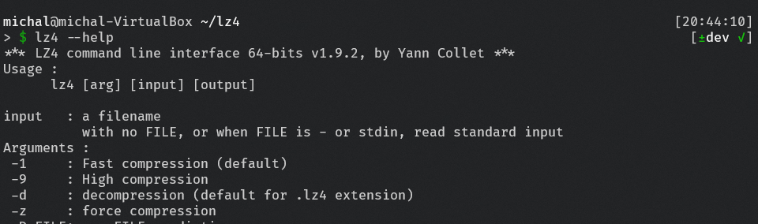
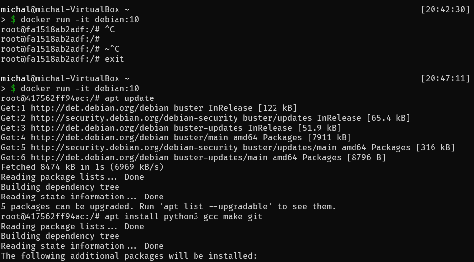
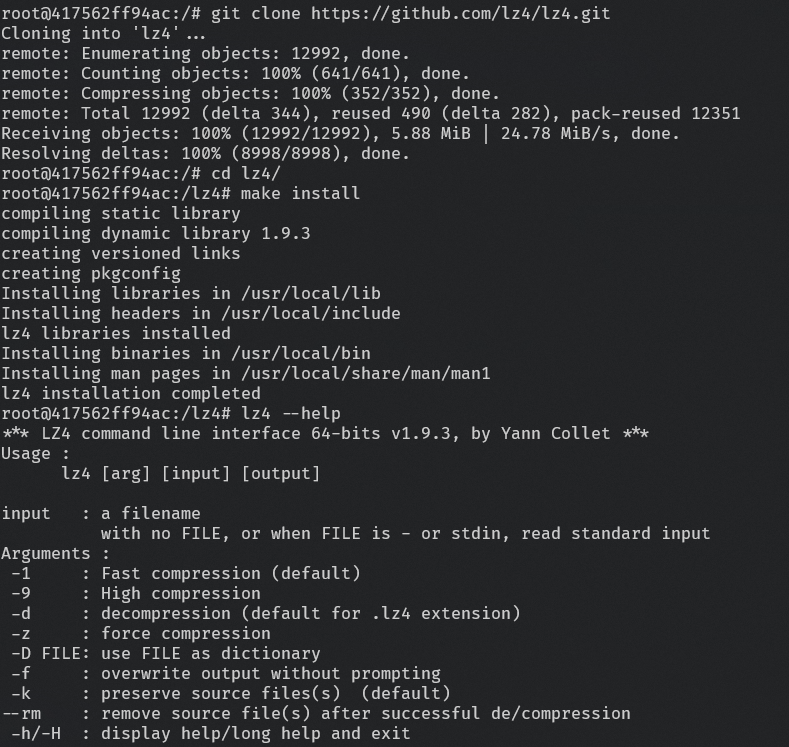
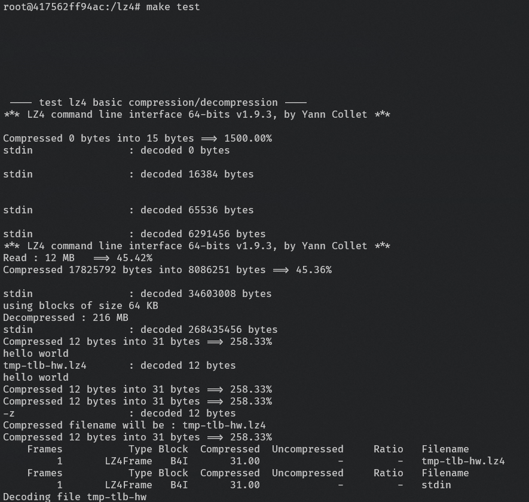
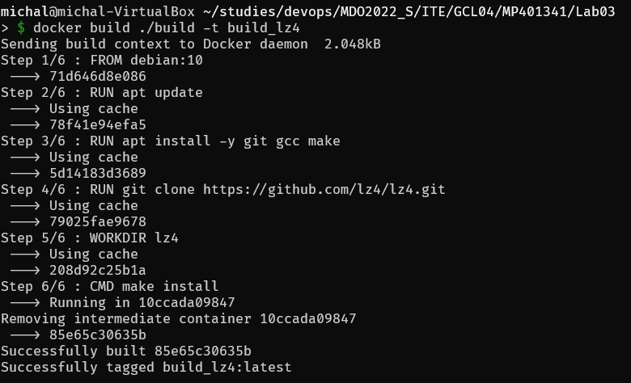
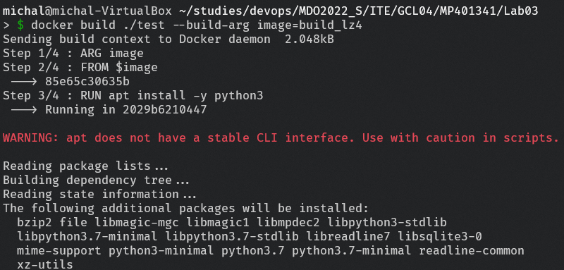
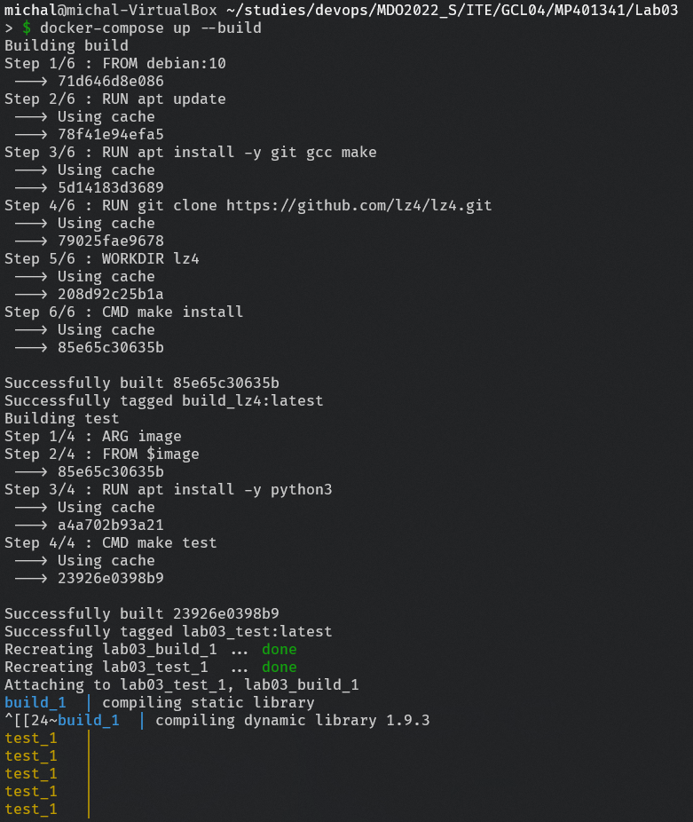

# Sprawozdanie Lab 3 - 24.03.2022

1. Wybór oprogramowania na zajęcia 
    1. Do wykonania zadania, wybrano projekt lz4 zawierający Makefile obejmujący budowanie i testowanie programu. 
        > https://github.com/lz4/lz4.git
    2. Sklonowano repozytorium, zbudowano pakiety przy użyciu make install, uruchomiono testy 
        > git clone git@github.com:lz4/lz4.git  
        > cd lz4  
        > make install  
        > make test  
        
        

    3. Przetestowano poprawność budowania
        > lz4 --help

        
    

2. Kroki z punktu pierwszego powtórzono na kontenerze utworzonym na bazie obrazu debian:10, wymagana była instalacja pakietów git, make, gcc, python3
    1. Zaaktualizowano listę dostępnyc pakietów i zainstalowano wymagane pakiety. Sklonowano repozytorium z wykorzystaniem https, nastepnie zbudowano pakiet, prztestowano działanie i uruchomiono testy
        > docker run -it debian:10
        > apt update  
        > apt install python3 gcc make git  
        > git clone https://github.com/lz4/lz4.git  
        > cd lz4  
        > make install      
        > lz4 --help  
        > make test      

        

        

        
    
3. Przygotowano dwa Dockerfile, do budowania i testowania aplikacji, dockerfile do budowania jest w folderze build, do testów w folderze test. 
    1. Przetestowano działanie dockerfile'a do budowania
        > docker build ./build -t build_lz4

        

    2. Przetestowano działanie dockerfile'a do testowania
        > docker build ./test --build-arg image=build_lz4

        

        
        
4. Utworzono docker-compose, dostępny w pliku docker-compose.yaml
    > docker-compose up --build

    

5. Wybrana aplikacja jest aplikacją użytkową, przez co kontener z zbudowanym programem nie nadaje sie na końcowy artefakt.  

6. Aby program nadawał się do wdrażania należałoby przygotować paczkę zawierającą jedynie zbudowany program lz4, repozytorium czy programy znajdujące się na kontenerze niepotrzebnie zwiększałyby tylko rozmiar. Tak przygotowany pakiet można byłoby dystrubować jako pakiet DEB. Aby doprowadzić do takiego stanu, można rozszerzyć funkcjonalność Dockerfile'a odpowiedzialnego za budowanie tak aby spakować odpowiednio wymagane pliki i wyodrębnić je z kontenera.

    
