# Sprawozdanie Lab 4 - 31.03.2022

1. Zachowywanie stanu
    1. Przygotowano wolumin wejściowy i wyjściowy 
        > docker volume  create --name inputVol  
        > docker volume  create --name outputVol  

        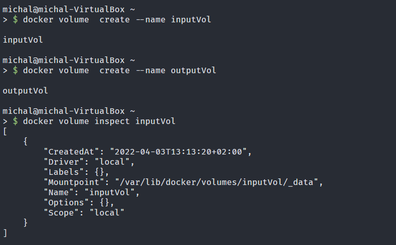

    2. Uruchomiono kontener z podłączonymi woluminami, komendą ls wylistowano katalogi
        > docker run -it --name -v inputVol:/input -v outputVol:/output  debian:10  
        > ls  

        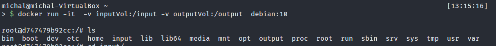

    3. Na hoście sklonowano repozytorium do folderu woluminu wejściowego
        > sudo -i  
        > cd /var/lib/docker/volumes/inputVol/_data/  
        > git clone https://github.com/lz4/lz4.git  

        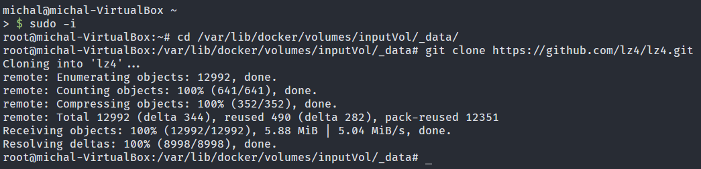

    4. W kontenerze zainstalowano wymagane pakiety i zbudowano pakiet wskazując na lokalizację wyjściową podmontowany wolumin /output po czym uruchomiono pakiet z tej lokalizacji. flaka DESTDIR ustawiła w makefile'u folder wyjścia, a prefix ustawiła folder w jakim znajdą się wszystkie elementy paczki.
        > cd ./input/lz4  
        > apt update    
        > apt install -y gcc make    

        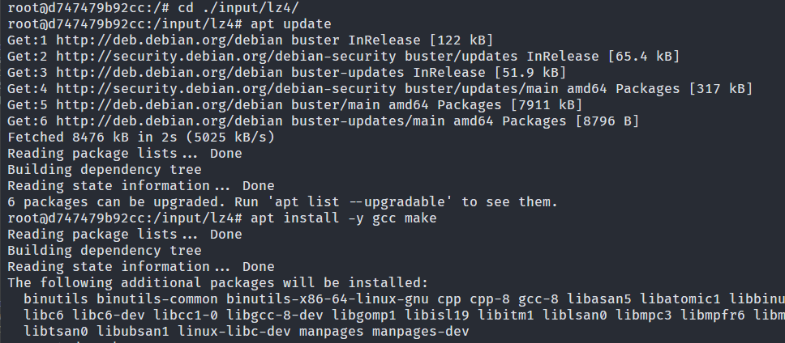

        > make prefix=/lz4pkg DESTDIR=/output install  
        > /output/lz4pkg/bin/lz4 --help  

        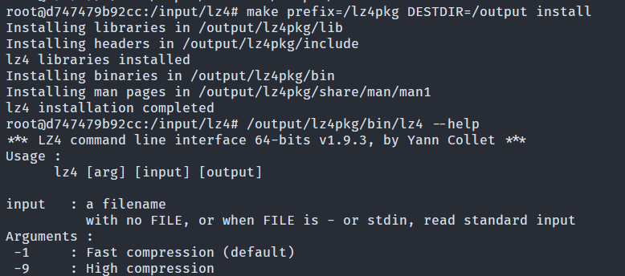

    5. Sprawdzono na hoście powstałę pliki na woluminie outputVol
        > cd /var/lib/docker/volumes/outputVol/_data/lz4pkg/bin  
        > ./lz4 --help

        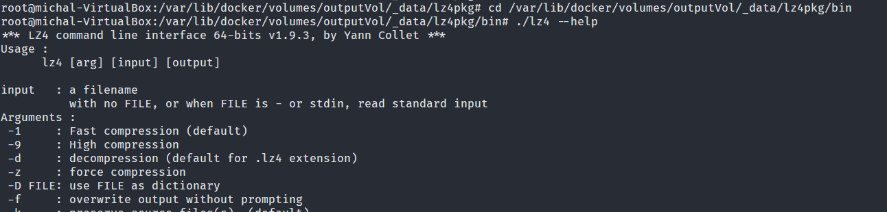

2. Eksponowanie portu
    1. Wewnątrz kontenera zainstalowano iperf3 oraz net-tools w celu uzyskania adresu ip kontenera
        > apt update  
        > apt install net-tools iperf3 -y  

        
    
    2. uruchomiono iperf3 w trybie serwera, następnie na bliźniaczym kontenerze uruchomiono iperf3 w roli klienta i połączono się do kontenera pierwszego
        > ifconfig eth0
        > iperf3 -s -p 3000
        Na drugim kontenerze
        > apt update
        > apt install net-tools iperf3 -y
        > ifconfig eth0
        > iperf3 -c 172.17.0.2 -p 3000

        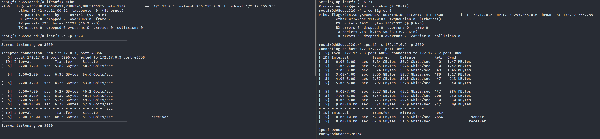

    3. Następnie połączono się z serwerem z systemu hosta
        > iperf3 -c 172.17.0.2 -p 3000  

        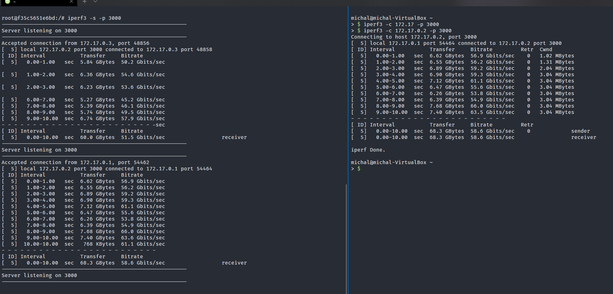

    5. Sprówano połączyć się z serwerm z poza hosta, z systemu Windows 
        > iperf3 -c localhost -p 3000  

        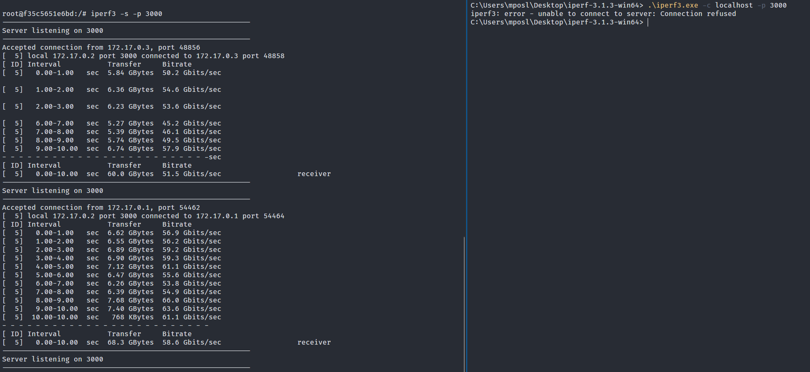
        Nie udało się nawiązać połączenia, w celu uzyskania połączenia sforwardowano port dodają flagę -p 3000:3000 do docker run, w celu przekierowania ruchu z portu 3000 na kontenerze na port 3000 wirtualnej maszyny, dodatkowo wymagane było sforwardowanie portu ze względu na konfigurację sieci wirtualnej maszyny w trybie NAT. Alternatywny rozwiązaniem było umieszczenie ip kontenera w tablicy przekierowań Virtualboxa, ale byłoby to rozwiązanie jednorazowe, gdyż nie mamy pewności że kontener zawsze będzie znajdował się pod tym samym adresem IP.

        Konfiguracja Virtualboxa  
        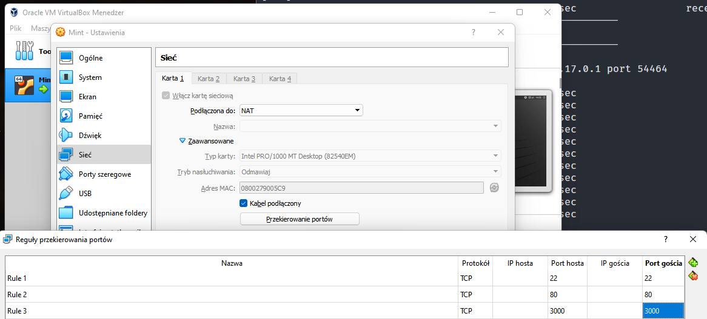

        Konfiguracja kontenera
        > docker run -p 3000:3000 -it debian:10  
        > apt update  
        > apt install net-tools iperf3 -y  
        > ifconfig eth0  
        > iperf3 -s -p 3000

        W systemie Windows, nad hostem
        > iperf3 -c 172.17.0.2 -p 3000  

        

    6. Zestawiono tabelarycznie uzyskane prędkości przesyłu danych

        | **Time Spans [s]** | **From Container [Gb/s]** | **From Host [Gb/s]** | **From Windows [Gb/s]** |
        |:---:|:---:|:---:|:---:|
        | 0-1 | 50.2 | 56.9 | 1.21 |
        | 1-2 | 54.6 | 56.2 | 1.28 |
        | 2-3 | 53.6 | 59.2 | 1.35 |
        | 3-4 | 50.7 | 59.3 | 1.32 |
        | 4-5 | 56.5 | 51.1 | 1.34 |
        | 5-6 | 50.8 | 55.6 | 1.38 |
        | 6-7 | 45.2 | 53.8 | 1.28 |
        | 7-8 | 46.2 | 54.9 | 1.36 |
        | 8-9 | 49.4 | 66 | 1.34 |
        | 9-10 | 57.9 | 63.6 | 1.39 |
        | Average | 51.5 | 58.6 | 1.32 |
        
    7. Wnioski
        
        Zgodnie z oczekiwaniami, uzyskaliśmy najszybszy przesył danych komunikując się z hosta do kontenera, zbliżone lecz niższe wyniki otrzymaliśmy wykonując połączenie z innego kontenera a najwolniejszą komunikacją okazała się komunikacja z systemu zewnętrznego.

3. Instalacja Jenkins

    1. Utworzono sieć dla Jenkins'a
        >docker network create jenkins

        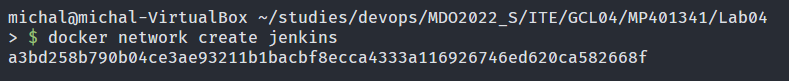

    2. Pobrano i uruchomiono obraz docker z skonfigurowaną siecią, portem i woluminami

        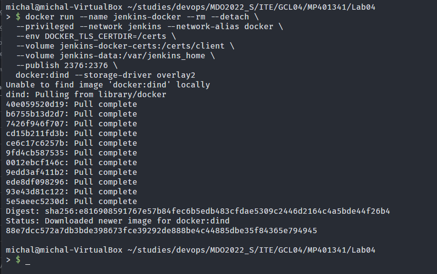

    3. Utworzono Dockerfile zgodny z dokumentacją (plik do wglądu dostępny w folderze jenkins) Następnie zbudowano na jego podstawie obraz o nazwie mpjenkins
        >mkdir jenkins  
        >cd ./jenkins  
        >nano ./jenkins/Dockerfile  
        >docker build -t mpjenkins  

        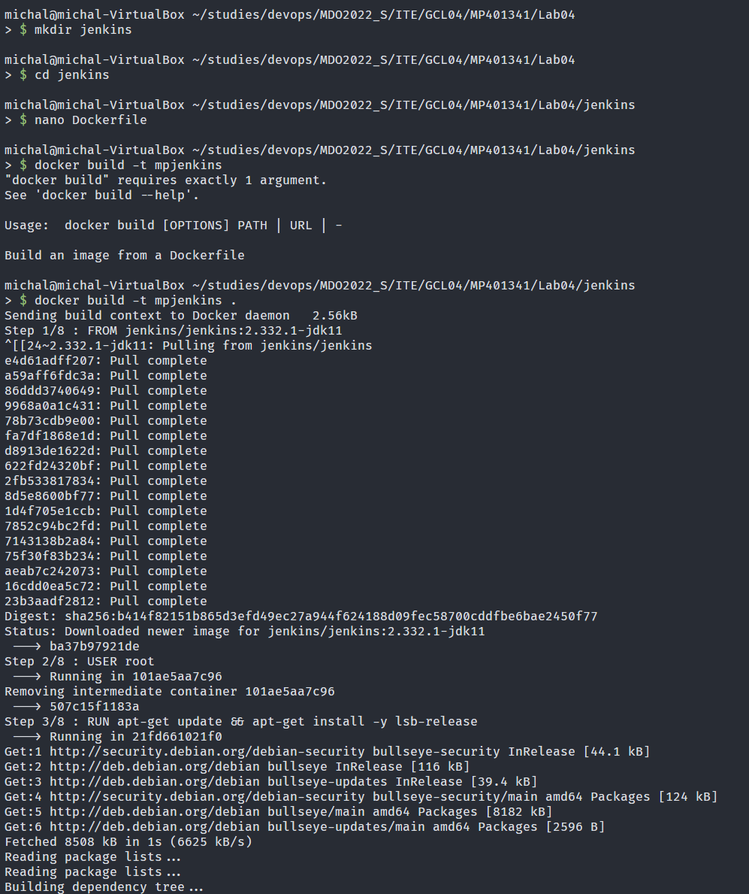

    4. Uruchomiono utworzony obraz.

        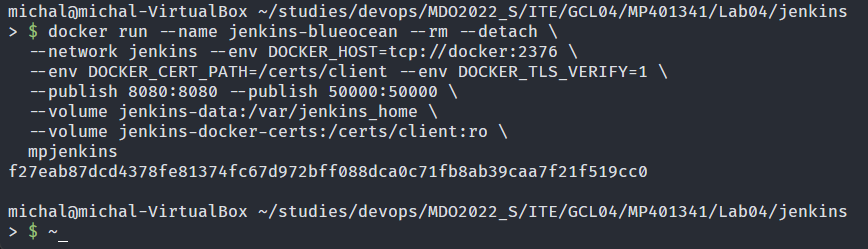

    5. Uzyskano hasło z logów działającego kontenera
        > docker ps  
        > docker logs f27eab87dcd4 | grep 'password' -A 5  

        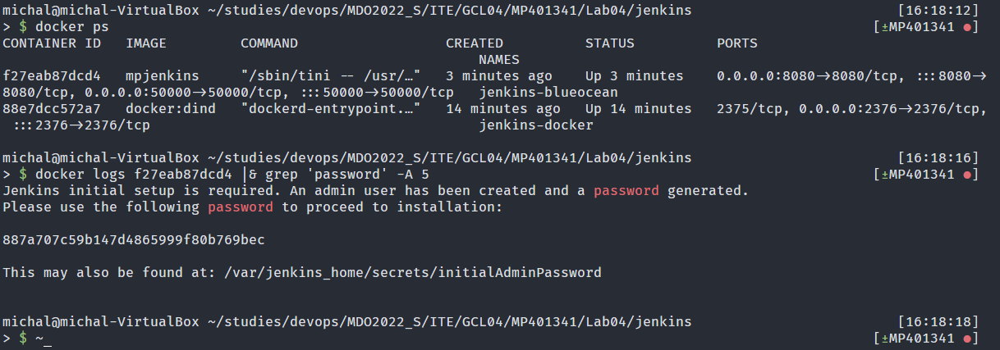

    6. Otworzenie strony Jenkins'a poza maszyną wirtualną wymagało przekierowania portu 8080 w virtualboxie

        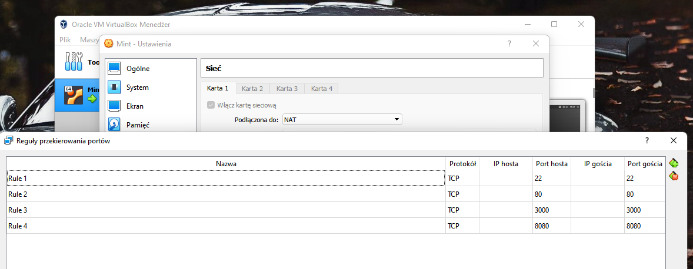
        
    7. Uzyskano dostęp do strony Jenkins i wykorzystano znalezione w logach hasło

        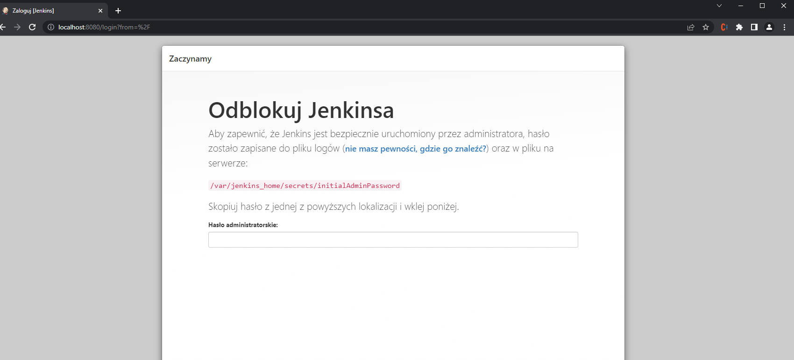

    8. Po konfiguracji ukazała się główna strona Jenkinsa

        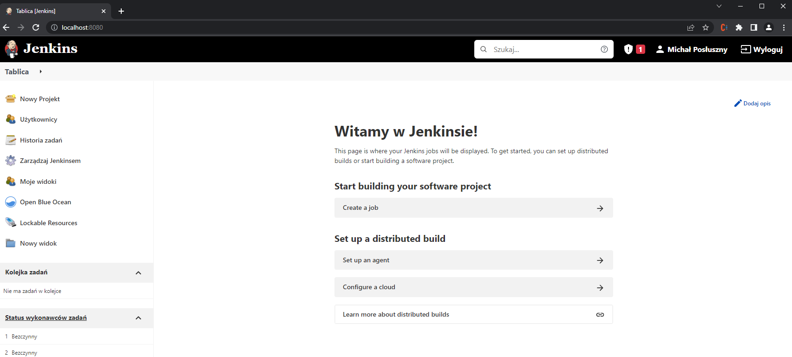