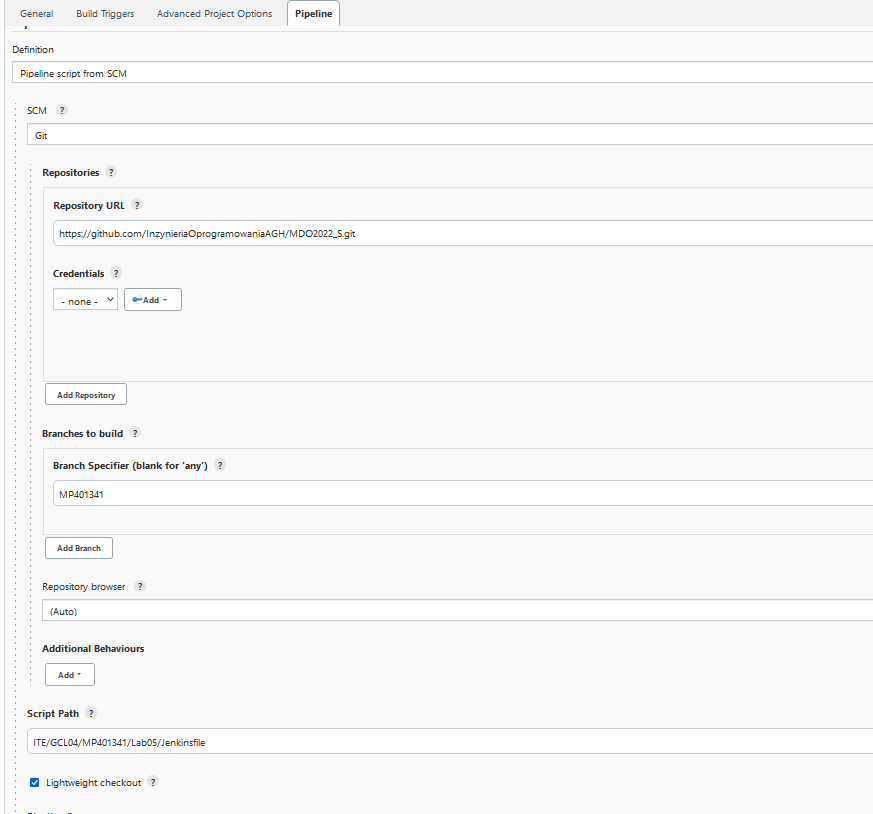
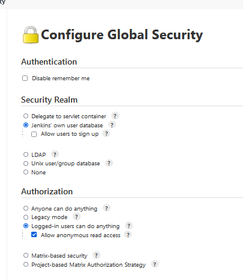
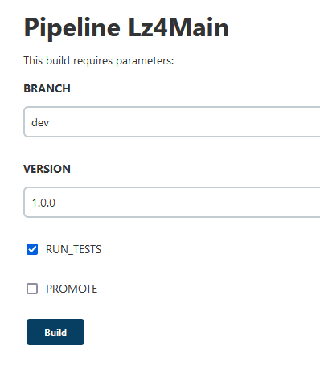
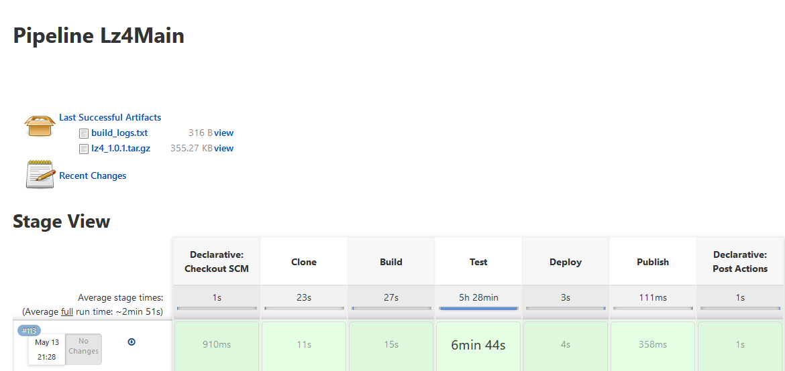

# Jenkins - Wdrożenie LZ4

## Cel

Celem przygotowanego pipeline’u było zautomatyzowanie budowania, przetestowania, wdrożenia i opublikowania projektu LZ4 – programu napisanego w C służącego do kompresji plików.

## Streszczenie

Do wykonania projektu utworzono cztery Dockerfile na bazie obrazu Debian. Budowanie projektu odbyło się przy pomocy Makefile’a, do testowania LZ4 wymagany był język Python. Deployment przeprowadzono na Dockerfile’u zbudowanym na obrazie Debian bez żadnych dodatkowych dependencji. Publikacja zbudowanego programu polegała na utworzeniu z niego paczki tar.gz zawierającej pliki wykonywalne i manual w formie mana dostępnego dla każdego odwiedzającego instancje Jenkinsa.

## Wykonanie

1.  Zanim rozpoczęto projektowanie pipeline’u wymagana była wstępna konfiguracja projektu

    - W zakładce Pipeline strony konfiguracji ustawiono opis pipeline’u jako Pipeline script from SCM, co jest wymagane aby wykorzystać zapisany na repozytorium Jenkinsfile.

      Wybranie tej opcji wymaga skonfigurowania url’a do sklonowania repozytorium, branch z którego zostanie wykorzystany Jenkinsfile oraz ścieżkę do pliku Jenkinsfile. Dodatkowo zaznaczono opcję Lightweight checkout. Repozytorium które zostały wykorzystane jest repozytorium zawierającym wiele innych branchy innych studentów, stąd opcja lightweight checkout ogranicza pobranie repozytorium wyłącznie do ustalonego brancha.

      

    - W ustawieniach Manage Jenkins -> Configure Global Security zmieniono ustawienia autoryzacji na: Allow anonymous read access, tak aby osoby niezalogowane miały dostęp do pobierania artefaktów i przeglądania wyników jobów.

      

2.  Skonfigurowano założenia wstępne Jenkinsfile’a.

    Ustalono agenta na dowolnego, w naszym projekcie nie wymagamy żadnego konkretnego agenta jak np. kontener Dockera, stąd też nie ustalamy wymagań.

    Parametr BRANCH pozwala nam wybrać brancha, który zostanie sklonowany z repozytorium LZ4. Parametr VERSION pozwala wpisać numer wersji, która zostanie wykorzystana w nazwie opublikowanej paczki. Parametr RUN_TESTS pozwala na ewentualne ominięcie testów, parametr ten został dodany, ponieważ testy trwają 6 minut, stąd też możemy chcieć wypromować build po pierwszym uruchomieniu joba w którym powtórzenie testów nie będzie wymagane. Ostatnim parametrem to PROMOTE, uruchamia stage Publish, który nazywa paczkę z uwzględnieniem parametru VERSION i dodaje paczkę jako artefakt

        pipeline {
            agent any
        parameters {
            string(name: 'BRANCH', defaultValue: 'dev', description: '')
            string(name: 'VERSION', defaultValue: '1.0.0', description: '')
            booleanParam(name: 'RUN_TESTS', defaultValue: true, description: '')
            booleanParam(name: 'PROMOTE', defaultValue: false, description: '')
            }

3.  Klonowanie repozytorium

    - Stage Clone w Jenkinsfile

      Przygotowuje środowisko pipeline’a do pracy, zaczynając od usunięcia wszystkich kontenerów i wolumenów które zakończyły pracę. Następnie tworzy wolumeny repo_vol (na który zostanie sklonowane repozytorium), oraz build_vol(na który zostanie sklonowany build). Następnie buduję Dockerfile służący do klonowania, nazywając go lz4clone. Po zbudowaniu kontenera, został on uruchomiony z podmontowanym repozytorium repo_vol na lokację lz4 i ustawioną zmienną środowiskową BRANCH na wartość zmiennej BRANCH

          stage("Clone"){
              steps {
              sh 'docker container prune -f'
              sh 'docker volume prune -f'
              sh 'docker volume  create --name repo_vol'
              sh 'docker volume  create --name build_vol'
              sh "docker build -t lz4clone . -f ITE/GCL04/MP401341/Lab05/DockerfileClone"
              sh "docker run -e BRANCH=${BRANCH} -v repo_vol:/lz4 lz4clone"
                  }
              }

    - Dockerfile służący do klonowania

      Bazuje na obrazie Debian 10 (tak jak wszystkie napisane Dockerfilel), wykonuje on aktualizację źródeł poprzez apt update i instaluje gita aby umożliwić sklonowanie. Entrypoint klonuje repozytorium wykorzstując zmienną środowiskową BRANCH aby sklonować odpowiedni branch.

          FROM debian:10
          RUN apt update
          RUN apt install -y git
          CMD git clone --branch ${BRANCH}  https://github.com/lz4/lz4.git

4.  Budowanie projektu

    - Stage Build w Jenkinsfile

      Ten krok buduje obraz DockerfileBuild i uruchamia go, nazywając kontener build_container podmontowując wolumeny repo_vol na lokalizację lz4, build_vol na lokalizację /build oraz ścieżkę na której pracuje Jenkins na folder /public. Ostatnie podmontowanie zostanie wykorzystane w celu wyniesienia tara z zbudowanymi plikami binarnymi poza kontener, by umożliwić ewentualną publikację.

          stage("Build") {
              steps {
                  sh 'docker build -t build . -f ITE/GCL04/MP401341/Lab05/DockerfileBuild'
                  sh 'docker run --name build_container -v repo_vol:/lz4 -v build_vol:/build -v ${PWD}:/public build'
                    }
                 }

    - Dockerfile do budowania projektu

      Aby zbudować lz4 potrzebuje kompilatora gcc oraz programu make do obsługi Makefile.
      Po instalacji tych pakietów pracujemy z lokalizacji repozytorium lz4 i tworzymy folder lz4build do którego zostaną zbudowane pliki binarne programu. Entrypointem jest ciąg komend. Pierwsza komenda usuwa prefix czyli folder w folderze do którego ma się zbudować projekt a DESTDIR ustawia folder do którego ma się zbudować na stworzony lz4build

      Po poprawnym zbudowaniu projektu pakujemy pliki binarne do tara z flagami

      - -c tworzy archiwum
      - -z kompresuje archiwum gzipem
      - -f ustawia folder który ma zostać zarchiwizowany

      Tak przygotowanego tara kopiujemy do podmontowanych lokalizacji build oraz public.

            FROM debian:10

            RUN apt update
            RUN apt install -y gcc make
            WORKDIR lz4
            RUN mkdir lz4build
            CMD sh -c "make prefix= DESTDIR=/lz4build install &&  tar -czf lz4.tar.gz /lz4build && cp lz4.tar.gz /public && cp lz4.tar.gz /build"

5.  Testowanie projektu

    - Jenkinsfile

      Użyto instrukcji when aby uwarunkować wejście w ten etap zależnie od wyboru użytkownika, tego samego dokonano także przy stage'u Publish.

      Przetestowanie buildu wymaga zaledwie dwóch kroków, potrzebujemy utworzyć obraz na bazie Dockerfile'a dodając argument image=build, aby wskazać na nazwę obrazu na którym ma bazować kontener testowy. Następnie tworzymy i uruchamiamy kontener z podmontowanym do folderu lz4 wolumenem zawierającym repozytorium

            stage("Test") {
                when {
                    environment name: 'RUN_TESTS', value: "true"
                    }
                    steps {
                    sh 'docker build -t test . -f ITE/GCL04/MP401341/Lab05/DockerfileTest --build-arg image=build'
                    sh 'docker run --name test_container -v repo_vol:/lz4 test'
                    }
                }

    - Dockerfile do testowania projektu

    Jak już wspomniano, wykorzystujemy wcześniej zbudowany obraz do utworzenia tego obrazu. Dodatkowo musimy zainstalować pakeit python3 będący językim programowania wykorzystanym do testowania lz4. Testy uruchamiamy komendą make test. Bład w testach zakończy pracę kontenera z błędem co spowoduje przerwanie pipeline'u.

            ARG image
            FROM $image
            RUN apt install -y python3
            CMD make test

6.  Wdrożenie zbudowanego programu

    - Stage Deploy w Jenkinsfile

      W celu wykonania wdrożenia w Jenkinsfile'u zdefiniowano stage w którym tworzymy obraz deployment i montujemy do niego wolumen z zbudowanym programem spakowanym w archiwum tar.

            stage("Deploy") {
                steps {
                    sh 'docker build -t deployment . -f ITE/GCL04/MP401341/Lab05/DockerfileDeploy'
                    sh 'docker run  -v build_vol:/build  deployment'
                }
            }

    - Dockerfile do wdrażania projektu

      Wykorzystanie archiwum tar pozwoli nam w pełni odwzorować uruchomienie programu przez zwykłego użytkownika. Zakładamy że program zostanie uruchomiony na dystrybucji Debian w wersji 10 bez żadnych dodatkowych dependencji.

      W celu przetestowania poprawnego działania pliku binarnego na kontenerze tworzymy plik do którego zapisujemy dowolne dane. Naszym entrypointem będzie seria komend służąca do sprawdzenia czy kompresja i dekompresja działają poprawnie.

      W pierwszym kroku rozpakowywujemy archiwum tar, uruchamiamy plik binarny lz4 podając nazwę pliku do skompresownaia i nazwę pliku docelowego, następnie dodając flagę -d do lz4 dokonujemy dekompresji do pliku decompressed a na końcu porównujemy komendą diff plik poczatkowy original z plikiem końcowym decompressed. Diff zwróci nam kod błędu inny niż 0 w przypadku gdy pliki będą różne, tym samym spowoduje przerwanie deploymentu. Na zakończenie dodano komunikat o poprawnej kompresji i dekompresji pliku.

      Wdrażanie możemy zawsze rozbudować o przetestowanie dodatkowych aspektów programu, budowanie tworzy nam zestaw programów lz4, lz4cat, lz4c, unlz4. Więc możemy pokusić się o dodanie procedury wdrażania każdego z programów. Co więcej efektem buildu są także pliki nagłówkowe wraz z biblioteką liblz4, to pozwala rozszerzyć wdrożenie jeszcze o np. skompilowanie przygotowanego wcześniej kodu który wykorzystuje bibliotekę liblz4.

            FROM debian:10
            RUN echo "Testing if compression is working properly" > original
            CMD sh -c "tar -xzf build/lz4.tar.gz && ./lz4build/bin/lz4 original compressed && ./lz4build/bin/lz4 -d compressed decompressed &&  diff original decompressed && echo Compression and decompression succesful

7.  Publikowanie projektu

    - Jenkinsfile

      Publikacja mogła odbyć się na różne sposoby m.in. dodanie pliku do przestrzeni publicznej na jakimś serwerze, utworzenie własnego serwera ftp, wysłanie maila z artefaktem czy też wykorzystanie Jenkinsa jako serwera naszych buildów. Zdecydowano się na tą ostatnią opcję, więc w kroku Publish zmieniamy nazwę pliku tak by uwzględnić nazwę wersji, a następnie używamy komendy archiveArtifacts by zapisać w Jenkinsie archiwum jako artefakt.

            stage("Publish") {
                when {
                        environment name: 'PROMOTE', value: "true"
                    }
                    steps {
                        sh "mv lz4.tar.gz lz4_${VERSION}.tar.gz"
                        archiveArtifacts "lz4_${VERSION}.tar.gz"
                    }
                }
            }

    - Dostępność

      Tak opublikowany artefakt jest potem dostępny dla każdego odwiedzającego Jenkinsa dzięki ustawionym na początku opcją dostępu do strony.

8.  Akcje po zakończeniu ostatniego stage'a

    Na opublikowaniu artefaktu nasza praca się nie kończy. Dodatkowo zapisujemy logi z kontenerów do plików build_logs.txt i test_logs.txt. Oba pliki opatrzono klauzulą catchError, tak by błąd spowodowany nieistniejącym kontener nie przerwał wykonywania kroków. W przypadku gdy przerwalibyśmy egezukcję pipeline'u w trakcie działania kontenera, musimy także zastopować wszystkie kontenery tak by dało się je potem usunąć. Po zebraniu logów następuje zapisanie na stałe logów jako artefaky i usunięcie logów z workspace'a

            post {
            always {
                catchError {
                sh 'docker stop $(docker ps -q) || true'
                    }
                catchError {
                sh 'docker container logs build_container > build_logs.txt'
                    }
                catchError {
                script{
                    if (env.RUN_TESTS == true){
                        sh 'docker container logs test_container > test_logs.txt'
                    }
                    }
                }
                archiveArtifacts '*_logs.txt'
                sh 'rm -rf *_logs.txt'
            }
            }

9.  Wynik działania pipeline'u

    Uruchomienie pipeline'a wymaga podania parametrów wejścia

    

    Po zakończeniu pracy możemy zauważyć, że nie zalogowany użytkownik ma dostęp do pobrania opublikowanych artfeaktów.

    

- Diagram Aktywności

- Diagram Wdrożenia
