# Sprawozdanie Lab 9 - 18.05.2022

1. Instalacja systemu fedora

    1. W programie Virtualbox utworzono nową maszynę

        

    2. Po utworzeniu, uruchomiono maszynę z obrazem Fedora 36 NetInstall x86_64  

        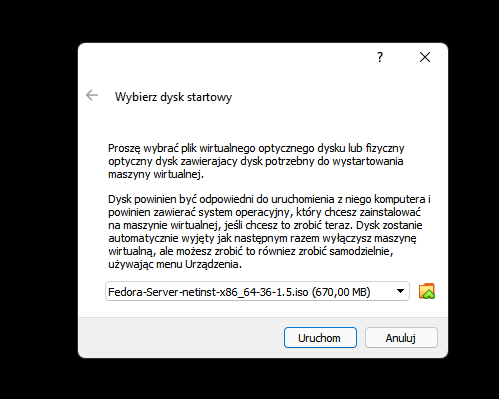

    3. Rozpoczęto instalację systemu Fedora

        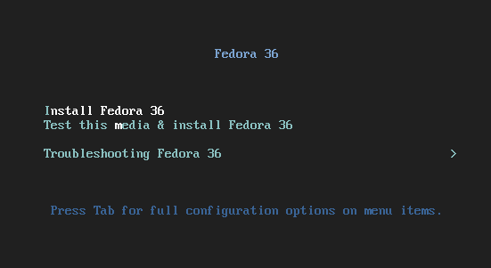

    4. Wybrano język angielski

        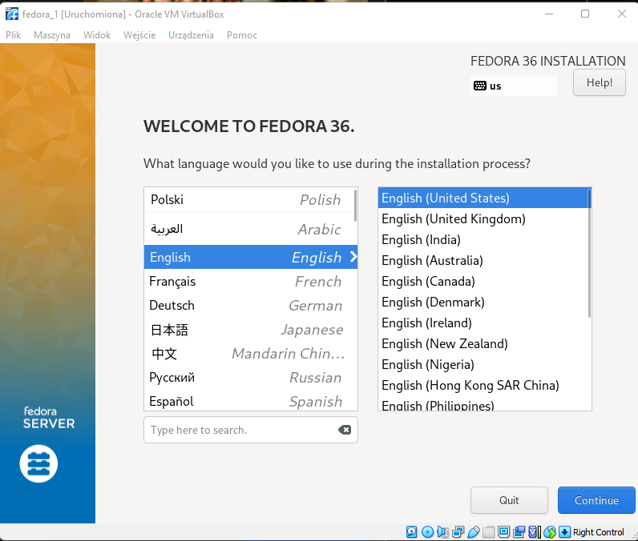

    5. W konfiguracji, sprawdzono każdą kategorię, utworzono konto administratora o nazwie admin

        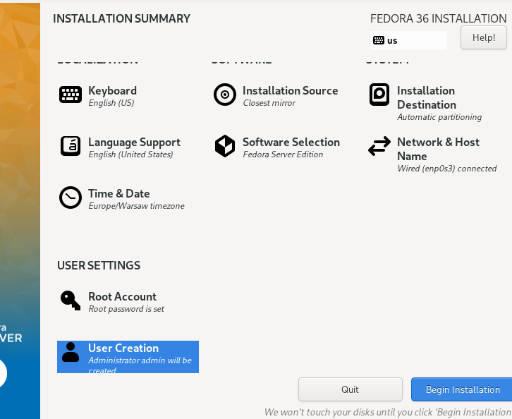

2. Wdrożenie na maszynie wirtualnej
    1. Zalogowano się do konta administratora

        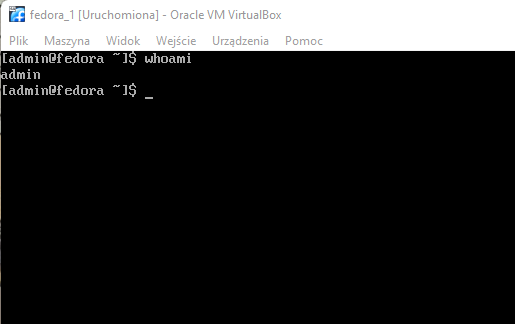

    2. Sprawdzono dostęp z poziomu przeglądarki do instancji Jenkinsa, sprawdzono link do ostatnio zbudowanej paczki

        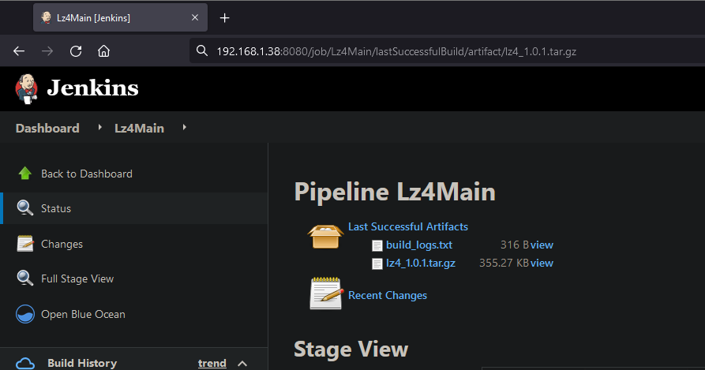

    3. Przy użyciu wgeta pobrano tara

        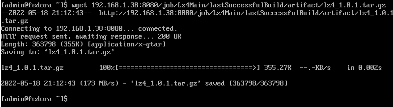

    4. Rozpakowana tara i przetestowano schemat wdrożeniowy

        

        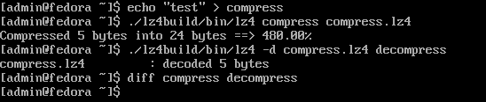

3. Przygotowanie pliku kickstart

    1. Z folderu /root/anaconda-ks.cfg wyciągnięto i zmodyfikowano plik kickstart 

    2. Zmieniono typ instalacji z graficznej na tekstową
    
            # Generated by Anaconda 36.16.5
            # Generated by pykickstart v3.36
            #version=F36
            # Use graphical install
            text

    3. Ustalono repozytoria z których pobrane zostaną pakiety

            # Network information
            network  --bootproto=dhcp --device=enp0s3 --ipv6=auto --activate
            # Repo
            url --mirrorlist=http://mirrors.fedoraproject.org/mirrorlist?repo=fedora-$releasever&arch=x86_64
            repo --name=updates --mirrorlist=http://mirrors.fedoraproject.org/mirrorlist?repo=updates-released-f$releasever&arch=x86_64

    4. Ustalno krok post, który pobierał i wdrażał artefakt, jego działanie jest bardzo zbliżone z działaniem wdrożeniowego Dockerfile'a, różnicę stanowi to, że artefakt pobieramy wgetem.

            %post
            mkdir deploy
            cd deploy
            wget 192.168.1.38:8080/job/Lz4Main/lastSuccessfulBuild/artifact/lz4_1.0.1.tar.gz
            tar -xzf lz4*.tar.gz
            echo "lz4 test" > original
            ./lz4build/bin/lz4 --help
            ./lz4build/bin/lz4 original compressed && ./lz4build/bin/lz4 -d compressed decompressed &&  diff original decompressed && echo Compression and decompression succesful"
            %end

4. Infrastructure as a code

    1. Po dodaniu pliku anaconda-ks.cfg na repozytorium, uzysakon link do surowej wersji pliku, przekazano go do instalatora.

        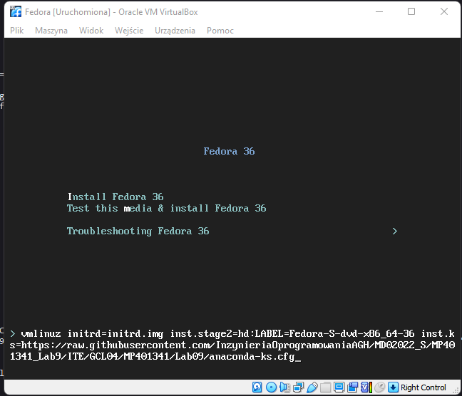

    2. Proces instalacji wykonał się pomyślnie

        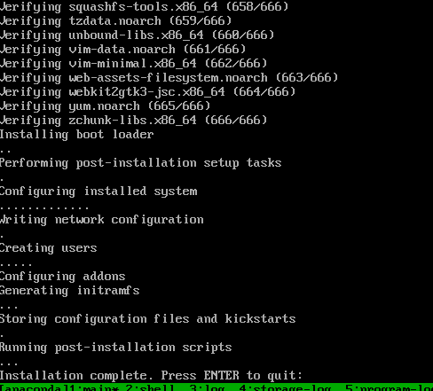

        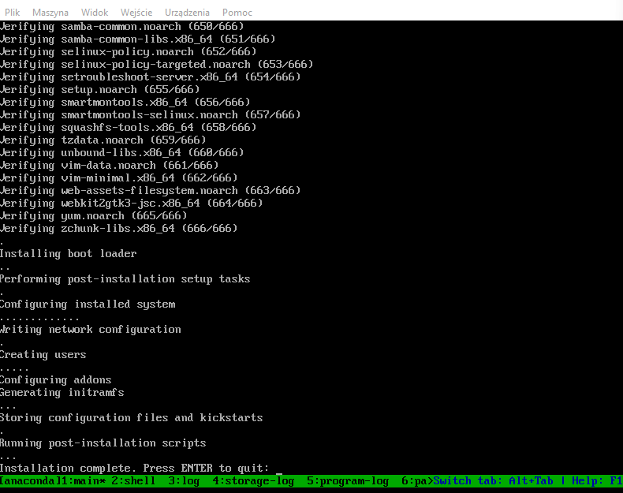

    3. Sprawdzono zawartość lokalizacji deploy, zawierała ona rozpakowany artefakt, wraz z plikami użytymi do przetestowania wdrożenia. Wdrożenie przeszło pomyślnie.

        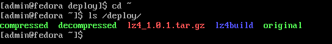