# Sprawozdanie Lab 11 - 09.06.2022

1.  Instalacja Minikube

    1. Pobrano i zainstalowano pakiet Minikube w wersji Latest

       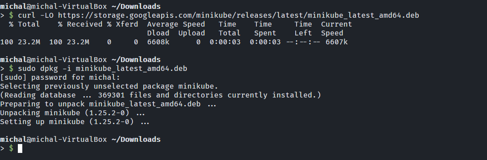

    2. Uruchomiono i skonfigurowano Minikube

       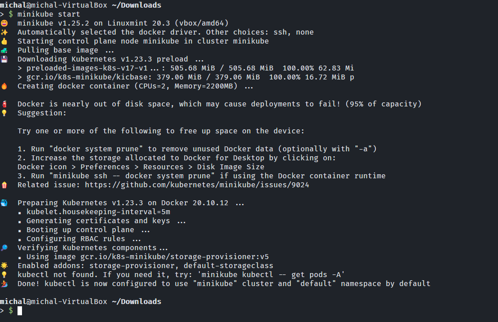

    3. Sprawdzono działające komponenty Minikube'a

       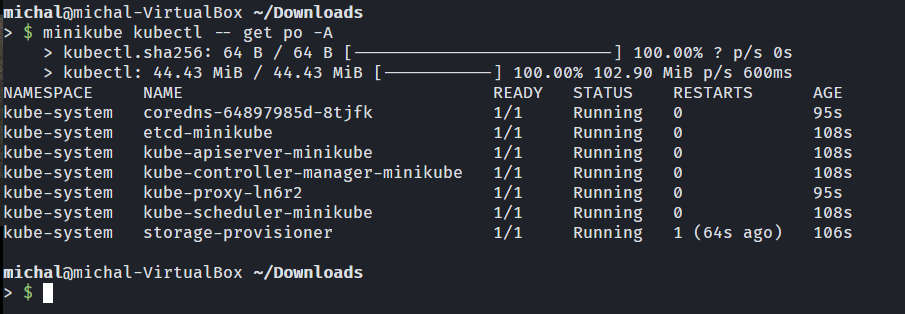

    4. Zgodnie z sugestią dokumentacji dodano w .bashrc alias kubectl aby uruchamiać ctl'a minikube'a.

       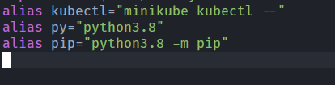

    5. Sprawdzono działania utworzonego aliasa

       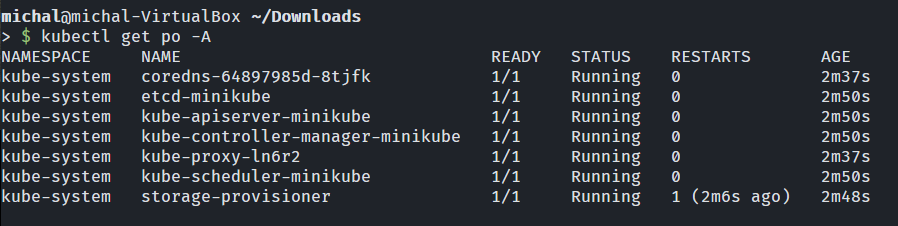

    6. Uruchomiono i sprawdzono działanie dashboarda Minikube'a

       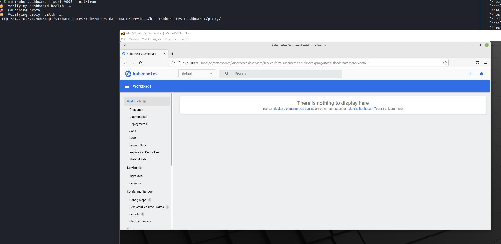

2.  Wdrożenie na maszynie wirtualnej

    1. W celu wdrożenia aplikacji LZ4 przygotowano prostą web aplikację w języku Python 3, która pozwalała na kompresję i dekompresję załadowanego na stronę pliku. Kod źródłowy dostępny jest w folderze service. Plik server.py służy do zaserwowania aplikacji frameworku Flask przy pomocy serwera http. Argumentami wejścia pliku server.py jest lokalizacja pliku wykonywalnego lz4 oraz numer wersji aplikacji.

    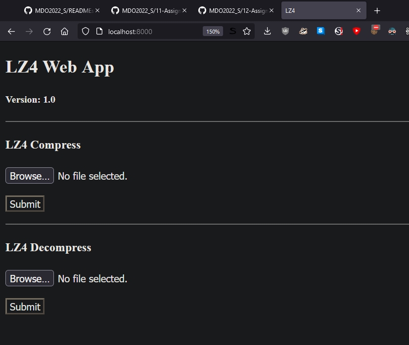

    2. Aby móc wykorzystać stworzoną aplikację w Kubernetesie stworzono Dockerfile o nazwie DockerfileCloudDeploy, który zawierał w sobie trzy etapy. Pierwszy stage na bazie obrazu Debian:10 klonował repozytorium i kompilował plik wykonywalny. Drugi stage na bazie obrazu Python:3 instalował wymagania aplikacji określone w requirements.txt i uruchamiał aplikację webową na porcie 8000.

    3. Utworzono dwa obrazy wersje 1.0 i 1.1. Wersję 1.0 uruchomiono jako kontener

    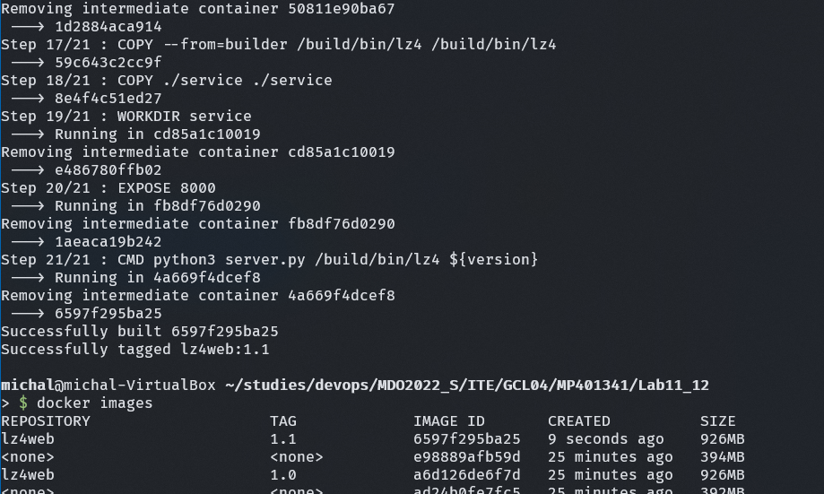
    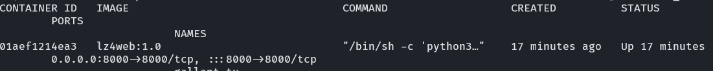

    4. W celu utworzenia poda z lokalnego obrazu należało zmienić dockera na dockera minikube'a. Usunięto poprzednie obrazy i utworzono obraz wersji 1.0 i 1.1 na nowo

    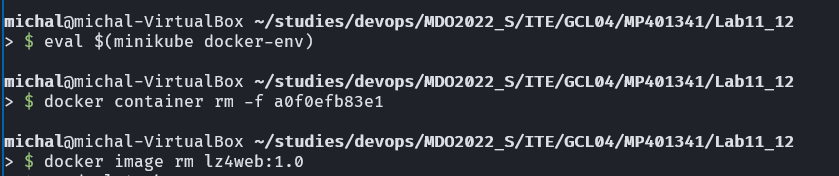
    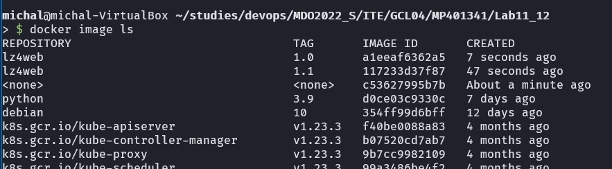

    5. Utworzono poda, sforwardowano porty.

    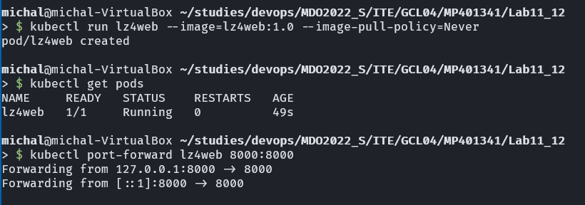

    6. Sprawdzono czy strona działa wchodząc na nią i poprzez dashboarda

    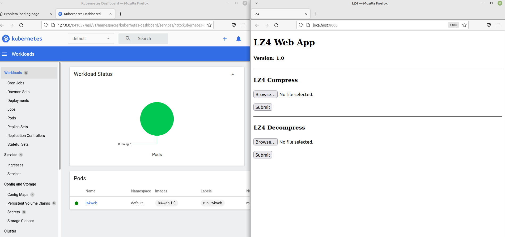

    7. Napisano konfigurację deploymentu

    ```yaml
    apiVersion: apps/v1
    kind: Deployment
    metadata:
    name: lz4web-deployment
    spec:
    selector:
      matchLabels:
        app: lz4web
    replicas: 3
    template:
      metadata:
        labels:
          app: lz4web
      spec:
        containers:
          - name: nginx
            image: lz4web:1.0
            imagePullPolicy: "Never"
            ports:
              - containerPort: 8000`
    ```

    8. Przetestowano konfigurację. Widoczne jest działanie trzech replik kontenera.

    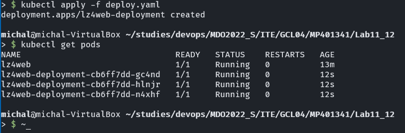
