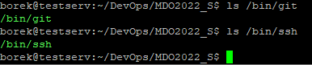
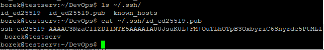
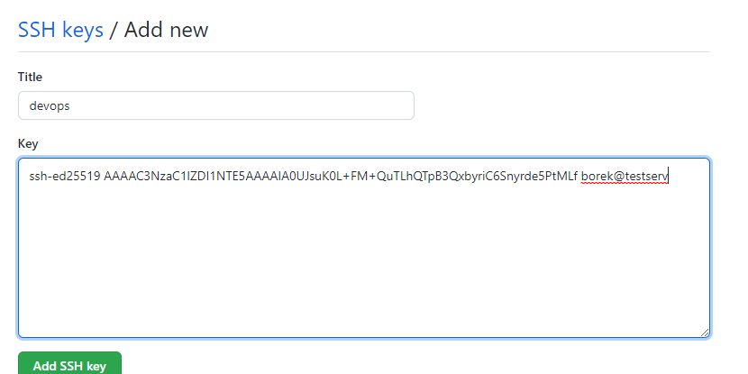
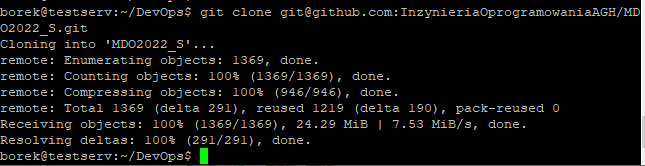
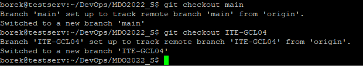
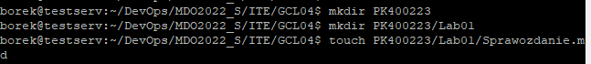
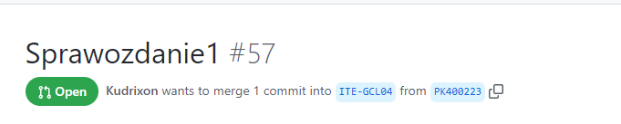

# Zajêcia 01 - Grupa 4
### Przemys³aw Kudriawcew 
---
## Zadania do wykonania
1. Zainstaluj klienta Git i obs³ugê kluczy SSH
 - 
2. Sklonuj repozytorium https://github.com/InzynieriaOprogramowaniaAGH/MDO2022_S za pomoc¹ HTTPS
 - ```git clone https://github.com/InzynieriaOprogramowaniaAGH/MDO2022_S.git```
 - 
3. Upewnij siê w kwestii dostêpu do repozytorium jako uczestnik i sklonuj je za pomoc¹ utworzonego klucza SSH
   - Utwórz dwa klucze SSH, inne ni¿ RSA, w tym co najmniej jeden zabezpieczony has³em
   - ```ssh-keygen -t ed25519```
   - 
   - Skonfiguruj klucz SSH jako metodê dostêpu do GitHuba
   - 
   - Sklonuj repozytorium z wykorzystaniem protoko³u SSH
   - ```git clone git@github.com:InzynieriaOprogramowaniaAGH/MDO2022_S.git```
   - 
4. Prze³¹cz siê na ga³¹Ÿ ```main```, a potem na ga³¹Ÿ swojej grupy (pilnuj ga³êzi i katalogu!) 
 - ```git checkout main```
 - ```git checkout ITE-GCL04```
 - 
5. Utwórz ga³¹Ÿ o nazwie "inicja³y & nr indeksu" np. ```KD232144```. Miej na uwadze, ¿e odga³êziasz siê od brancha grupy!
 - ```git checkout -b PK400223```
 - 
6. Rozpocznij pracê na nowej ga³êzi
   - W katalogu w³aœciwym dla grupy utwórz nowy katalog, tak¿e o nazwie "inicja³y & nr indeksu" np. ```KD232144```
   - ```mkdir PK400223```
   - W nim tak¿e utwórz katalog: Lab01
   - ```mkdir PK400223/Lab01```
   - W nowym katalogu dodaj plik ze sprawozdaniem
   - ```touch PK400223/Lab01/Sprawozdanie.md```
   - 
   - Dodaj zrzuty ekranu (jako inline)
   - Wyœlij zmiany do zdalnego Ÿród³a
   - ```git add .```
   - ```git commit -m 'message'```
   - ``` git push --set-upstream origin PK400223 ```
   - 
   - Spróbuj wci¹gn¹æ swoj¹ ga³¹Ÿ do ga³êzi grupowej
   - 
   - Zaktualizuj sprawozdanie i zrzuty o ten krok i wyœlij aktualizacjê do zdalnego Ÿród³a (na swojej ga³êzi)
7. Wystaw Pull Request do ga³êzi grupowej
8. Zg³oœ zadanie (Teams assignment - je¿eli dostêpne)