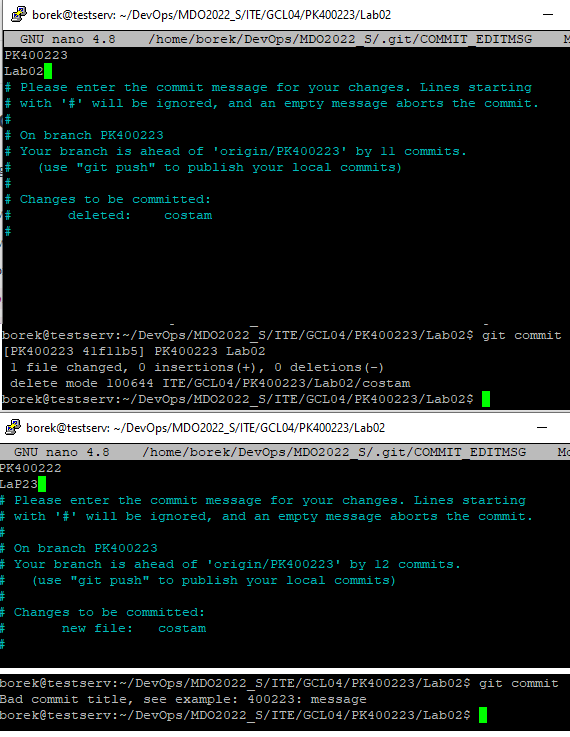
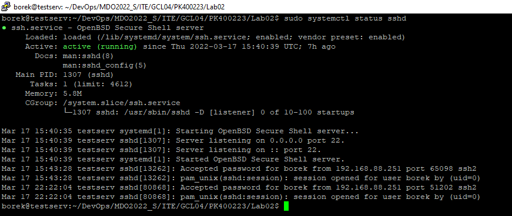
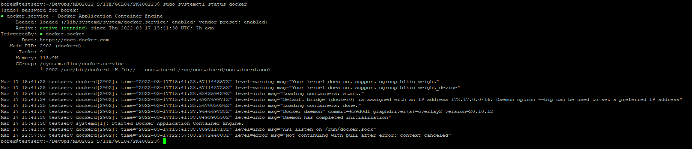
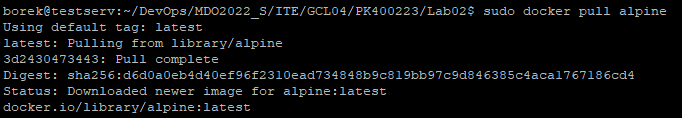
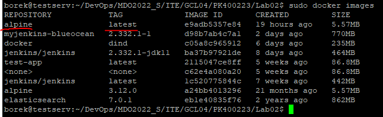

# Zajêcia 02
### Przemys³aw Kudriawcew
---
## Zadania do wykonania
1. Przygotuj git hook, który rozwi¹¿e najczêstsze problemy z commitami
* hook sprawdzaj¹cy, czy tytu³ commita nazywa siê ```<inicja³y><numer indeksu>```
* hook sprawdzaj¹cy, czy w treœci commita pada numer labu, w³aœciwy dla zadania
- 
2. Umieœæ hook w sprawozdaniu w taki sposób, aby da³o siê go przejrzeæ
W pliku commit-msg zamieszczono poni¿szy skrypt
```bash
#!/usr/bin/env bash
INPUT_FILE=$1
START_LINE=`head -n1 $INPUT_FILE`
PATTERN="^(PK400223)"
PATTERN2=".*(Lab)[0-9][0-9]*."
if ! [[ "$START_LINE" =~ $PATTERN ]]; then
  echo "Bad commit title, see example: 400223: message"
  exit 1
fi


while IFS= read -r line
do	
	if [[ $line =~ $PATTERN2 ]]; then
		exit 0
	fi
done < <(sed 1d $INPUT_FILE)

echo "Bad commit message, needs to contain Lab0X or LabXX number according to actual lab number"
exit 1
```
3. Rozpocznij przygotowanie œrodowiska Dockerowego
    * zapewnij dostêp do maszyny wirtualnej przez zdalny terminal (nie "przez okienko")
    * ``` sudo systemctl statsu sshd ```
    * - 
    * je¿eli nie jest stosowane VM (np. WSL, Mac, natywny linux), wyka¿ ten fakt **dok³adnie**
    * zainstaluj œrodowisko dockerowe w stosowanym systemie operacyjnym
4. Dzia³anie œrodowiska
    * wyka¿, ¿e œrodowisko dockerowe jest uruchomione i dzia³a (z definicji)
    * ``` sudo systemctl status docker ```
    * - 
    * wyka¿ dzia³anie z sposób praktyczny (z w³asnoœci):
      * pobierz obraz dystrybucji linuksowej i uruchom go
      * ``` sudo docker pull alpine ```
      * - 
      * wyœwietl jego numer wersji
      *  ``` sudo docker images ```
      * - 
5. Za³ó¿ konto na Docker Hub
- 
-  