# Zajêcia 03
### 2022-03-21 -- 2022-03-25
---
# Docker files, kontener jako definicja etapu

### Przeprowadzenie buildu w kontenerze
1. Wykonaj kroki build i test wewn¹trz wybranego kontenera bazowego. Tj. wybierz "wystarczaj¹cy" kontener, np ```ubuntu``` dla aplikacji C lub ```node``` dla Node.js
	* uruchom kontener
	* pod³¹cz do niego TTY celem rozpoczêcia interaktywnej pracy
	* ```docker run -it node:14-alpine3.15 sh ```
	 - 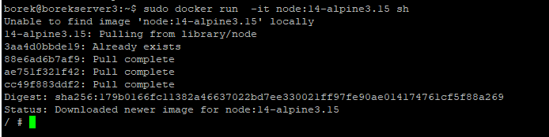
	* zaopatrz kontener w wymagania wstêpne (je¿eli proces budowania nie robi tego sam)
	* ```apk add git```
	* 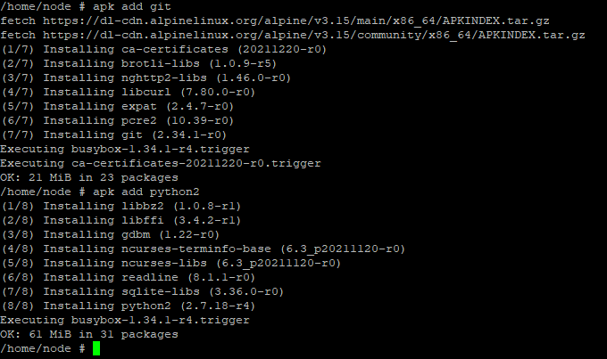
	* sklonuj repozytorium
	* ``` git clone https://github.com/gothinkster/vue-realworld-example-app ```
	* 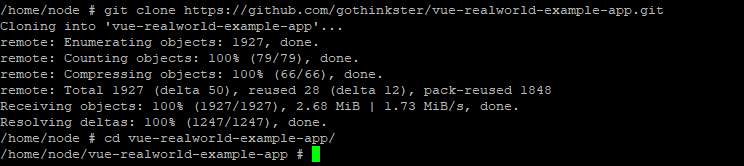
	* uruchom build
	* ```npm install```
	* ```npm run build```
	* 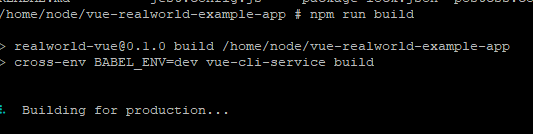
	* 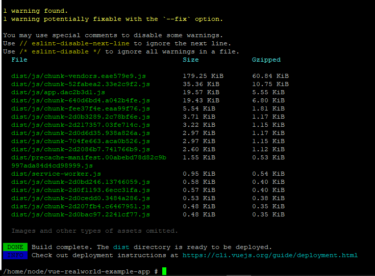
	* uruchom testy
	* ```npm test```
	* 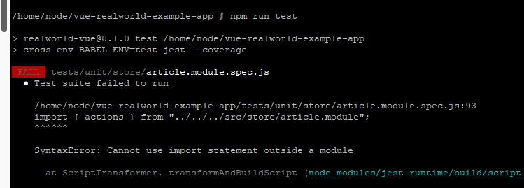
	* 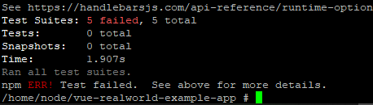
2. Stwórz dwa pliki Dockerfile automatyzuj¹ce kroki powy¿ej, z uwzglêdnieniem nastêpuj¹cych kwestii
	* Kontener pierwszy ma przeprowadzaæ wszystkie kroki a¿ do builda
	* ``` docker build -f Docker-builder . ```
	* 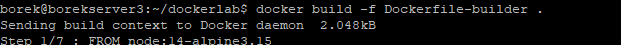
	* 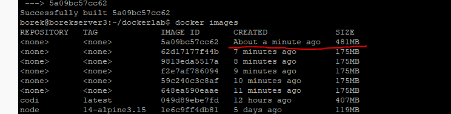
```bash
FROM node:14-alpine3.15
WORKDIR ./
RUN apk add git
RUN apk add python2
RUN git clone https://github.com/gothinkster/vue-realworld-example-app.git
WORKDIR /vue-realworld-example-app
RUN npm install
RUN npm build
```
* Kontener drugi ma bazowaæ na pierwszym i wykonywaæ testy
* ``` docker build -f Docker-runner . ```
```bash
FROM 5a09bc57cc62
CMD ["npm", "test"]
```
3. Wyka¿, ¿e kontener wdra¿a siê i pracuje poprawnie. Pamiêtaj o ró¿nicy miêdzy obrazem a kontenerem. Co pracuje w takim kontenerze?

``` docker run #value of image id ```

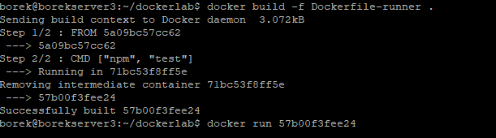
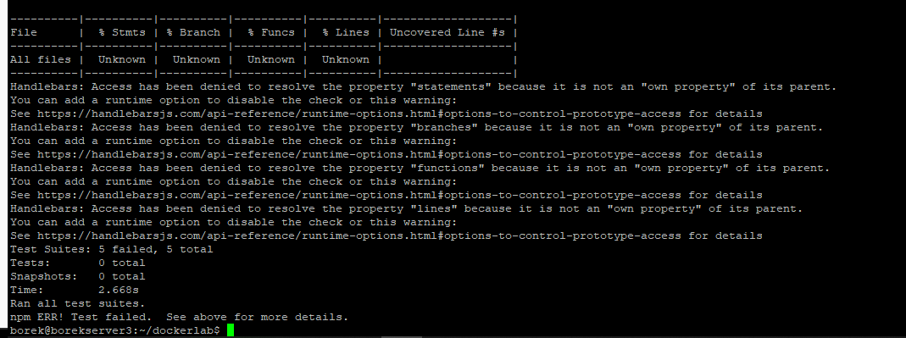