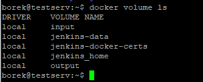
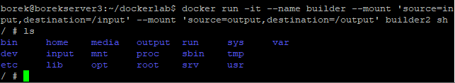
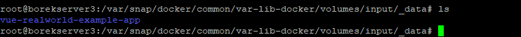
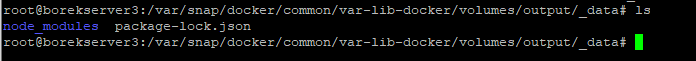
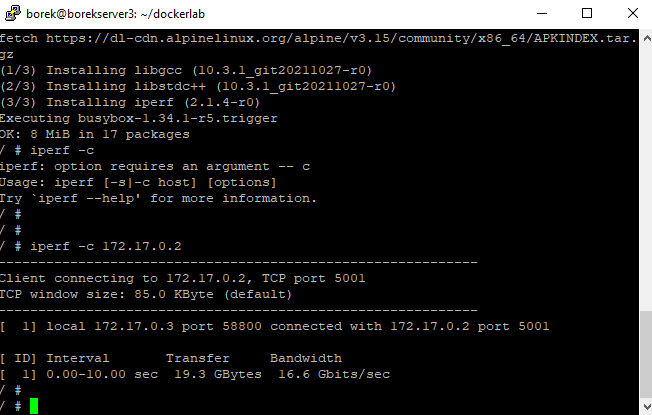
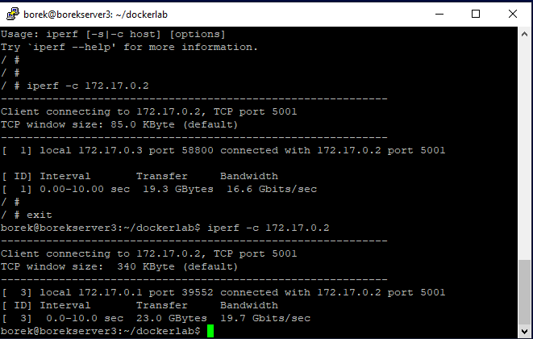
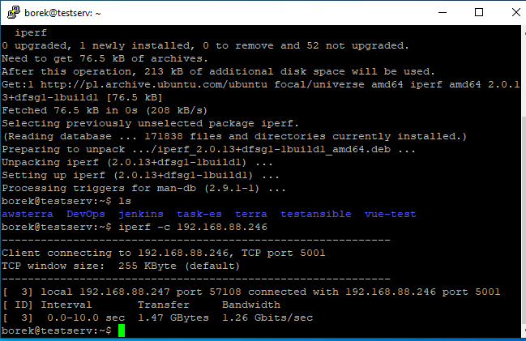
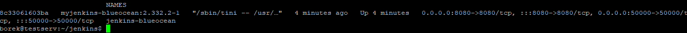
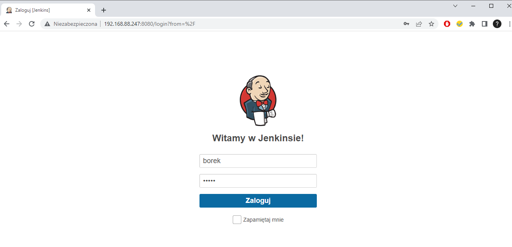

# Zajęcia 04
### 2022-03-28 -- 2022-04-01
---
# Dodatkowa terminologia w konteneryzacji, instancja Jenkins

## Zadania do wykonania
### Zachowywanie stanu
* Przygotuj woluminy wejściowy i wyjściowy, o dowolnych nazwach, i podłącz je do kontenera bazowego, z którego rozpoczynano poprzednio pracę
``` docker volume create input/output```
- 
* Uruchom kontener, zainstaluj niezbędne wymagania wstępne (jeżeli istnieją), ale *bez gita*
- 
* Sklonuj repozytorium na wolumin wejściowy
- 
* Uruchom build w kontenerze
* Zapisz powstałe/zbudowane pliki na woluminie wyjściowym
- 

### Eksponowanie portu
* Uruchom wewnątrz kontenera serwer iperf (iperf3)
 - 
* Połącz się z nim z drugiego kontenera, zbadaj ruch
- 
* Połącz się spoza kontenera (z hosta i spoza hosta)
* Przedstaw przepustowość komunikacji lub problem z jej zmierzeniem (wyciągnij log z kontenera)
- 
- 


### Instancja Jenkins
* Zapoznaj się z dokumentacją  https://www.jenkins.io/doc/book/installing/docker/
* Przeprowadź instalację skonteneryzowanej instancji Jenkinsa z pomocnikiem DIND
* Zainicjalizuj instację, wykaż działające kontenery, pokaż ekran logowania
- 
- 

Dockerfile
```bash
FROM jenkins/jenkins:2.332.1-jdk11
USER root
RUN apt-get update && apt-get install -y lsb-release
RUN curl -fsSLo /usr/share/keyrings/docker-archive-keyring.asc \
  https://download.docker.com/linux/debian/gpg
RUN echo "deb [arch=$(dpkg --print-architecture) \
  signed-by=/usr/share/keyrings/docker-archive-keyring.asc] \
  https://download.docker.com/linux/debian \
  $(lsb_release -cs) stable" > /etc/apt/sources.list.d/docker.list
RUN apt-get update && apt-get install -y docker-ce-cli
USER jenkins
RUN jenkins-plugin-cli --plugins "blueocean:1.25.3 docker-workflow:1.28"
```
