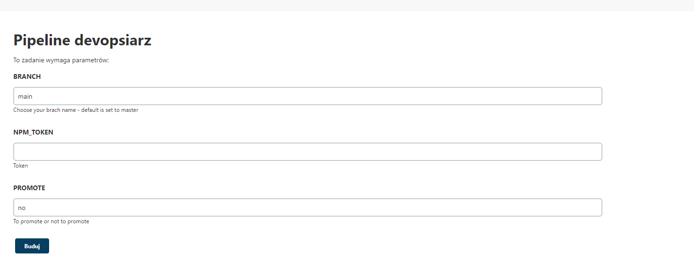
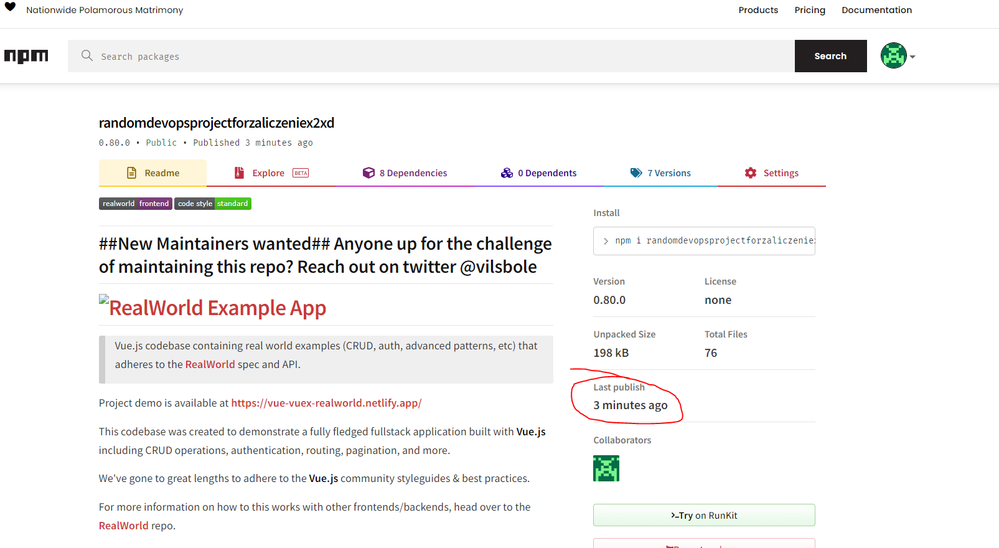
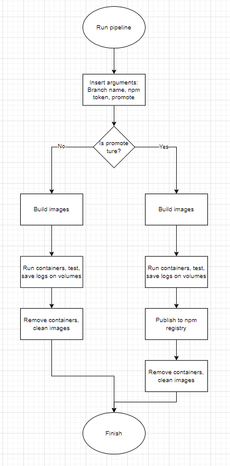

# Sprawozdanie projekt Pipeline
### 2022-05-26
---
# Wykona³ Przemys³aw Kudriawcew
### Requirements to run project
1. Install Jenkins according to official Jenkins docker instalation guide: https://www.jenkins.io/doc/book/installing/docker/
2. To make project more realistic I'm using agent on another server called node from now, to setup node: https://embeddedartistry.com/blog/2018/01/11/jenkins-configuring-a-linux-slave-node, node should be named "TestNode".
3. For sake of making project possible to test I'm passing npm Token in here: https://yopass.se/#/s/6a1a2934-b175-4319-908b-5d1a95120a47/iyx8XKares50zQU8E6ErJT
### Running project and explanations
1. Projects consists of one forked repo https://github.com/Kudrixon/vue-realworld-example-app and Dockerfiles:

Prebuilder:
```bash
FROM node:14-alpine3.15
WORKDIR ./
RUN apk add git
RUN apk add python2
```
Dependencies needed to run project

Builder: 
```bash
FROM base
ARG NPM_TOKEN
WORKDIR ./
RUN git clone https://github.com/Kudrixon/vue-realworld-example-app.git
WORKDIR /vue-realworld-example-app
RUN echo "//registry.npmjs.org/:_authToken=$NPM_TOKEN" >> ~/.npmrc
RUN npm build 
```
ARG parameter is used here to avoid putting token as a plain text in dockerfile

Tester:
```bash
FROM devopsprojekt
CMD npm run test
```
Runner:
```bash
FROM devopsprojekt
EXPOSE 8080
CMD ["npm", "run", "serve"]
```
2. To automate publishing process we'll be using Jenkins CI server as mentioned earlier. Also Jenkinsfile setup will be discussed as it's essential to understand how project works and why some decisions were made.
```bash
pipeline {
    agent {
        node {
            label 'TestNode'
        }
    }
    parameters {
        string(name: 'BRANCH', defaultValue: 'main', description: 'Choose your brach name - default is set to master')
        string(name: 'NPM_TOKEN', defaultValue: '', description: 'Token')
        string(name: 'PROMOTE', defaultValue: 'no', description: 'To promote or not to promote')
    }
    stages {
        stage('git') {
            steps {
                git credentialsId: '1',
                url: 'https://github.com/InzynieriaOprogramowaniaAGH/MDO2022_S',
                branch: "${params.BRANCH}"
            }
        }
        stage('Build') {
            steps {
                sh 'docker volume create vol-in'
                sh 'docker volume create vol-out'
                sh 'docker build -t base -f ITE/GCL04/PK400223/Lab05/Dockerfiles/Dockerfile-prebuilder  ITE/GCL04/PK400223/Lab05/Dockerfiles/'
                sh "docker build -t devopsprojekt --build-arg NPM_TOKEN=${params.NPM_TOKEN} -f ITE/GCL04/PK400223/Lab05/Dockerfiles/Dockerfile-builder  ITE/GCL04/PK400223/Lab05/Dockerfiles/"
                sh "docker build -t tester -f ITE/GCL04/PK400223/Lab05/Dockerfiles/Dockerfile-tester  ITE/GCL04/PK400223/Lab05/Dockerfiles/" 
                sh "docker build -t runner -f ITE/GCL04/PK400223/Lab05/Dockerfiles/Dockerfile-runner  ITE/GCL04/PK400223/Lab05/Dockerfiles/" 
            }
        }
       stage('Test') {
           steps {
               sh 'docker run -d -v vol-out:/root/.npm/_logs tester'
           }
        }
       stage('Deploy') {
             steps {
               sh 'docker run --name app -d -v vol-out:/vue-realworld-example-app/node_modules -p 8080:8080 runner'
             }
         }
       stage('Publish') {
            when {
                expression {params.PROMOTE.contains("yes")}
            }
           steps {
                withCredentials([gitUsernamePassword(credentialsId: "1", ToolName: 'git-tool')]){
                    sh 'docker exec app sh -c "git config --global user.email "polokol13@gmail.com""'
                    sh 'docker exec app sh -c "git config --global user.name "Przemyslaw Kudriawcew""'
                    sh 'docker exec app sh -c "npm version 0.${BUILD_NUMBER}.0"'
                    sh 'docker exec app sh -c "npm publish"' 
                }
           }
       }
    }
    post { 
        always { 
                sh 'docker stop app'
                sh 'docker system prune -af'
        }
    }
}
```
It's better to run jobs on specified nodes with known parameters that is why I'm using TestNode to make sure my root node isn't overwhelmed by tasks.

There are three parameters starting from line 7, those parameters disable fully automation of this pipeline but ensures to keep it safer. BRANCH is parameter for which branch should be used in repo placed in 16th line. NPM_TOKEN is needed for making Publishing possible as for this project publishing means pushing changes to https://registry.npmjs.org/. Parameter PROMOTE is used as an indicator wheter to push this version to registry or not.

Build stage consists of set of docker build commands along with creating docker volumes to store logs on. All of it should be self explenatory except for --build-arg NPM_token=${params.NPM_TOKEN} which is used here because of ARG command in Dockerfile-builder mentioned before.

Deployment stage runs app for a short while to export node_modules artifact onto vol-out volume

Publishing stage contains when statement which checks if PROMOTE parameter is equal to yes. If yes was provided before star of pipeline then the rest of stage should run. Logged onto correct git account user is able to push changes by npm version which is parametrized with BUILD_NUMBER so every run should have diffrent version of package published.

After whole process post stage clears only running container and clears all of dangling images containers and volumes.

If everything is allright then new version of package should be posted here: https://www.npmjs.com/package/randomdevopsprojectforzaliczeniex2xd

- 
- 
- 

