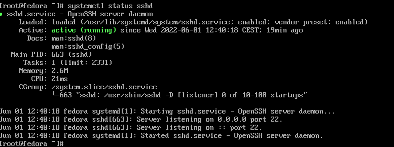
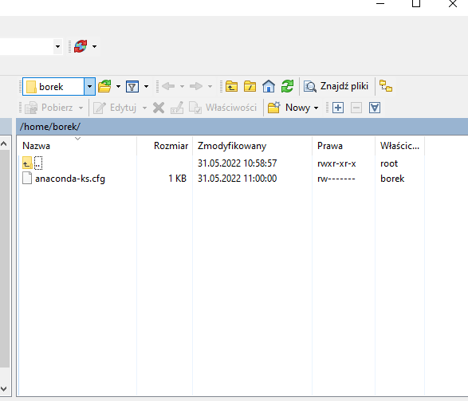
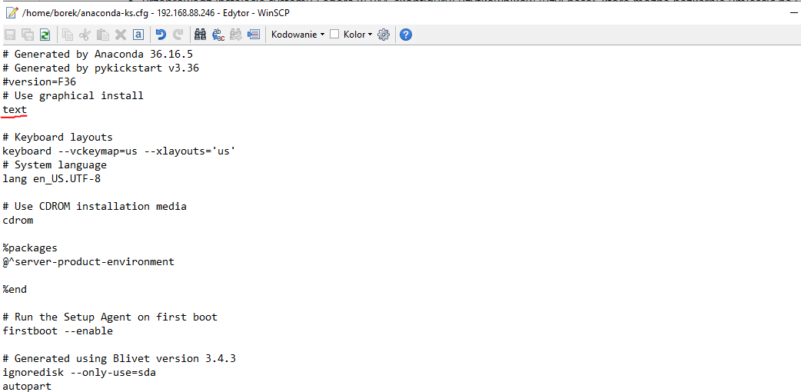
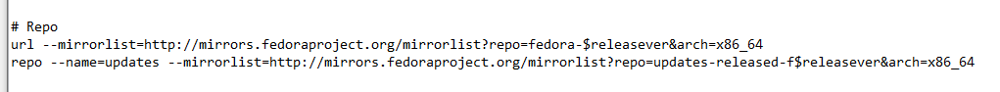
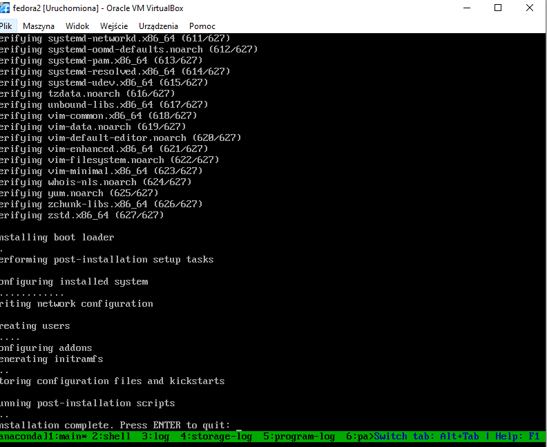

# Zajêcia 09
### 2022-05-04 -- 2022-05-06
---
# Przygotowanie wdro¿eñ nienadzorowanych dla platform z pe³nym OS

## Zadania do wykonania
### Przygotowanie systemu pod uruchomienie
* PrzeprowadŸ instalacjê systemu Fedora w VM, skonfiguruj u¿ytkowników (u¿yj hase³, które mo¿na bezkarnie umieœciæ na GitHubie!), sieæ, wybierz podstawowy zbiór oprogramowania, optymalnie bez GUI
- 
- 
- 
Instalacja uruchomienie serwera ssh oraz przerzucenie pliku przez WINSCP do edycji
* PrzeprowadŸ drug¹ instalacjê systemu Fedora w VM - celem drugiego systemu bêdzie wy³¹cznie serwowanie repozytorium przez HTTP
- 
- 
Pobranie pliku oraz zedytowanie go aby przeprowadza³ instalacjê tekstow¹ z odpowiedniego repo
- 
- 
W trakcie instalacji potrzebne by³o wciœniêcie ESC i wpisanie komendy: linux inst.ks=https://raw.githubusercontent.com/InzynieriaOprogramowaniaAGH/MDO2022_S/PK400223/ITE/GCL04/PK400223/Lab09/ksfile.ks
aby instalacja z pliku z serwera http siê uda³a

