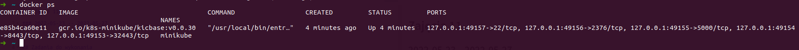
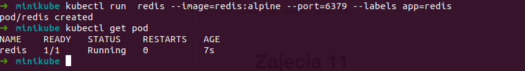
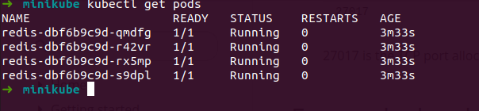
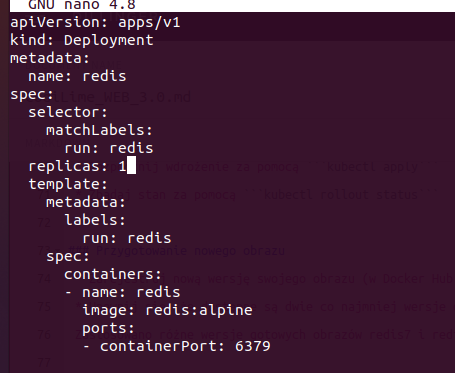
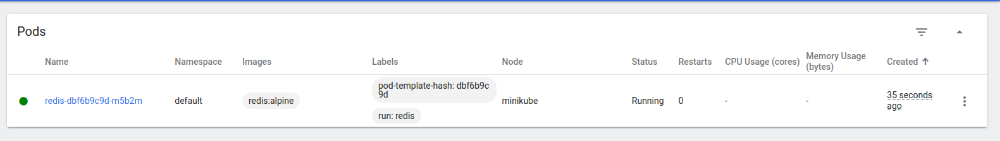
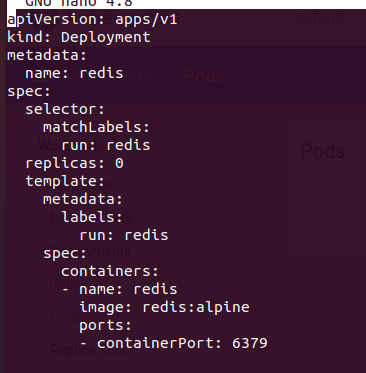
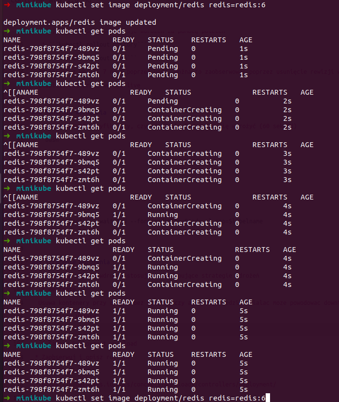
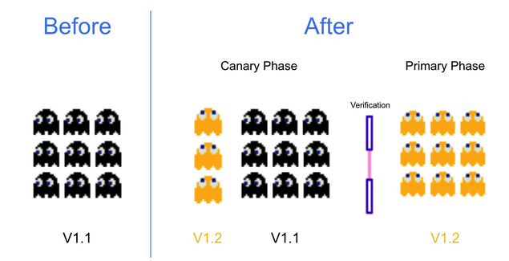

# Zajęcia 11
### 2022-05-23 -- 2022-05-27

## Zadania do wykonania
### Instalacja klastra Kubernetes
 * Zaopatrz się w implementację stosu k8s: minikube
 * https://minikube.sigs.k8s.io/docs/start/
 * Przeprowadź instalację, wykaż poziom bezpieczeństwa instalacji
 * zaopatrz się w polecenie kubectl
```bash 
alias kubectl="minikube kubectl --"
```
 * Uruchom Kubernetes, pokaż działający kontener/worker
 
 
 * Zmityguj problemy wynikające z wymagań sprzętowych lub odnieś się do nich (względem dokumentacji)
 Brak problemów mam dobrego laptopa :)
 * Uruchom Dashboard, otwórz w przeglądarce, przedstaw łączność
  
  
 * Zapoznaj się z koncepcjami funkcji wyprowadzanych przez kubernetesa (pod, deployment itp)

### Uruchamianie oprogramowania
 * Uruchom kontener na stosie k8s
 ```bash
  kubectl run  redis --image=redis:alpine --port=6379 --labels app=redis
 ```
 label został dodany celem pozniejszego uzywania go do ReplicaSetow
  
  
 * Kontener uruchomiony w minikubie zostanie automatycznie ubrany w pod.
 * ```minikube kubectl run -- <nazwa-wdrożenia> --image=<obraz-docker> --port=<wyprowadzany port> --labels app=<nazwa-wdrożenia>```
 * Przedstaw że pod działa (via Dashboard oraz kubectl)
  
  
 * Wyprowadź port celem dotarcia do eksponowanej funkcjonalności
 * ```kubectl port-forward <nazwa-wdrożenia> <LO_PORT>:<PODMAIN_CNTNR_PORT> ```
 * Przedstaw komunikację z eskponowaną funkcjonalnością
 
 
 
 

 
### Przekucie wdrożenia manualnego w plik wdrożenia (wprowadzenie)
 * Zapisanie wdrożenia jako plik YML
 * Dodanie replik
```bash
apiVersion: apps/v1
kind: Deployment
metadata:
  name: redis
spec:
  selector:
    matchLabels:
      run: redis
  replicas: 4
  template:
    metadata:
      labels:
        run: redis
    spec:
      containers:
      - name: redis
        image: redis:alpine
        ports:
        - containerPort: 6379
```
-------------------------------------------------------------
# Zajęcia 12
### 2022-05-30 -- 2022-06-03

# Wdrażanie na zarządzalne kontenery: Kubernetes (2)
### Konwersja wdrożenia ręcznego na wdrożenie deklaratywne YAML
 * Upewnij się, że posiadasz wdrożenie z poprzednich zajęć zapisane jako plik
 Plik podany powyżej w ostatnim punkcie z poprzedniego sprawozdania
 * Wzbogać swój obraz o 4 repliki
 

 * Rozpocznij wdrożenie za pomocą ```kubectl apply```
 * Zbadaj stan za pomocą ```kubectl rollout status```


### Przygotowanie nowego obrazu
 * Zarejestruj nową wersję swojego obrazu (w Docker Hub lub lokalnie)
 * Upewnij się, że dostępne są dwie co najmniej wersje obrazu z wybranym programem
 Zastosowano różne wersje gotowych obrazów redis7 i redis6
  
### Zmiany w deploymencie
 * Aktualizuj plik YAML z wdrożeniem i przeprowadzaj je ponownie po zastosowaniu następujących zmian:
   * zwiększenie replik
   * zmniejszenie liczby replik do 1
   * 
 
 
   * zmniejszenie liczby replik do 0
   * 
 
 
   * Zastosowanie nowej wersji obrazu
   * Zastosowanie starszej wersji obrazu
 * Przywracaj poprzednie wersje wdrożeń za pomocą poleceń
   * ```kubectl rollout history```
   * ```kubectl rollout undo```
  Zmieniono z wersji 7 na 6 poprzez undo, można to zaobserwować poprzez usunięcie rewizji w historii ponieważ została zduplikowana przez wersje live
  
 
 

### Kontrola wdrożenia
 * Napisz skrypt weryfikujący, czy wdrożenie "zdążyło" się wdrożyć (60 sekund)
 ```bash
 !/bin/zsh

labelname=$1

sleep 60
minikube kubectl -- wait pod --for=condition=Ready -l app=$labelname
 ```
 
### Strategie wdrożenia
 * Przygotuj wersje wdrożeń stosujące następujące strategie wdrożeń
   * Recreate
  Usuwa kontenery przy update bez pewosci czy aplikacja bedzie dzialac moze powodowac downtime
  

   * Rolling Update
 Usuwa jeden reszta działa ok i kiedy wiadomo że updatowany pod jest gotowy bierze się za następny
 

   * Canary Deployment workload
 Używamy 2 różnych wersji na raz w zależności od etykiety wybranej przy update najczesciej wersja stable i canary
 



