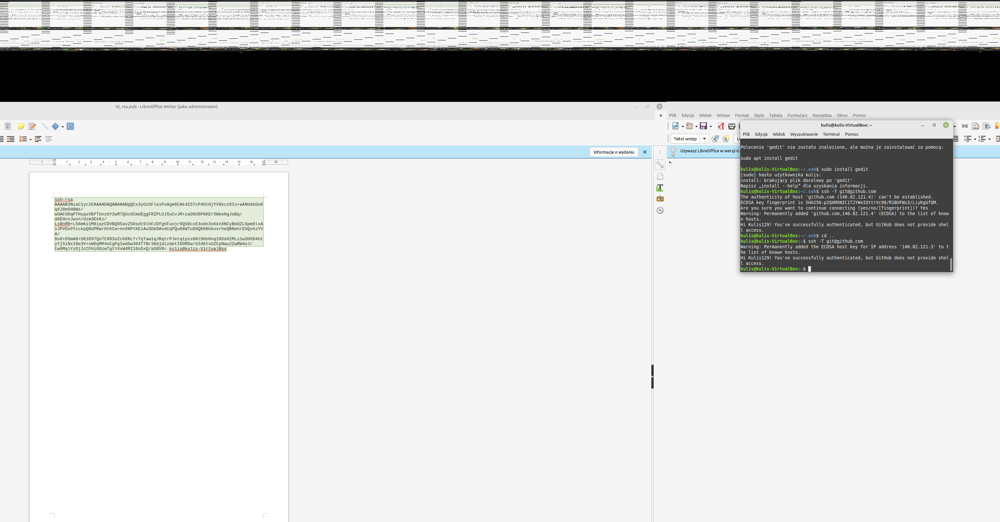

# Sprawozdanie z laboratorium 1

## Tworzenie kluczy ssh: 
1. Najpierw w folderze ~/.ssh utworzono pierwsza parę kluczy ssh:
    
        ssh-keygen -t "git@github.pl"
    bez żadnego hasła 

 

 Poniżej zamieszczam zrzut ekranu z kluczem publicznym ssh

 

 

## Pobranie repozytorium oraz stworzenie własnego brancha:

1. Pobranie repozytorium przy pomocy ssh przy uzyciu komendy:

        git clone git@github.com:InzynieriaOprogramowaniaAGH/MDO2022_S.git
    

Ponizej zrzut ekranu z terminalu pokazujący, że pobranie przy pomocy ssh działa

2. Przejście poleceniem git checkout na gałąź główną a następnie na grupową, tak aby upewnić się, że jestem wstanie wykonać polecenia git-a

3. Stworzenie własnego brancha odgałęziając branch ITE-GCL07 komendą:

        git checkout -b PK401667 origin/ITE-GCL04

4. Następnie przejscie do folder ITE/GCL04 i utworzenie w nim własnego folderu komendą:

        mkdir PK401667
5. W folderz PK401667 otworzono folder lab1 i w nim umieszono materiały do sprawozdania

6. Następnie dodano zmiany oraz zcommitowano je poleceniami:

        git add ../
        git commit -m "Initial commit"

7. Na koniec push'nieto repo na własnego brancha poleceniem:

        git push origin HEAD

8. Po wykonaniu pierwszego push'u przystąpiono do wykonania sprawozdania.

 

9. Merge z gałezią grupy. Do wykonania niego wystarczyło się przełączyć na galąź grupy a potem użyć polecenia:

        git merge PK401667
        
 

 

Niesty nie udało się wykonać innych zrzutów ekranu ponieważ system odmówił współpracy i wirtualna maszyna przestałą działać

## Wnioski:

1. Git wydaje się być pomocnym nażędzieme, jednak wymaga on dużej ilości pracy aby się z nim połączyć tak aby działał w 100%.
2. Linux Mint nie nadaje się do pracy ponieważ wyżuca dużo błędów i jest podatny na przestawanie działać trwale.
