# Sprawozdanie Lab 01

Sławomir Kotula

IT, DevOps, grupa lab 4

Data: 13.03.2022

# Instalacja Git
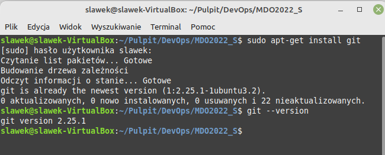

# Instalacja SSH
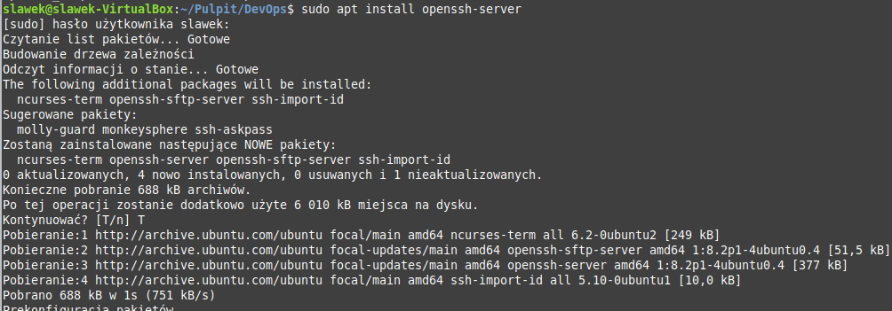

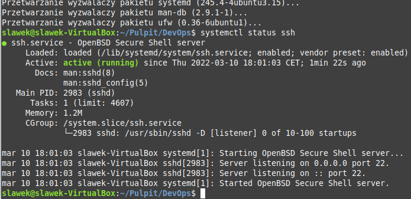

# Sklonowanie repozytorium git clone przez HTTPS
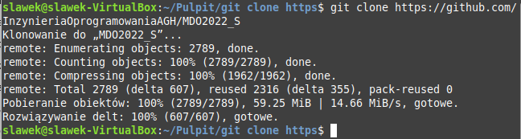

# Generacja kluczy SSH

# Dodanie klucza publicznego do github
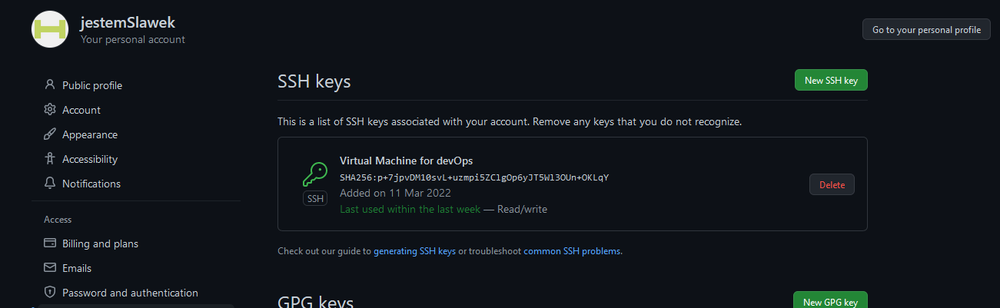

# Sklonowanie repozytorium git clone przez SSH
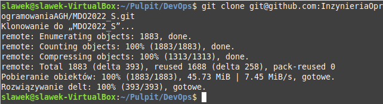

# Przełączenie na gałąź grupy
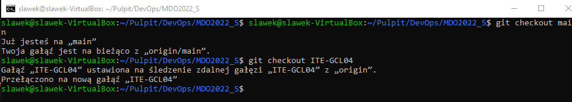

# Stworzenie własnej gałęzi
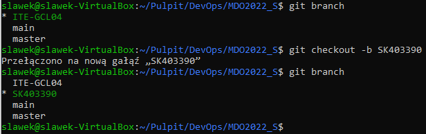

# Utworzenie katalogów i pliku ze sprawozdaniem
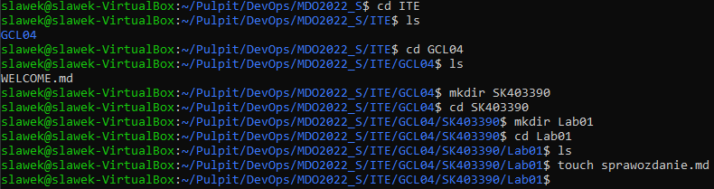

# Wysłanie sprawozdania do zdalnego źródła
## Git add
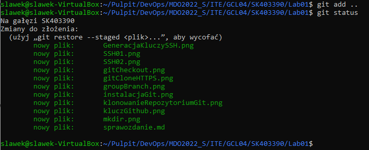
## Git commit
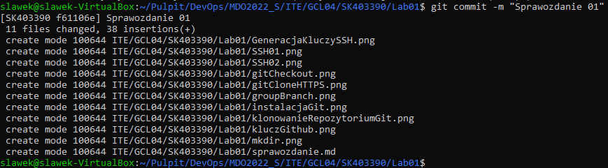
## Git push
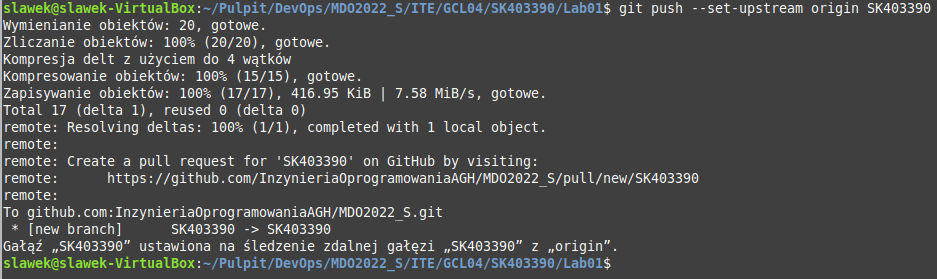