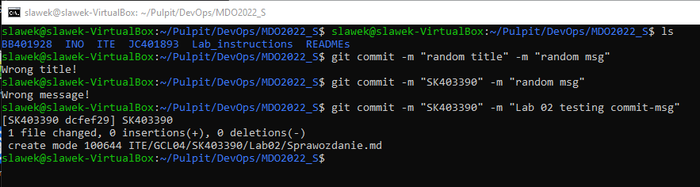
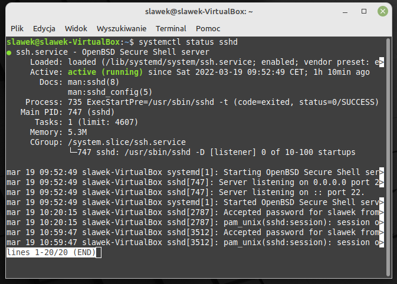
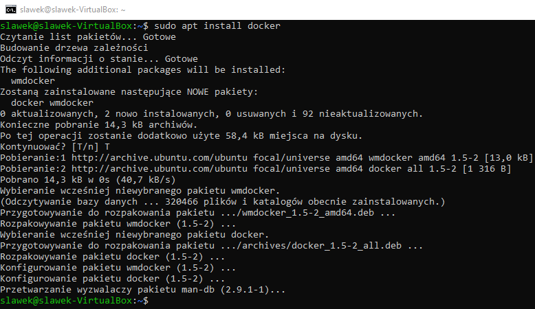
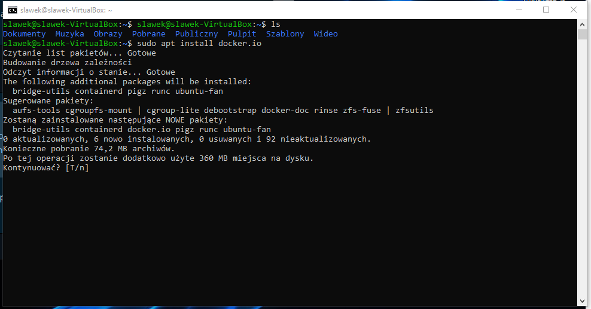
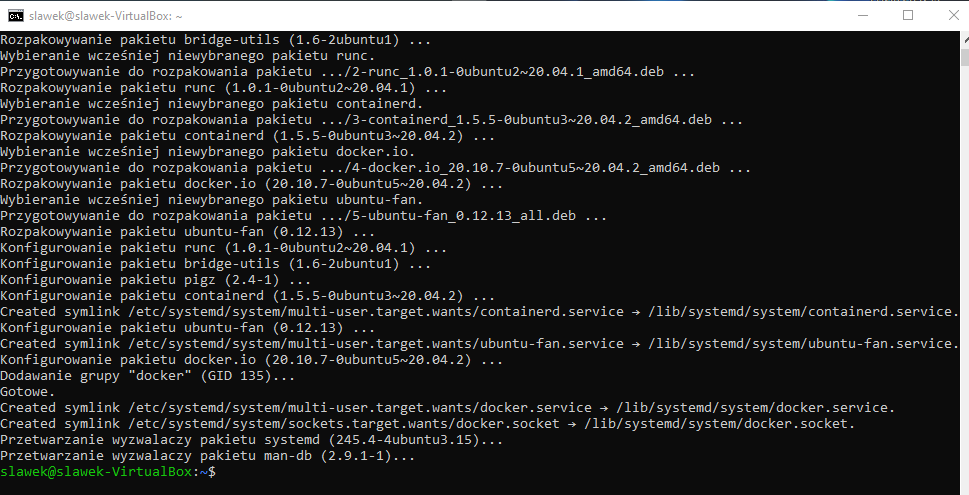
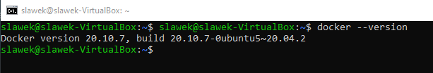
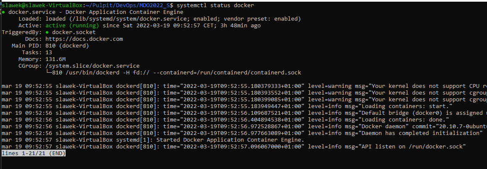
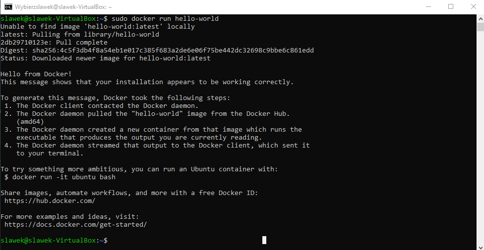
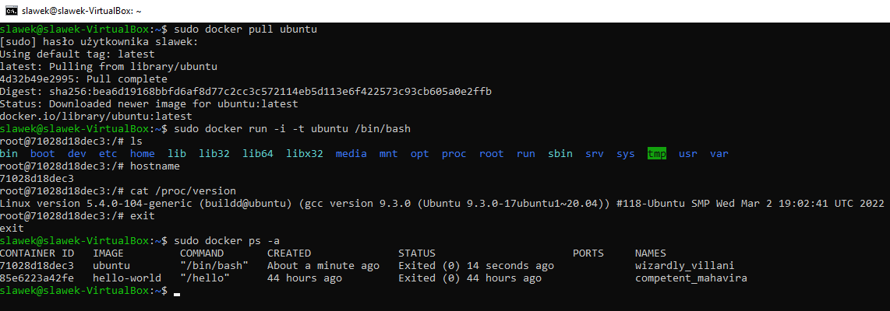
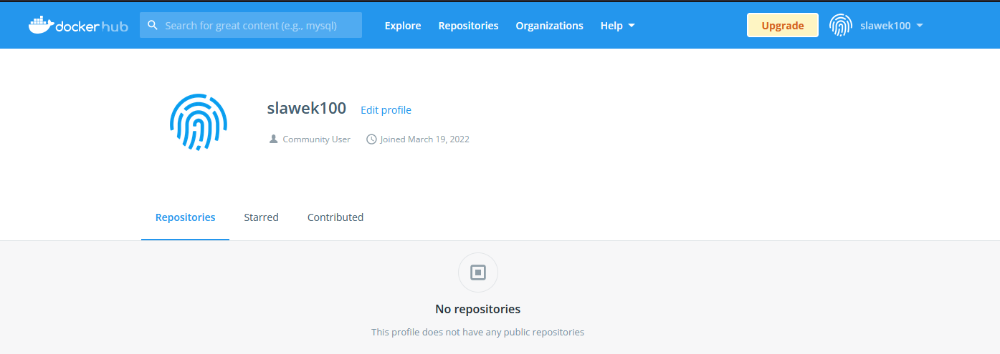

# Sprawozdanie Lab 02

Sławomir Kotula

IT, DevOps, grupa lab 4

Data: 19.03.2022

# Przygotowanie git hook
## w katalogu .git/hooks/ dodano plik commit-msg sprawdzający poprawność tytułu i wiadomości commitów
### .git/hooks/commit-msg:
    #!/bin/bash

    title=`head -n1 $1`
    if [ "$title" != "SK403390" ]; then
        echo "Wrong title!"
        exit 1
    fi

    MSG=`tail -n1 $1`
    if ! [ "$MSG" =~ "Lab 02" ]; then
        echo "Wrong message!"
        exit 1
    fi

# Efekt działania hooka:

# Serwer SSH jest zainstalowany i działa

# Podłączenie do serwera z konsoli Windows

# Zainstalowano dockera

# Docker zainstalowano poprawnie

# Status serwisu docker

# Uruchomienie przykładowego programu Hello World w dockerze

# Pobranie i uruchomienie Ubuntu

# Założono konto na dockerhub
