# Sprawozdanie Lab 03

Sławomir Kotula

IT, DevOps, grupa lab 4

Data: 28.03.2022

### Do przeprowadzenia zadania wykorzystano github testowego klienta irssi: https://github.com/irssi/irssi

# Na maszynie wirtualnej Linux Mint sklonowano repozytorium:
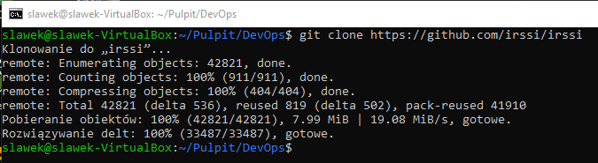

# Doinstalowanie brakujących zależności potrzebnych do zbudowania aplikacji
### Brakujące zależności znaleziono przez wpisanie polecenia meson Build i sprawdzenie czego brakowało
## zainstalowano meson:
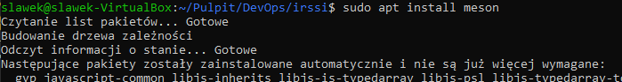
## bibliotekę glib:
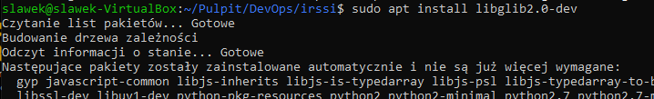
## bibliotekę utf-8proc,

## oraz bibliotekę tinfo
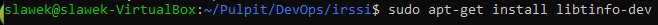

# Wywołanie polecenia meson Build
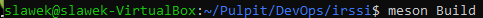

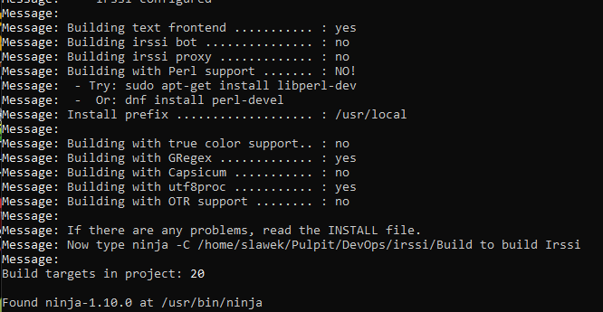
## Aplikacja jest teraz gotowa do zbudowania. Nie będzie zawierała wszystkich funkcjonalności, ale da się uruchomiić

# Zbudowanie Irssi
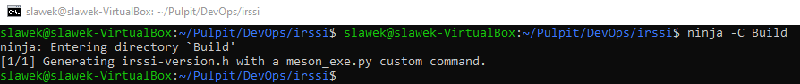
# Uruchomienie programu irssi
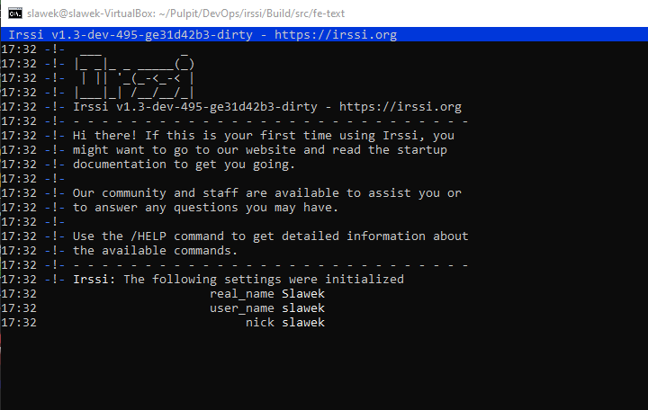
# Uruchomienie testów irssi
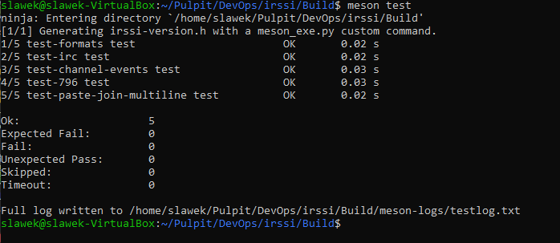
## Udało się uruchomić aplikację irssi na maszynie wirtualnej Linux Mint. Następnie powtórzono te kroki z użyciem dockera i obrazu Ubuntu

# Uruchomienie Ubuntu z bashem
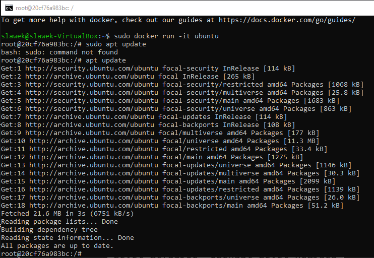

## Nowa maszyna jest nie ma gita, kompilatora gcc wymaganego do zbudowania aplikacji czy innych pakietów które trzeba doinstalować
# Instalacja gita (po wykonaniu apt update)
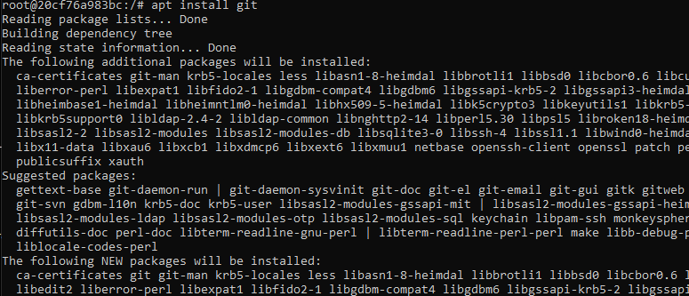

# Sklonowanie repozytorium
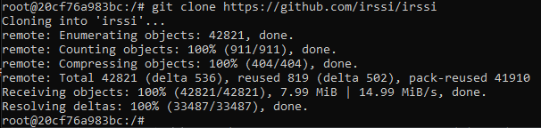

# Instalacja meson
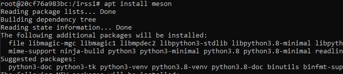

# Następnie doinstalowano następujące pakiety: gcc, glib, ssl(libssl-dev), utf8 i tinfo
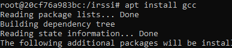
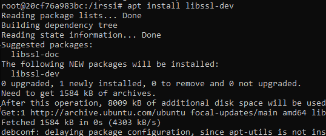

# Meson build pokazuje, że można zbudować aplikację

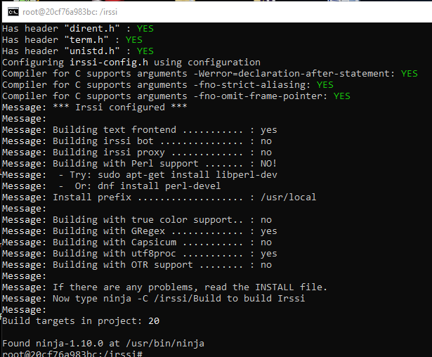

# Testy działają
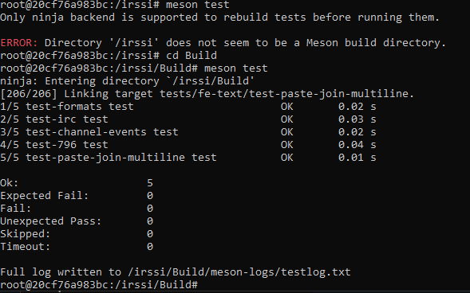

# Aplikacja daje się uruchomić
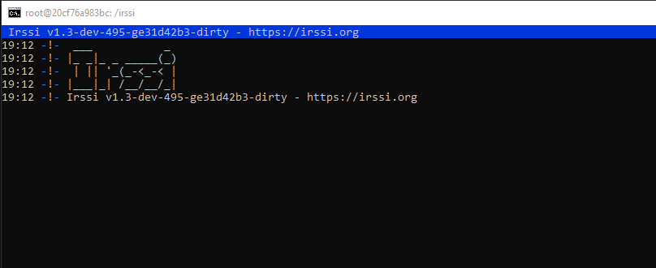

# Następnie utworzono Dockerfile który powtarza wykonane kroki i tworzy maszynę gotową do uruchomienia aplikacji
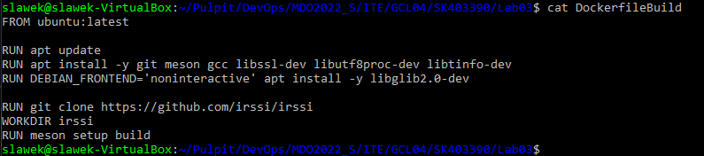

# Docker build tworzy obraz
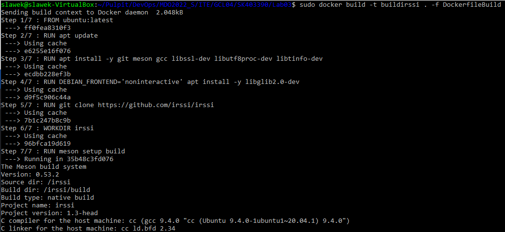
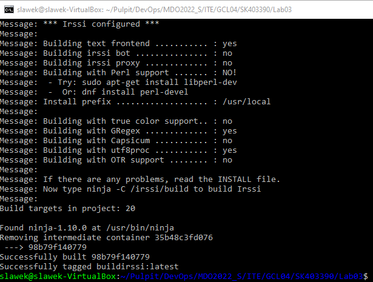

# Uruchomienie i sprawdzenie działania kontenera
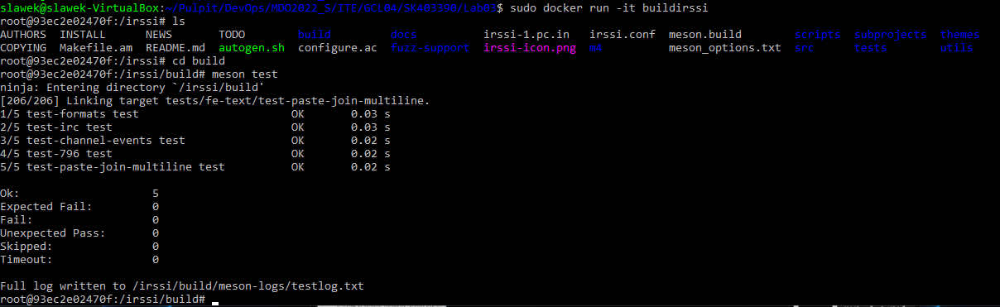

# Powtórzenie kroków dla drugiego dockerfila uruchamiającego testy
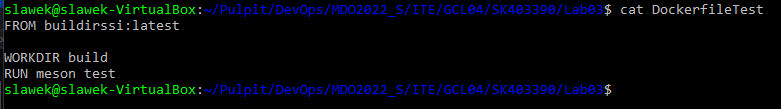
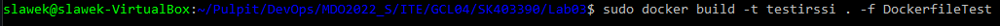
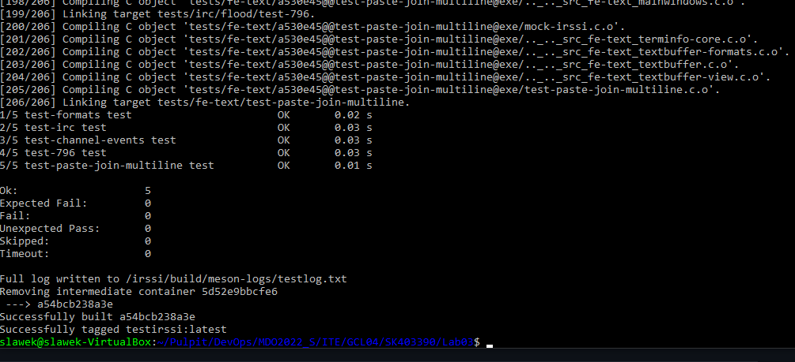

# Po stworzeniu obrazu z dockerfile można stworzyć kontener i w bashu ją uruchomić
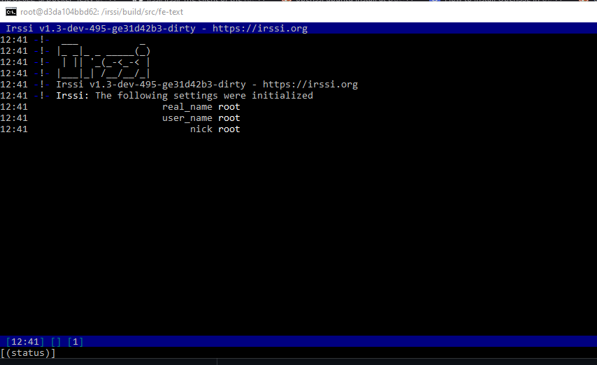

# Docker images
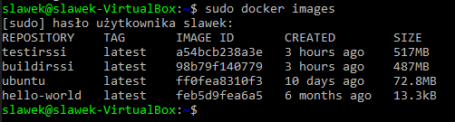

# Docker ps
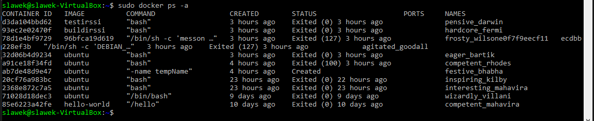