# Sprawozdanie Lab 03

Sławomir Kotula

IT, DevOps, grupa lab 4

Data: 05.04.2022

# Stworzenie woluminów
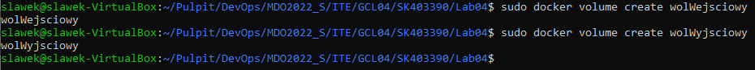

# Uruchomienie ubuntu z podpiętymi woluminami
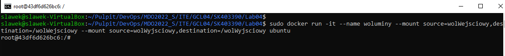

# Woluminy są widoczne w systemie plików
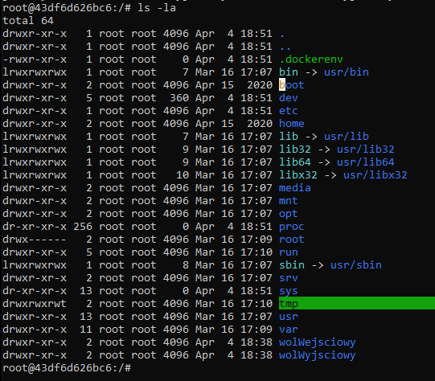

# Instalacja wymaganych zależności bez gita
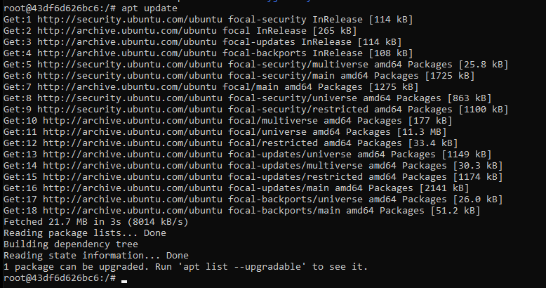
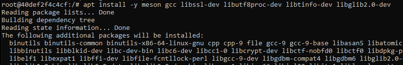

- Sklonuj repozytorium na wolumin wejściowy
# Sprawdzenie lokacji woluminu
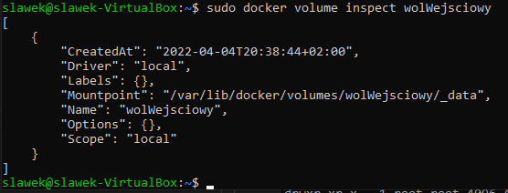

# Odmowa wejścia do katalogu z kontenerem
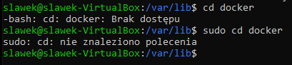

## Po zalogowaniu na roota można wejść do folderu
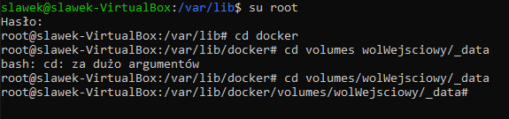

# sklonowanie repozytorium
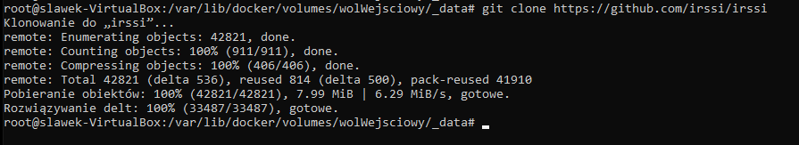

# irssi jest teraz widoczne na dockerze
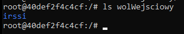

# Skopiowanie irssi z woluminu na kontener
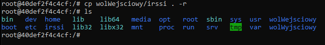

# Zbudowanie projektu
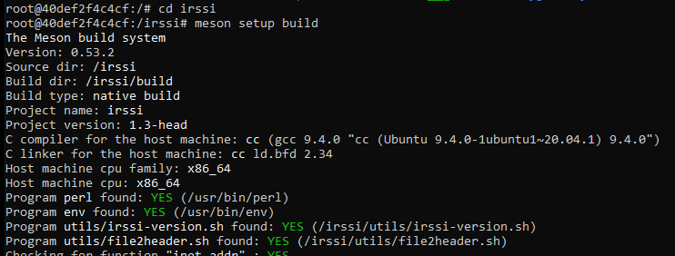
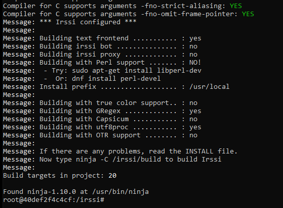

# Skopiowanie zbudowanych plików do woluminu wyjściowego
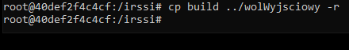

# Pliki są widoczne na maszynie wirtualnej
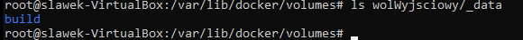

# Uruchomienie kontenera z przekierowaniem portów
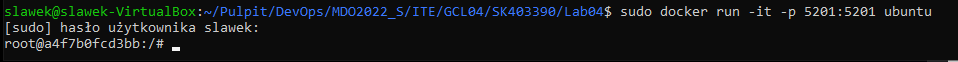

# Sprawdzenie ip kontenera
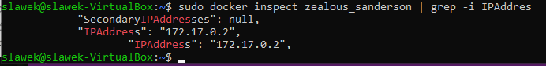

# Instalacja i uruchomienie iperf3 w konenerze
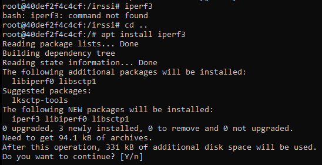
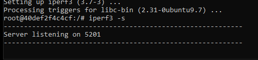

## Utworzono nowy kontener, zainstalowano na nim iperf3. Następnie uruchomiono klienta i połączono się z drugim kontenerem
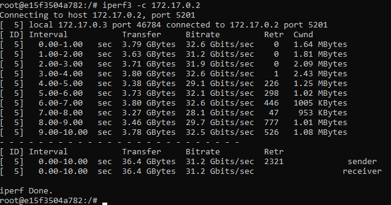

# Połączenie z hosta
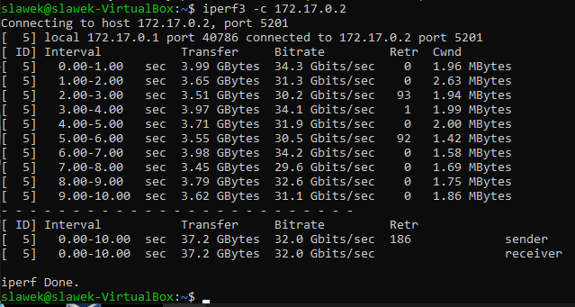

# Połączenie z poza hosta(Windows)
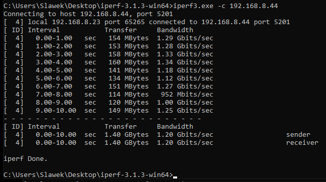

# Logi po stronie serwera
## Od góry: Windows, inny kontener, Host
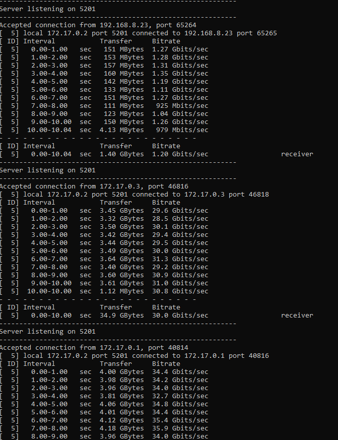

# Po zamknięciu kontenera można sprawdzić jego zmiany w logach
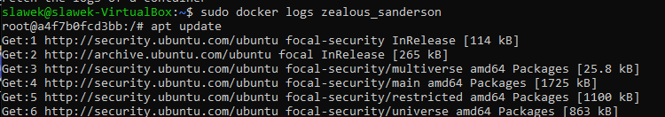

- Instalacja Jenkinsa

# Utworzenie sieci jenkins w dockerze
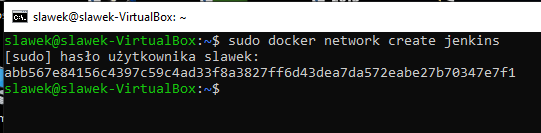

# Utworzenie kontenera z dockerem
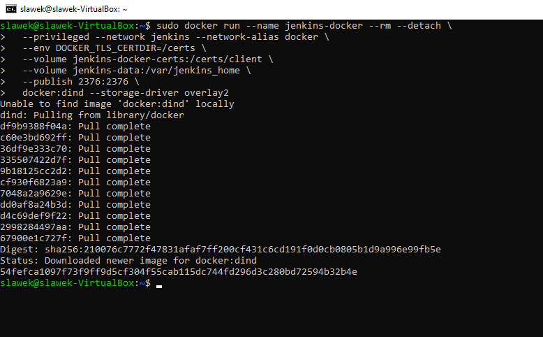

# Stworzenie Dockerfile
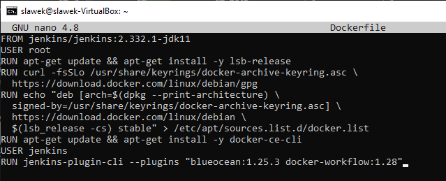

# Zbudowanie obrazu
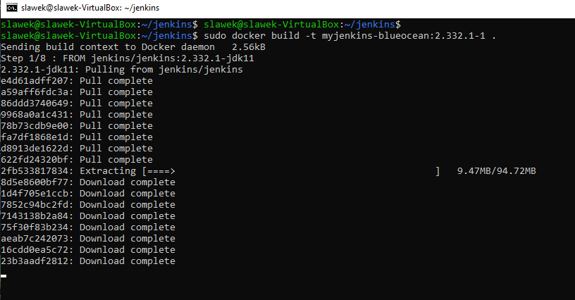

# Utworzenie kontenera z jetkinsem
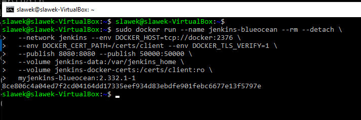

# Mam teraz dostęp do strony jetkinsa
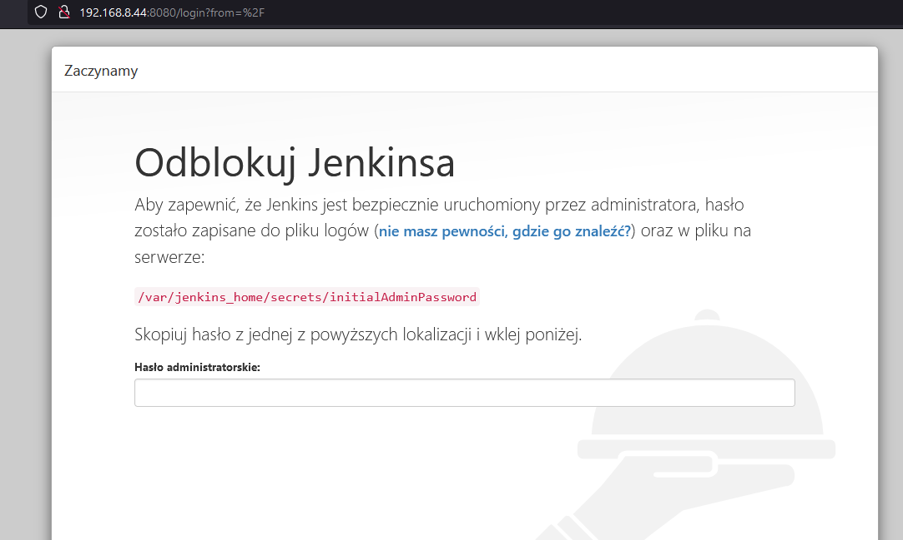

# W logach dockera znajduje się hasło
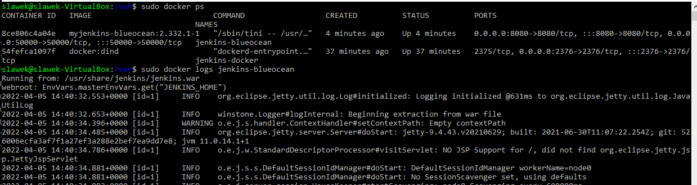
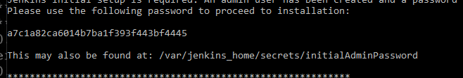

# Jenkins został zainstalowany
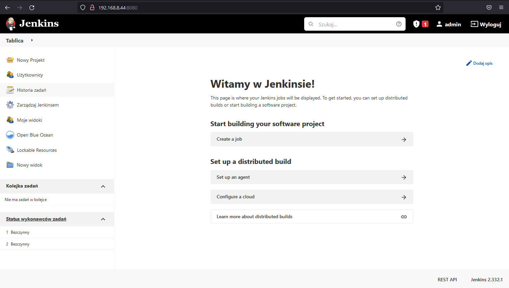