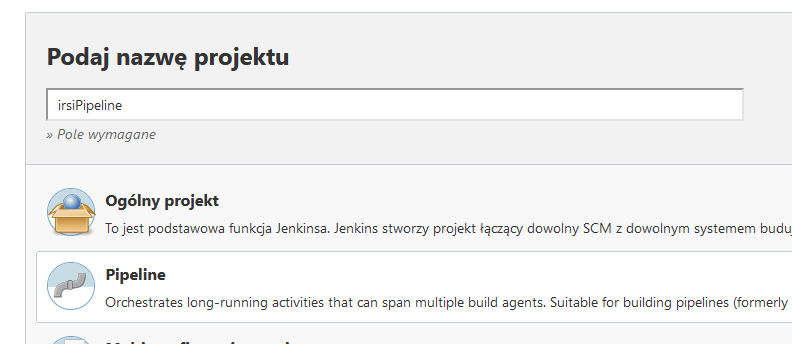
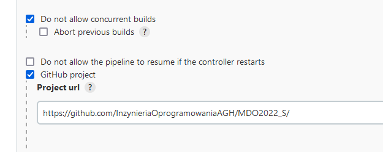
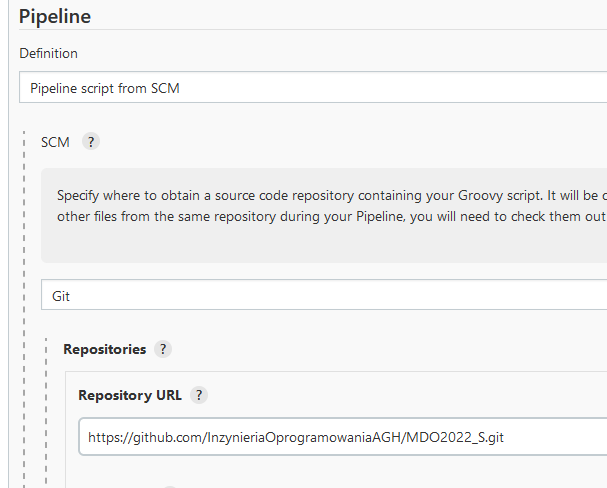
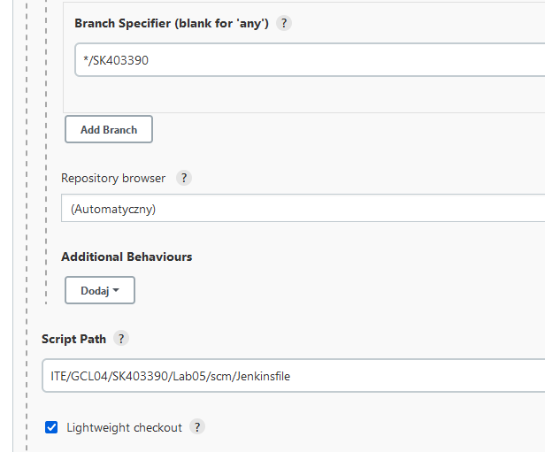
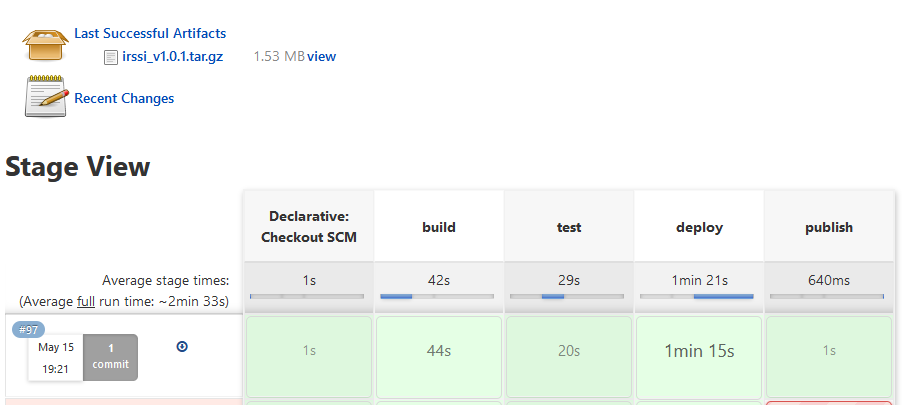
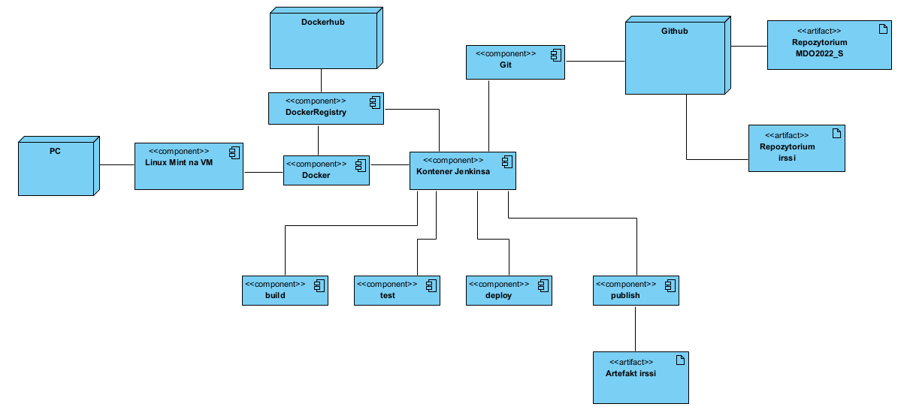
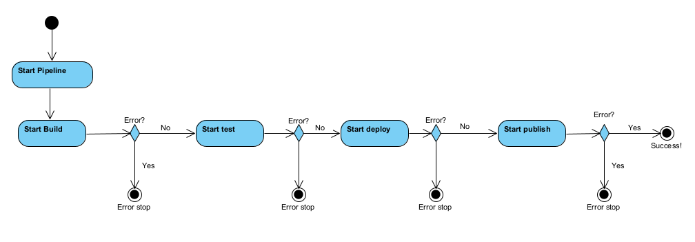

# Sprawozdanie Lab 05

Sławomir Kotula

IT, DevOps, grupa lab 4

Data: 15.05.2022

# Cel projektu
Celem projektu jest stworzenie pipeline, serii kroków wykonywanych po dostarczeniu kodu programu, celem których jest zbudowanie danego programu, przeprowadzeniu automatycznych testów oraz przygotowanie oprogramowania do wydanie na rynek lub do klienta.

# Streszczenie projektu
Do stworzenia pipelina wykorzystano Jenkinsa. Na maszynie wirtualnej z systemem Linux Mint stworzono 2 kontenery: jenkins-docker eksponujący port 2376 oraz jenkins-blueocean eksponujący porty 8080 i 50000 pozwalające na komunikację z kontenerami - obsługę pipeline. Wybranym przeze mnie oprogramowaniem jest aplikacja irssi - komunikator tekstowy.

### pipeline przeprowadza następujące kroki:
- Pobiera z repozytorium na githubie plik Jenkinsfile zawierający instrukcje do wykonania
- Tworzy nowy kontener do którego kopiuje kod irssi
- Na podstawie kodu buduje aplikacje irssi
- Przeprowadza testy
- Kopiuje zbudowaną aplikację i uruchamia ją na nowym, pustym systemie
- Udostępnia zbudowaną aplikację jako artefakt pipeline

# Przygotowanie pipeline
Serwis Jenkins uruchomiony został w kontererze na maszynie wirtualnej Linux Mint. Sposób uruchomienia Jenkinsa w dockerze została opisana w sprawozdaniu z labolatorium 04.

### Tworzenie nowego pipeline


### Zablokowano możliwość uruchomienia wielu buildów w tym samym czasie i dodano projekt na githubie


### Plik Jenkinsfile, przechowujący polecenia pipeline znajduje się na repozytorium na githubie. Skonfigurowano pipeline tak, aby pobierał plik i wykonywał kod automatycznie. Wpisano adres projektu, gałąź na której znajduje się Jenkinsfile(SK403390) oraz ścieżka do pliku: ITE/GCL04/SK403390/Lab05/scm/.



# Etapy pipeline
Plik Jenkinsfile podzielony jest na kilka etapów(stages), wykonywanych jeden po drugim. Są to:
## 1. build
- Cel: Zbudowanie na podstawie kodu z githuba aplikacji irssi
- Kod:
```
stage('build') {
    steps {
        sh 'docker kill tempContainer || true'
        sleep 1
        sh 'docker build -t buildirssi . -f ITE/GCL04/SK403390/Lab05/DockerfileBuild'
        sh 'docker run --name tempContainer -dit --rm buildirssi'
        sh 'rm -r fe-text || true'
        sh 'rm -r irssi || true'
        sh 'docker container exec tempContainer ls'
        sh 'docker container exec tempContainer ls ..'
        sh 'docker container exec tempContainer ls build/src/fe-text'
        sh 'docker cp tempContainer:irssi/build/src/fe-text .'
        sh 'docker cp tempContainer:irssi .'
        sh 'docker kill tempContainer'
        sh 'ls irssi/build/src/fe-text'
    }
}
```
- Opis kodu: Jenkinsfile tworzy obraz buildirssi na podstawie pliku DockerfileBuild. DockerfileBuild zawiera instrukcje, które na nowopobranej maszynie ubuntu instalują gita oraz zależności niezbędne do zbudowania irssi. Następnie kod irssi jest pobierany z repozytorium i uruchomione zostają polecenia budujące aplikację. Po udanym stworzeniu obrazu zostaje na jego podstawie uruchomiony kontener i za pomocą polecenia docker cp skopiowany zostaje folder fe-text zawierający plik wykonywalny irssi.
- DockerfileBuild:
``` Dockerfile
FROM ubuntu:latest

RUN apt-get update
RUN apt-get install -y git meson gcc libssl-dev libutf8proc-dev libtinfo-dev
RUN DEBIAN_FRONTEND='noninteractive' apt-get install -y libglib2.0-dev

RUN git clone https://github.com/irssi/irssi

WORKDIR irssi
RUN meson setup build
RUN ninja -C /irssi/build
```
### Uwagi:
- Kontener stworzony w tym kroku jest usuwany natychmiast po skopiowaniu katalogu. Jeżeli jednak nastąpi błąd i kontener nie zostanie usunięty może dojść do konfliktu nazw i w efekcie do "wysypania się" pipeline. Aby temu zapobiec pierwsza linijka stage-a próbuje usunąć kontener. Dodanie "|| true" do docker kill powoduje że polecenie nigdy nie zwróca błędu. Polecenie sleep 1 daje czas na usunięcie kontenera.

## 2. test
- Cel: Uruchomienie testów
- Kod:
```
stage('test') {
    steps {
        sh 'docker build -t testirssi . -f ITE/GCL04/SK403390/Lab05/DockerfileTest'
        sh 'docker run testirssi'
    }
}
```
- Opis kodu: Na podstawie wcześniej stworzonego obrazu buildirssi zostaje stworzony obraz testirssi który uruchamia testy.
- DockerfileTest:
``` Dockerfile
FROM buildirssi:latest

WORKDIR build
RUN meson test
```

## 3. deploy
- Cel: Aplikacja zbudowana w kroku build jest uruchamiana na nowym kontenerze symulującym klienta.
- Kod:
```
stage('deploy') {
    steps {
        sh 'echo "Do uruchomienia programu wymagane jest zainstalowanie bibliotek libglib2.0 i libutf8proc-dev" > installationInfo'
        sh 'cat installationInfo'
        sh "docker container kill deployContainer3 || true"
        sleep 1
        sh 'docker run --rm --name deployContainer3 -dit ubuntu'
        sh 'docker cp fe-text deployContainer3:.'
        sh 'docker container exec deployContainer3 sh -c "apt-get update"'
        sh 'docker container exec deployContainer3 sh -c "DEBIAN_FRONTEND="noninteractive" apt-get install -y libglib2.0"'
        sh "docker container exec deployContainer3 sh -c 'apt-get install -y libutf8proc-dev'"
        sh 'docker container exec deployContainer3 ls -al fe-text'
        sh "docker container exec deployContainer3 sh -c './fe-text/irssi --version'"
        sh "docker container kill deployContainer3"
    }
}
```
- Opis kodu: Wcześniej zbudowana aplikacja przeniesiona zostaje na nowostworzony kontener ubuntu. Następnie zostają doinstalowane zależności bez których aplikacja się nie uruchamia - libutf8proc oraz libglib2.0. Sprawdzona zostaje wersja programu irssi - brak wyświetlenia wersji sugeruje niepoprawnie przeprowadzony deploy.
### Uwagi:
- Podobnie jak w przypadku kroku build mogą wystąpić problemy z konfliktem nazw kontenerów
- Irssi jest komunikatorem tekstowym i uruchomienie go powoduje uruchomienie okna do wpisywania poleceń, irssi nie zostanie zamknięte do momentu wpisania do niego polecenia /exit. Żeby ominąć problemy wynikające z tego faktu w kroku deploy nie uruchamiam samej aplikacji, tylko sprawdzam wersję programu, zwrócenie wersji programu bez żadnych błędów sugeruje, że irssi zostało zainstalowane poprawnie.

## 3. publish
- Cel: Publiczne udostępnienie aplikacji w miejscu z którego klient może ją odebrać.
- Kod:
```
stage('publish') {
    when {
        expression {
            return params.promote == true;
        }
    }
    steps {
        sh 'cp installationInfo fe-text'
        echo params.version
        sh "tar -zcf irssi_v${params.version}.tar.gz fe-text"
        archiveArtifacts artifacts: "irssi_v${params.version}.tar.gz"
    }
}
```
- Opis kodu: Skopiowany wcześniej plik irssi, po przejściu kroków test i deploy nadaje się na udostępnienie klientowi. Aplikacja zostaje dostarczona jako artefakt i klient ma możliwość odwiedzenia strony i pobrania nowej wersji programu. Do pipeline dodano 2 parametry: checkbox promote i text-field version. Przy uruchomieniu pipeline można wybrać czy artefakt ma zostać stworzony i można nadać mu numer. Plik installationInfo oraz irssi zostają spakowane razem i umieszczone jako artefakt.

### Uwagi:
- Użycie złego rodzaju cudzysłowiów w komendzie sh "tar..." powoduje godzinę szukania błędów

### Poprawnie uruchomiony pipeline ze zwróconym plikiem który można pobrać


Diagram aktywności:


Diagram wdrożenia:
