# Sprawozdanie Lab 03

Sławomir Kotula

IT, DevOps, grupa lab 4

Data: 11.05.2022

# Przeprowadź instalację systemu Fedora w VM...
### Przygotowano maszynę wirtualną, przydzielono jej 24GB miejsca na dysku. Wybrano język instalacji angielski, polski układ klawiatury, przeprowadzono manualne partycjonowanie, w sekcji software selection wybrano "minimal install", stworzono konto roota i użytkownika bez uprawnień administracyjnych - deployer:

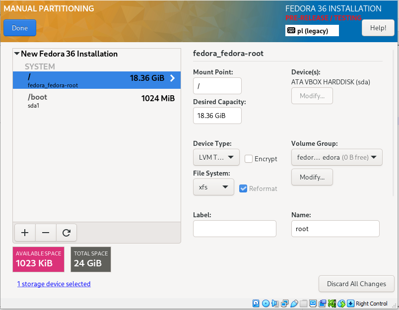

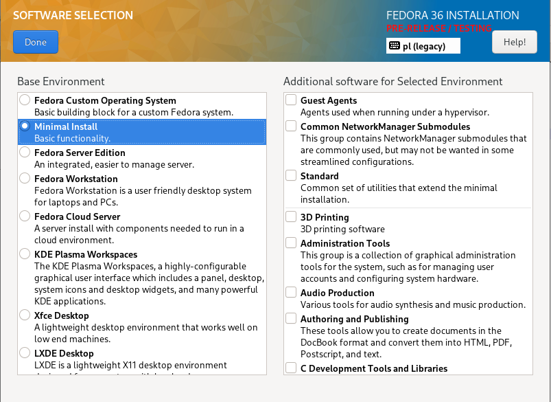

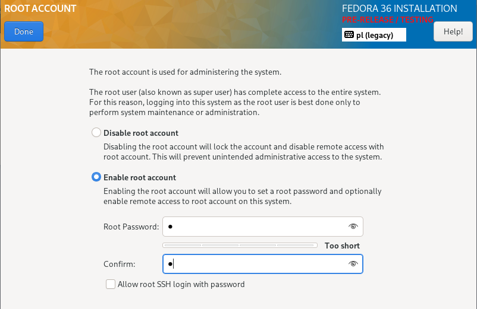

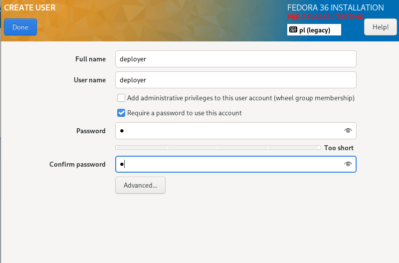

Uruchomiono instalację
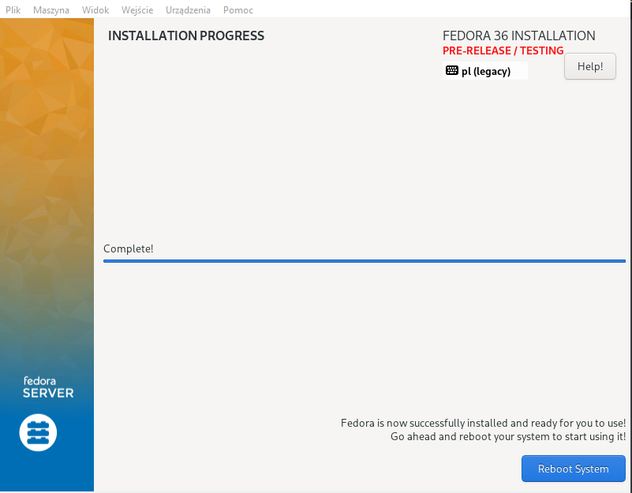

### Instalacja została przeprowadzona pomyślnie, w jej wyniku stworzony został plik <i>anaconda-ks.cfg</i>, zawierający informację dla instalatora automatycznego - pozwoli na powtórzenie procesu instalacji bez wpisywania danych ręcznie
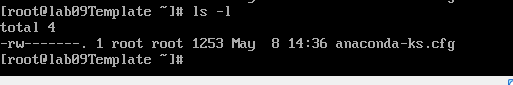

# Przeprowadź drugą instalację systemu Fedora w VM z serwerem HTPP
### Druga maszyna będzie służyła jako serwer plików http, z której pobrany zostanie plik irssi.
### Na nowej maszynie przeprowadzono instalację serwisu httpd: Zaktualizowano listę pakietów
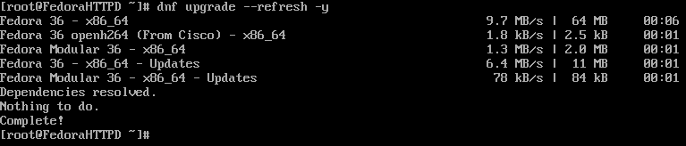

### Zainstalowano httpd
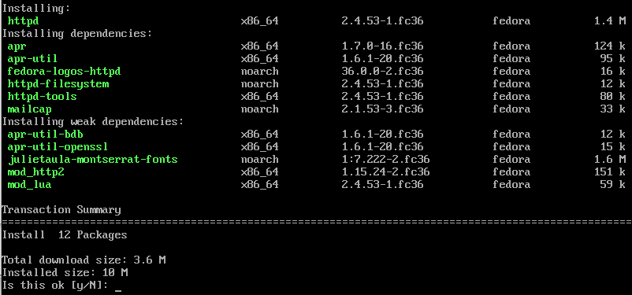

### Uruchomiono httpd
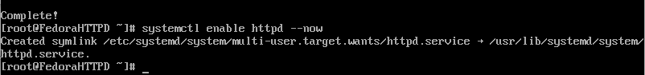
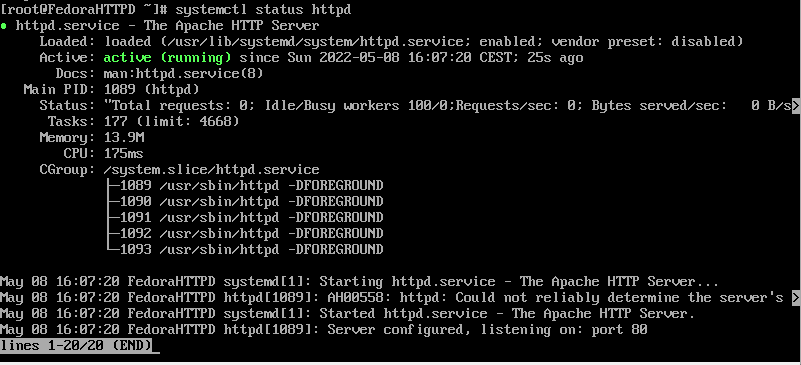

### Dodano wyjątki do zapory
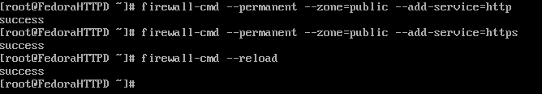

### W folderze /var/www/html/ stworzono folder shares do którego skopiowano plik irssi. Teraz można połączyć się z serwerem i pobrać z niego pliki
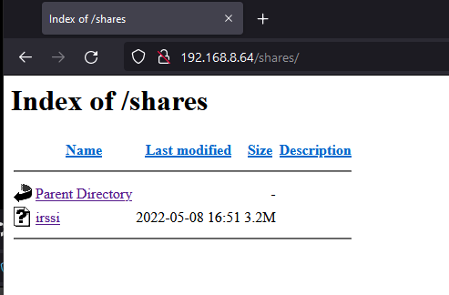

### Na pierwszej fedorze zainstalowano wget

### Pobrano irssi z serwera. Po pobraniu zmieniono uprawnienia do pliku aby właściciel mógł go uruchomić. Brakuje zależności
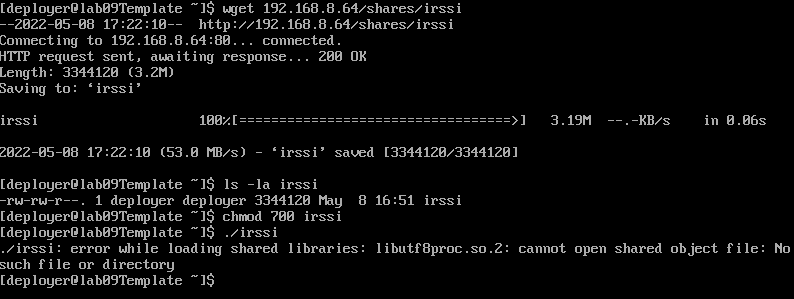

### Po zainstalowaniu libutf8 irssi daje się uruchomić
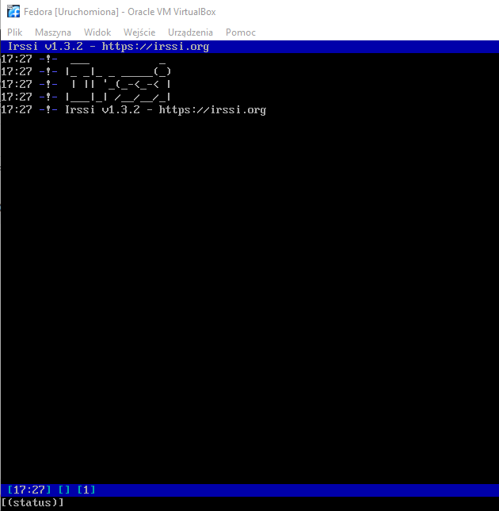

# Instalacja nienadzorowana
### Plik <i>anaconda-ks.cfg</i> będzie musiał zostać edytowany i wysłany na github. W tym celu połączono się z Fedorą przez sftp przez Filezillę. Użytkownik deployer nie ma uprawnień do pliku anaconda, więc wymagane było skopiowanie pliku do do jego katalogu domowego i zmiana właściciela pliku za pomocą polecenia chown
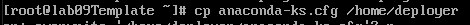

## Wprowadzono zmiany do pliku:
### Zmieniono typ instalacji na tekstowy, 
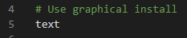

### Wprowadzono informacje o repozytorium
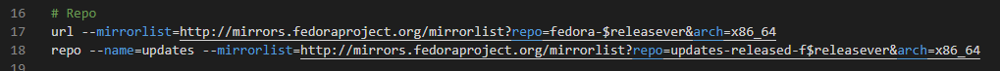

### Dodano wymagane zależności: wget do pobrania irssi, uft8proc do uruchomienia programu
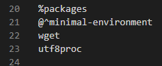

### Dodano sekcję post do której wstawiono polecenia pobierające irssi
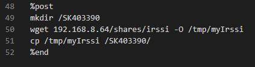

### Stworzono nową maszynę, przypięto do niej płytkę z fedorą i uruchomiono instalację nienadzorowaną
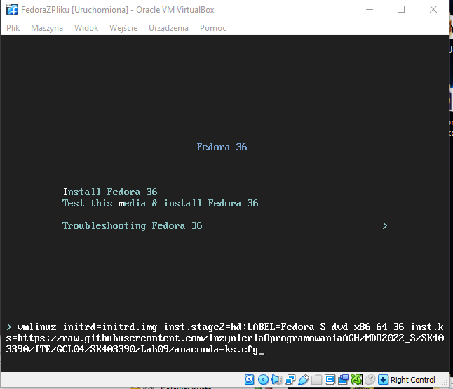
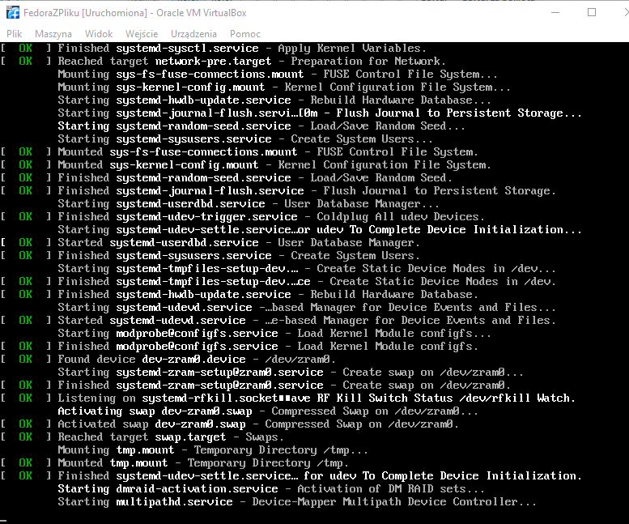
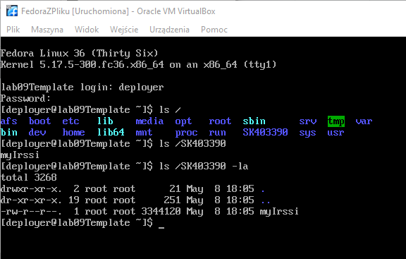

### Po zmienieniu uprawnień do pliku irssi się uruchamia
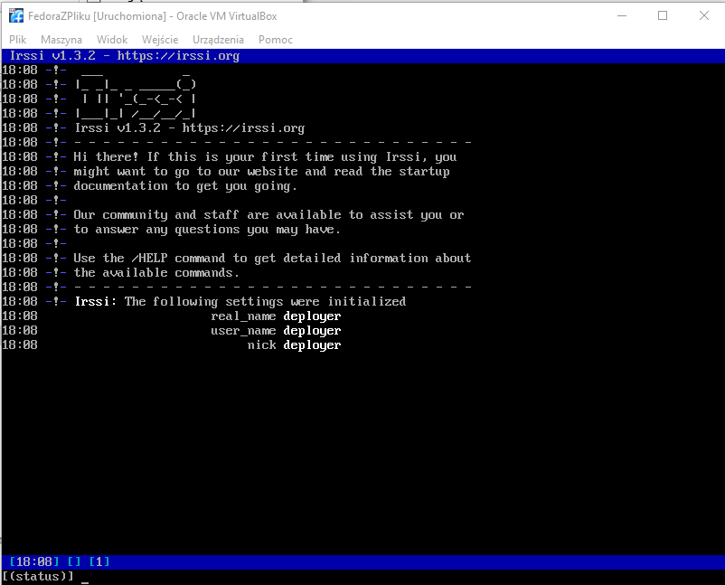
