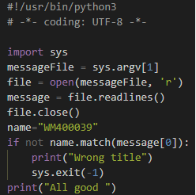
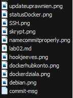
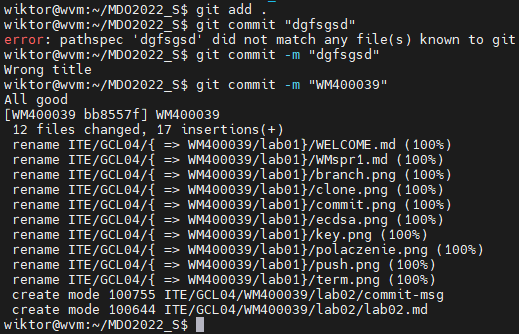
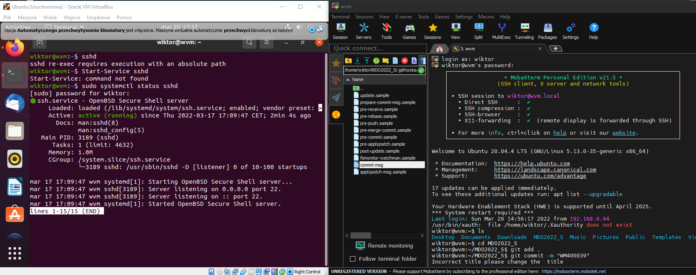
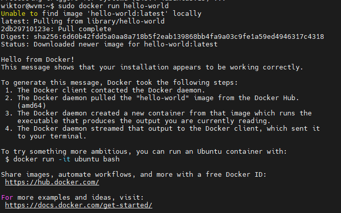
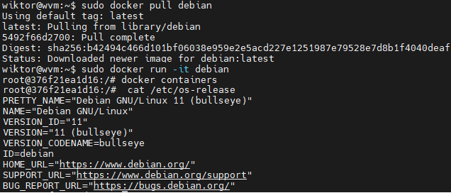
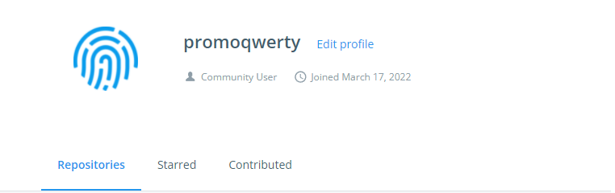

# Lab02 
## Napisałem odpowiedni skrypt Pythonowy, który weryfikuje, czy message commita zawiera inicjały i numer indeksu. Hook umieściłem w commitowanym folderze
 
## Zweryfikowałem działanie skryptu na screenie poniżej

## Połączyłem się z maszynową wirtualną poprzez protokół SSH. Wykorzystałem ustawienie mostkowanej karty sieciowej.

## Przystąpiłem do setupowania dockera. Uruchomiłem dla testu obraz 'hello-world'

## Sprawdziłem także status dockera

## Żeby zweryfikować działanie dockera z własności, pobrałem debiana, uruchomiłem go i wyświetliłem jego numer wersji

## Na koniec stworzyłem konto na dockerhubie
