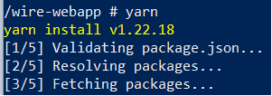
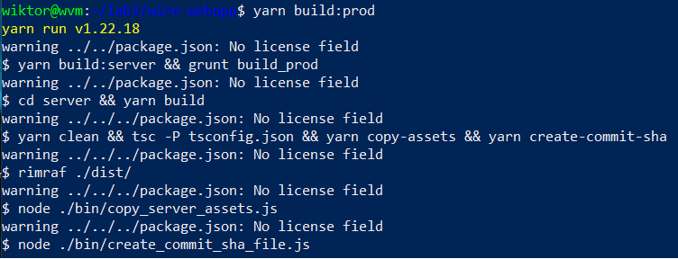
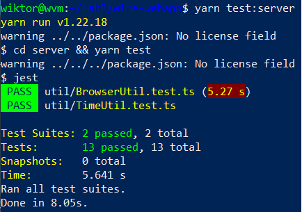
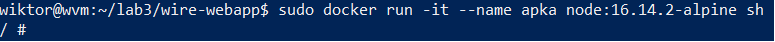
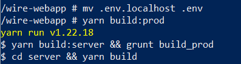
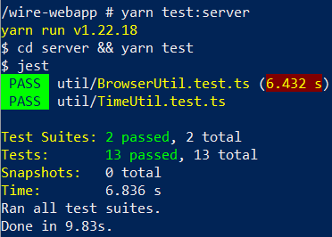
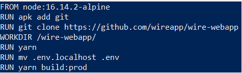
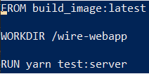
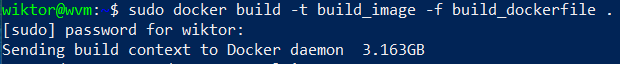
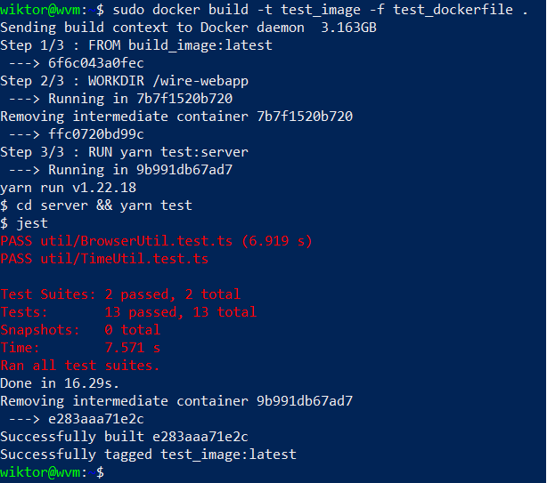

# Lab03

## W ramach laboratorium zdecydowałem się na wykorzystanie komunikatora Wire.
## https://github.com/wireapp/wire-webapp
## Doinstalowałem wymagane zależności (menedżer projektu yarn) 

## Zbudowałem aplikację zgodnie z instrukcją zamieszczoną w repozytorium projektu

## Uruchomiłem testy, żeby zweryfikować poprawność działania aplikacji

## Uruchomiłem kontener na bazie obrazu node:16.14.2-alpine w trybie interaktywnym

## Zbudowałem aplikację w kontenerze, wcześniej instalując yarna i jego zależności

## Testy

## Po weryfikacji poprawnego działania aplikacji stworzyłem dwa dockerfile
## Build Dockerfile
  
## Test Dockerfile
  
## Mając już gotowe te pliki utworzyłem nowy obraz korzystający z dockerfila na bazie poprzedniego obrazu

## Analogicznie z testowym imagem, z taką różnicą, że do budowania testowego obrazu wykorzystałem obraz do budowania (widać to w dockerfilu)

       
## <b> Problemy i porażki </b>
## W ramach laboratorium poświęciłem kilka godzin na poszukiwanie działającej 
## na kontenerze i posiadającej unit testy apki. Krótka lista sprawdzonych repozytoriów:
##  
## https://github.com/microsoft/PowerBI-JavaScript
## https://github.com/airsquared/blobsaver
## https://github.com/bootique/bootique
## https://github.com/ThrowTheSwitch/Unity
## https://github.com/ThrowTheSwitch/Unity
## https://github.com/jsbin/jsbin
## 
##   <b>Przykładowe problemy z wyżej wymienionymi aplikacjami: </b>
##  - aplikacja jest dekstopowa, co za tym idzie nie uruchomi się na dockerze; 
##  - aplikacja do testów wykorzystuje przeglądarki takie jake Chrome czy PhantomJS;  
##  pomimo usilnych prób nie udało mi się zainstalować tych przeglądarek na kontenerze;
##  - aplikacja jest leciwa, i co za tym idzie, wykorzystuje stare wersje NPMa i Noda, które
##   nie są kompatybilne z nowszymi; powoduje to problemy z instalacją i dziwne bugi; 

##     Gdy już udało znaleźć mi się odpowiednią, działającą aplikację, okazała się ona zajmować ponad 3 GB miejsca na dysku. Pomijając problem ze zmieszczeniem jej na wirtualnej maszynie, budowała się ona każdorazowo ponad pół godziny.

