# Lab04

## Part 1: volumes
Na początek utworzyłem dwa wolumeny: output i input

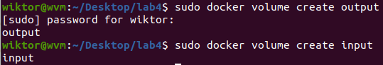

Uruchomiłem kontener wykorzystując obraz użyty w ramach poprzednich laboratoriów: Node:16.14.2-alpine, dodałem do niego też oba stworzone woluminy 
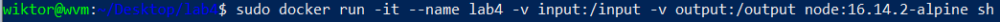
Uruchomiony kontener
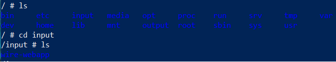  
Sprawdziłem lokalizację folderu input na moim systemie i sklonowałem w tamtym miejscu repozytorium
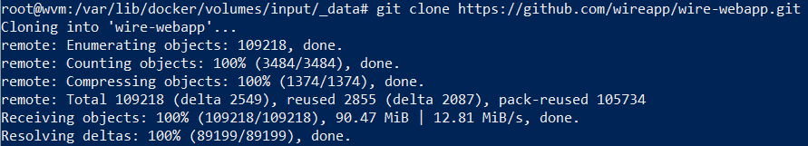
Zbudowałem aplikację znajdującą się na kontenerze w folderze input, po czym przeniosłem folder serwer, zawierące produkty buildu, przede wszystkim dist, do outputa (bez żadnego konkretnego powodu zacząłem używać zielonego koloru tła w powershellu, jednak to dalej ten sam terminal)
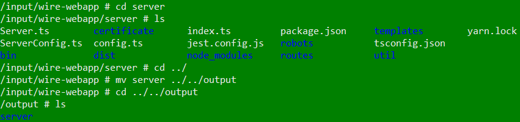

## Part 2: iperf3

Zainstalowałem iperfa na dwóch kontenerach. Jednego wykorzystałem jako serwer, drugiego jako klient

Następnie wyszedłem z kontenera, który był wcześniej klientem, i spróbowałem się połączyć bezpośrednio z systemu (maszyny wirtualnej) 

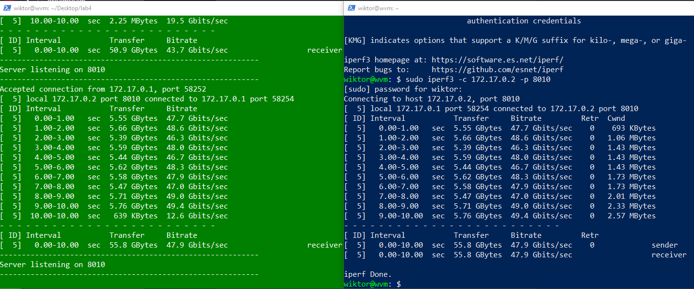

Na końcu połączyłem się z serwerem z Windowsa (w ramach innego posiedzienia, stąd też różni się wykorzystany port)
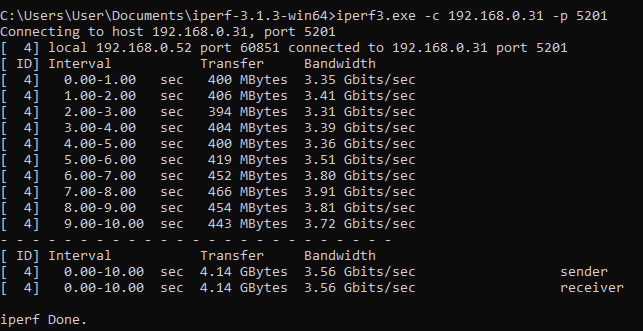
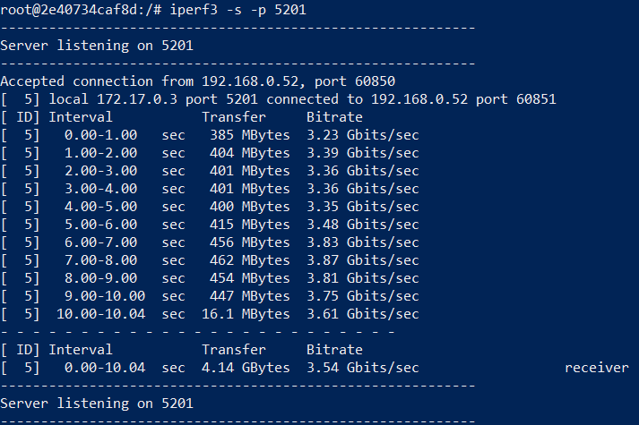

Do każdego połączenia przedstawiłem logi serwera, dlatego też nie będę wyciągał logów z kontenera

## Part 3: Jenkins

Postąpiłem zgodnie z instrukcją zamieszczoną na stronie Jenkinsa. Uruchomiłem kontener:
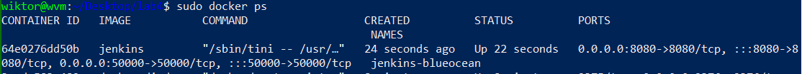

Sprawdziłem adres ip przydzielony kontenerowi, wpisałem go w przeglądarce razem z portem 8080 na którym stoi kontener. Zostałem przekierowany do strony logowania. Sprawdziłem hasło w logach kontenera. Zapomniałem uwiecznić na screenie ekranu logowania, mam natomiast screeny następnych etapów setupu.

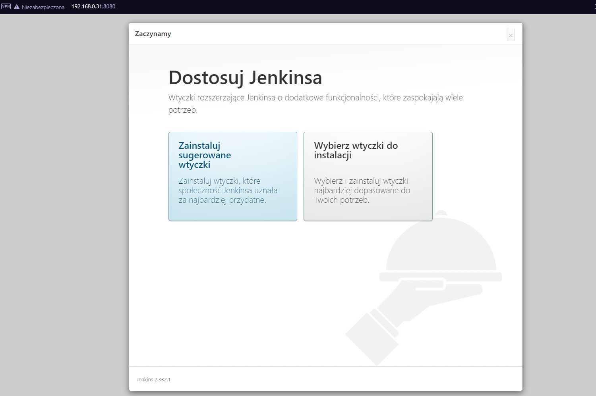
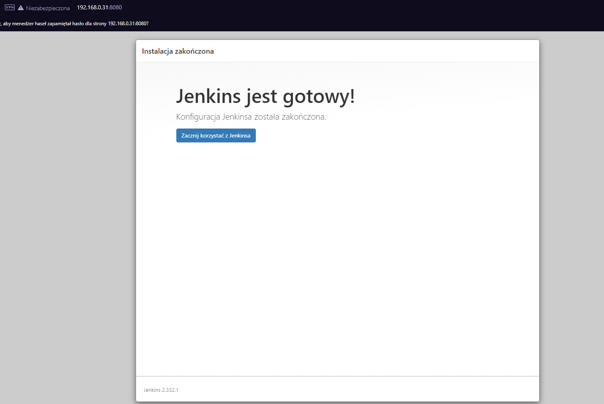