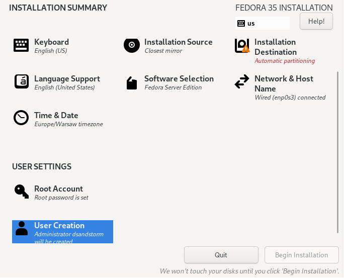
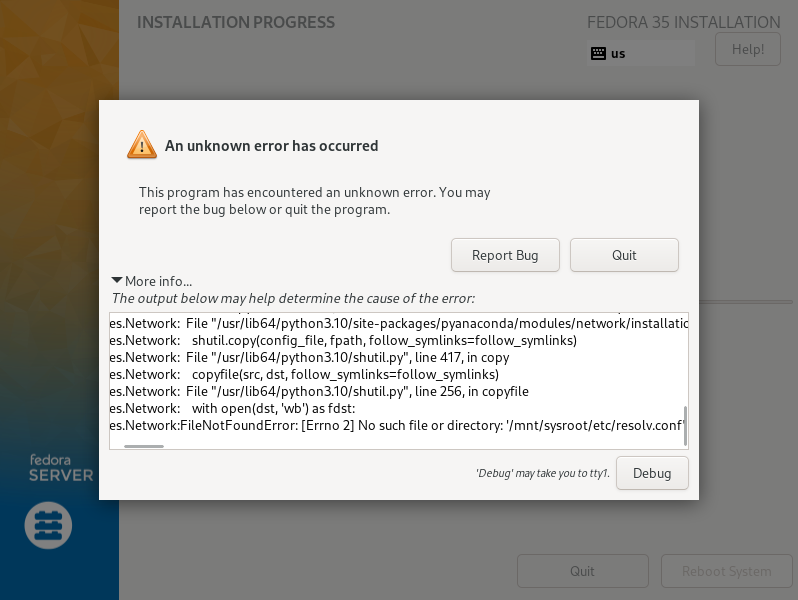
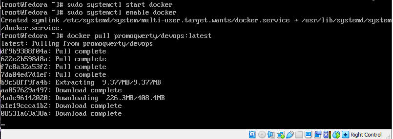

# Zajęcia 09

## 1. Przeprowadziłem instalację Fedory serwer. Początkowo planowałem zainstalować wersję numer 35, jednakże dziwny błąd uniemożliwił mi korzystanie z niej. Pomimo poprawnego skonfigurowania użytkownika należącego do grupy wheel i utworzenia hasła dla roota nie można się było na nich zalogować. Przejście na 36 wersję rozwiązało problem.

## 2. Punkt drugi rozwiązałem klonując maszynę wirtualną utworzoną wcześniej, zmieniając jednak adres MAC - taki sam adres MAC może doprowadzić do problemów działania protokołów sieciowych, takich choćby jak ARP
## 3. Krok ten został wykonany przeze mnie poprzez upload obrazu na Dockerhubie - próbowałem do tematu podejść jednak ambitniej. Niestety, z mizernym skutkiem. Na początek chciałem wykorzystać serwer Apache, dokonać uploadu na niego, i za pomocą wgeta lub innego prostego narzędzia pobrać plik na kliencie. W tym celu spakowałem obraz do pliku .tar. Niestety, rozwiązanie to jest problematyczne i wymagało dużego nakładu pracy. Podjąłem także próbę ustawienia serwera ftp poprzez vsftp, jednakże nie udało mi się nawiązać połączenia pomiędzy maszynami (problem z firewallem którego nie rozwiązałem).  
## 4. Jako że wykorzystuję, jak wyżej wspomniałem, Docker Huba, na początek instaluję Dockera. Robię to zgodnie z instrukcją załączoną w dokumentacji:

## Następnie uruchamiam Dockera. Dodatkowo ustawiam go sobie, żeby się uruchamiał przy każdym starcie systemu. Mając go włączonego mogę zastosować komendę docker pull, która pobiera z mojego publicznego repozytorium artefakt z buildem. 
