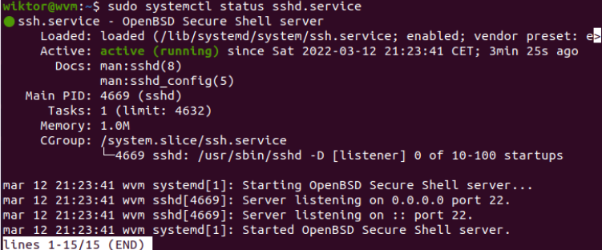

# Wiktor Mikłasz, grupa 4, 12.03.2022

Połączyłem się przez ssh z moją maszyną wirtualną

Wygenerowałem klucze ECDSA

Skopiowałem ręcznie publiczny klucz z ukrytego folderu /ssh i dodałem go do githuba

za pomocą ssh sklonowałem repo 

Utworzyłem nowego brancha 

