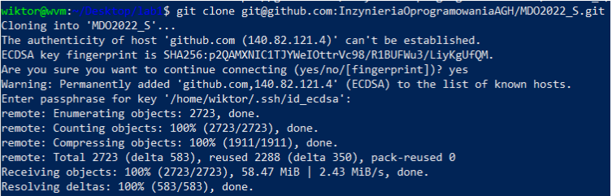
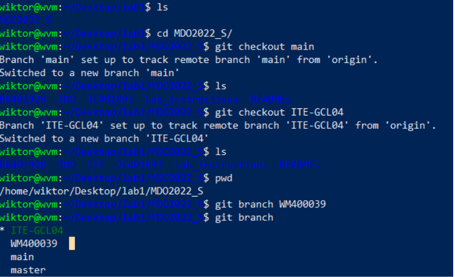
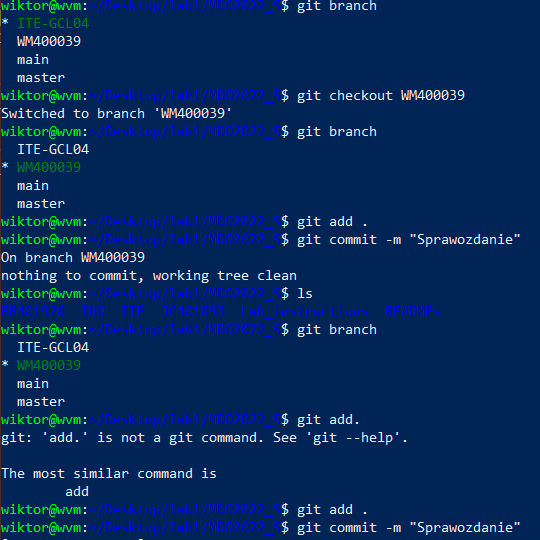
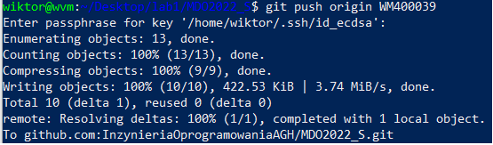

# Wiktor Mikłasz, grupa 4, 12.03.2022

Nawiązałem połączenie z serwerem ssh

Skopiowałem ręcznie publiczny klucz z ukrytego folderu /ssh i dodałem go do githuba
  Wygenerowałem klucze ECDSA  

za pomocą ssh sklonowałem repozytorium  

Utworzyłem nowego brancha                

Do tranferu plików(screenów) poprzez protokół ssh wykorzystałem program MobaXTerm

Zmieniłem brancha za pomocą git checkout, za pomocą "git add ." dodałem wszystkie zmienione pliki do commita, żeby następnie  
za pomocą git commit stworzyć gotowego do wypchnięcia commita

Wypchnąłem commita za pomocą git push origin (nazwa mojego brancha)

