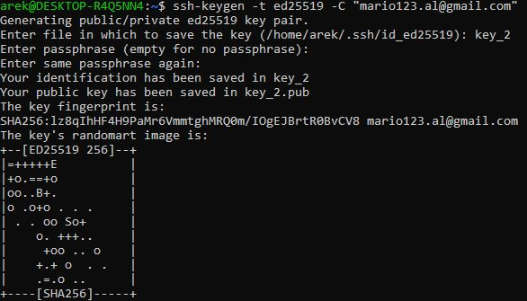
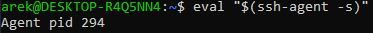
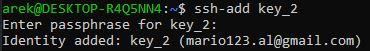
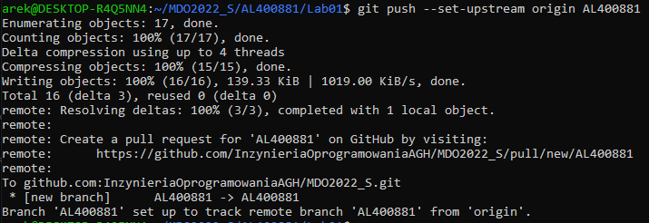
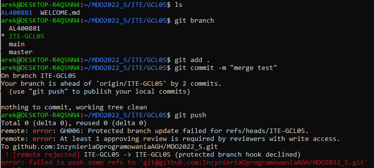

## Sprawozdanie 1

### Wprowadzenie, Git, Gałęzie, SSH

Upewniając się, że Git jest zainstalowany i możliwa jest obsługa kluczy, przystąpiono do realizacji ćwiczenia. 


Należało sklonować repozytorium za pomocą HTTPS i utworzonego klucza SSH. Można było tego dokonać odpowiednio:
```
git clone https://github.com/InzynieriaOprogramowaniaAGH/MDO2022_S.git
git clone git@github.com:InzynieriaOprogramowaniaAGH/MDO2022_S.git
```


Aby klonowanie za pomocą SSH było możliwe, to należało je poprzedzić generowaniem klucza. Zgodnie z poleceniami utworzono dwa - jeden zabezpieczony hasłem i jeden bez. W obu przypadkach użyto **ed25519**.
```shell
ssh-keygen -t ed25519 -C "moj_email@mail.com"
```


Następnie uruchomiono agenta SSH i dodano mu klucze.
```shell
eval "$(ssh-agent -s)"
```


```shell
ssh-add key_2
```



Poniższymi poleceniami przełączono się na branch **main** i gałąź grupy, tj. **ITE-GCL05**
```git
git checkout main
git checkout ITE_GCL05
```

Będąc w odpowiedniej gałęzi utworzono nowy katalog w folderze **ITE/GCL05** o nazwie składającej się z inicjałów i numeru indeksu. W nim utworzono plik ze sprawozdaniem o nazwie **Sprawozdanie** i wydzielono nowy folder do przechowywania screenshotów. Kolejny etap zakładał wysłanie plików do zdalnego źródła.
```
git add .
git commit -m "text"
git push --set-upstream origin AL400881
```


Następnie spróbowano wciągnąć własną gałąź do gałęzi grupowej:
```
git checkout ITE-GCL05
git merge AL400881
git add .
git push
```
... co skutkowało następującym wydrukiem:

