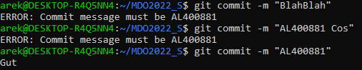
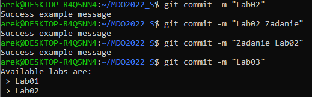
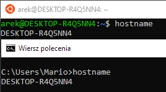
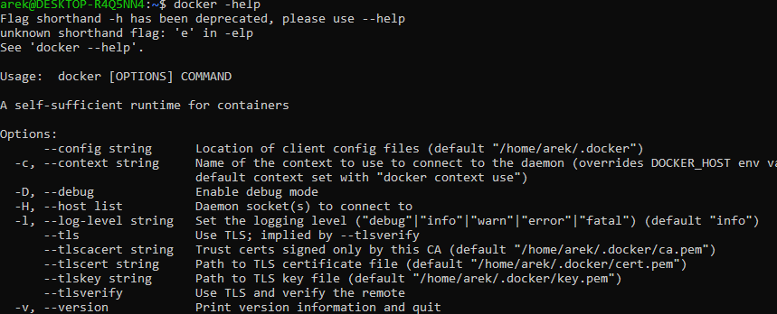
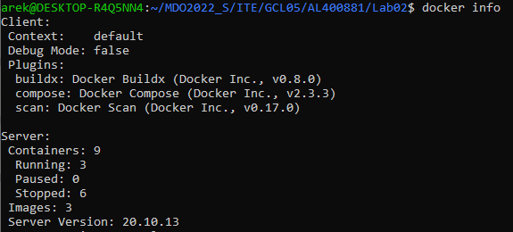
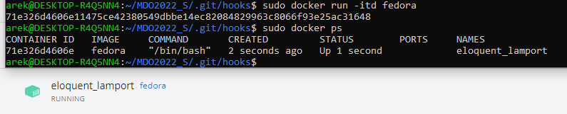
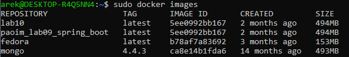

## Sprawozdanie 2

### Hooks, heterogeniczne środowisko pracy, instancja Dockera

#### Wykonane zadania

1. & 2. Przygotuj git hook, który rozwiąże najczęstsze problemy z commitami
    * hook sprawdzający, czy tytuł commita nazywa się ```<inicjały><numer indeksu>```
    

	    ```sh
	    #!/bin/sh

	    name="AL400881"

	    if [ "$name" != "$(cat $1)" ]; then
		echo >&2 "ERROR: Commit message must be $name"
		exit 1
	    fi;    
	    ```
    
    * hook sprawdzający, czy w treści commita pada numer labu, właściwy dla zadania
    

	    ```sh
	    #!/bin/sh

	    path=~/MDO2022_S/READMEs
	    labs="$(find $path/*.md -printf "%f\n" | cut -c-2)"
	    found=0

	    for num in $labs; do
		case "(cat $1)" in
		    *Lab$num*) found=1 ;;
		esac
	    done

	    if [ $found = 0 ]; then
		echo "Available labs are:"
		for lab in $labs; do
			echo " > Lab$lab"
		done
		exit 1
	    fi
	    ```

3. Rozpocznij przygotowanie środowiska Dockerowego
    * zapewnij dostęp do maszyny wirtualnej przez zdalny terminal (nie "przez okienko")
    
    	Z powodu pracy na WSL pominięto ten krok.

    	Wykazanie, że WSL działa na tym samym hoście co Windows:
    
    	

    	Wspólne pliki między systemami:
    
    	

    * zainstaluj środowisko dockerowe w stosowanym systemie operacyjnym
    

	    ```
	    sudo apt install docker
	    ```


4. Działanie środowiska
    * wykaż, że środowisko dockerowe jest uruchomione i działa (z definicji)
        

	    ```
	    docker info
	    ```

    * wykaż działanie z sposób praktyczny (z własności):
      * pobierz obraz dystrybucji linuksowej i uruchom go 
      	
      ```
      docker pull fedora
      docker run -itd fedora
      ```

      * wyświetl jego numer wersji
      Ponieważ nie sprecyzowano wesji obrazu, to pobrało najnowszą dostępną *latest*      
      
      ```
      docker images
      ```

5. Załóż konto na Docker Hub
   Do realizacji zadania wykorzystano już istniejące konto
   
