## Sprawozdanie 3

### # Docker files, kontener jako definicja etapu

#### Wykonane zadania

Wybranym repozytorium był framework [Svelte](https://github.com/sveltejs/svelte).
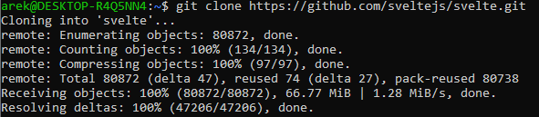
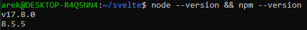
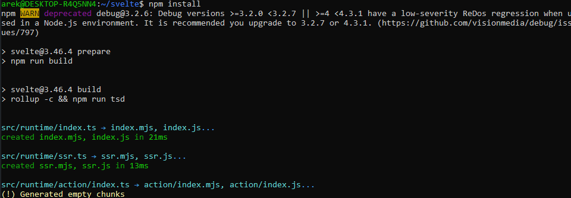

Po zainstalowaniu wszystkich zależności, przeprowadzono *build* za pomocą polecenia **npm run build**, a testy jednostkowe stosując **npm run test:unit**.
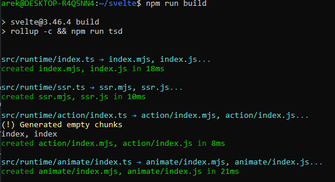
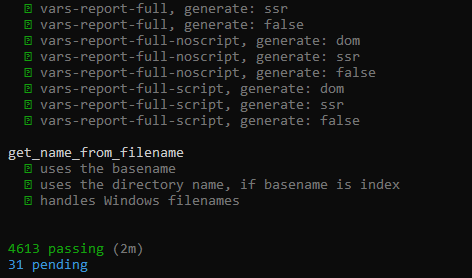

Następnie przystąpiono do konteneryzacji w Dockerze. Za obraz bazowy wybrano **Node** w najnowszej wersji. 
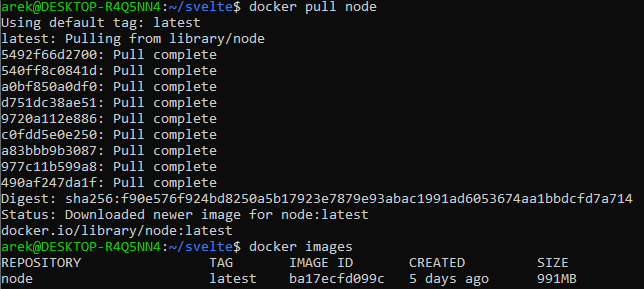

Poniższym poleceniem doinstalowano wymagane do działania zależności. Zastosowano **npm ci** zamiast **npm i**, ponieważ zostało ono stworzone do uruchamiania w zautomatyzowanych środowiskach ([Link](https://docs.npmjs.com/cli/v8/commands/npm-ci)). 
```bash
npm ci
```

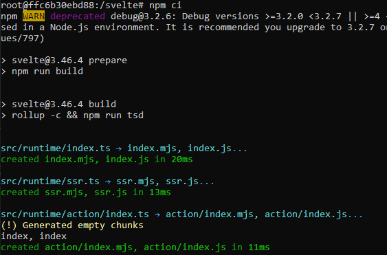

Tak jak wcześniej, sklonowano repozytorium i przetestowano działanie poprzez uruchomienie *build* i *testów*.


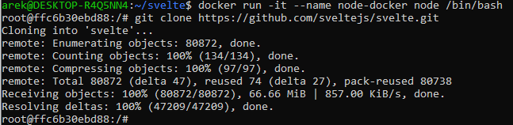

Kolejnym etapem było utworzenie dwóch plików Dockerfile automatyzujących powyższe kroki. Stworzono w tym celu plik **Dockerfile.build**, którego zadaniem było przeprowadzenie wszystkich kroków aż do builda oraz **Dockerfile.test** bazujący na pierwszym kontenerze i uruchamiający testy.
```dockerfile
# Dockerfile.build
FROM node:latest

WORKDIR /app
COPY rollup.config.js ./
COPY package*.json ./

RUN npm ci

COPY . ./

RUN npm run build
```

```dockerfile
# Dockerfile.test
FROM docker-build

WORKDIR /app

CMD ["npm", "run", "test:unit"]
```

 

 - Budowa
	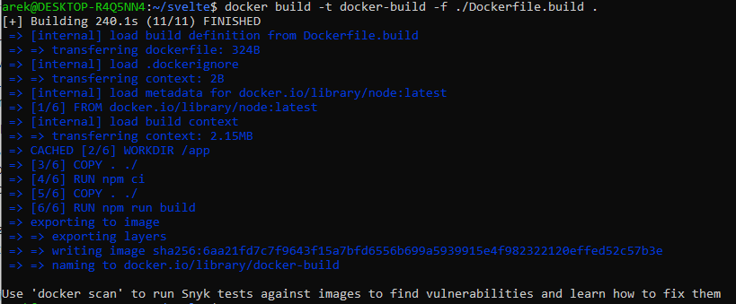
	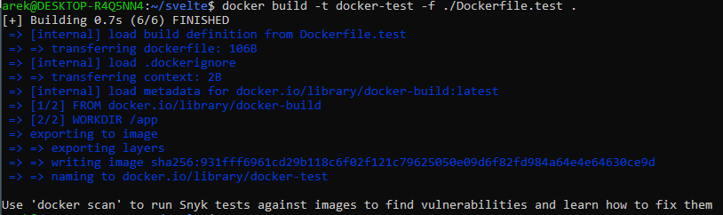

- Uruchomienie
	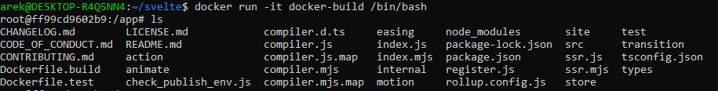
	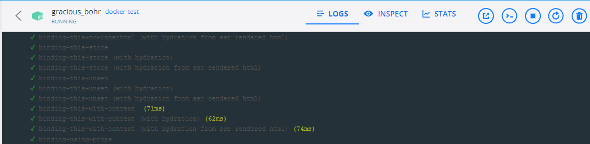
	
	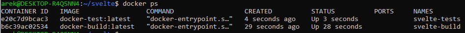
