# Sprawozdanie 4

## Przygotowanie wdrożeń nienadzorowanych dla platform z pełnym OS

<br/>
<hr/>

## Zadania do wykonania

### Przygotowanie systemu pod uruchomienie

-   Przeprowadź instalację systemu Fedora w VM, skonfiguruj użytkowników (użyj haseł, które można bezkarnie umieścić na GitHubie!), sieć, wybierz podstawowy zbiór oprogramowania, optymalnie bez GUI

Utworzono nową maszynę wirtualną, na której zainstalowano system Fedora Server 36. Zgodnie z poleceniem wybrano minimalną instalację.

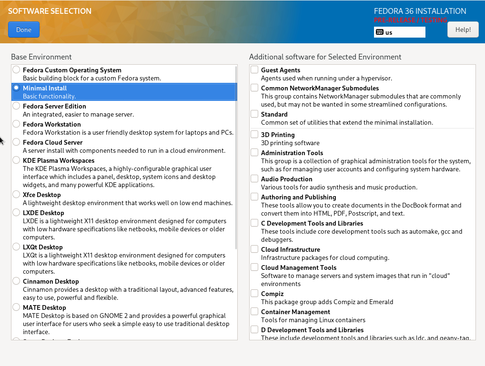

Następnie utworzono konto **root'a** z prostym hasłem:

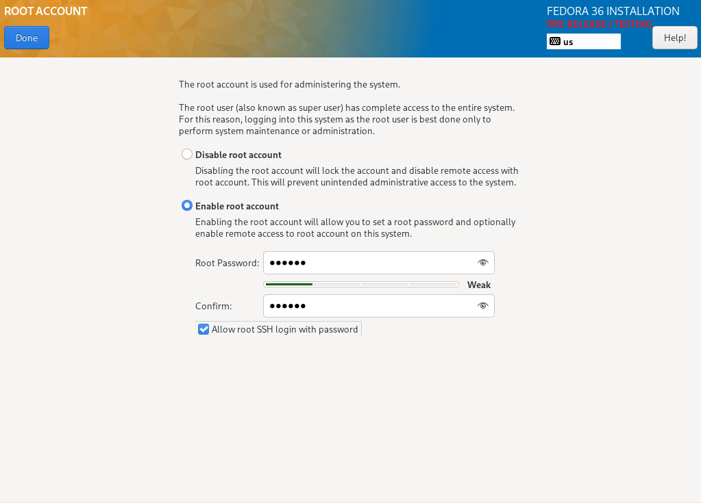

po czym nadano nazwę hosta. Postanowiono wykorzystać schemat przedstawiony na zajęciach, tj. **lab09.template.agh**.

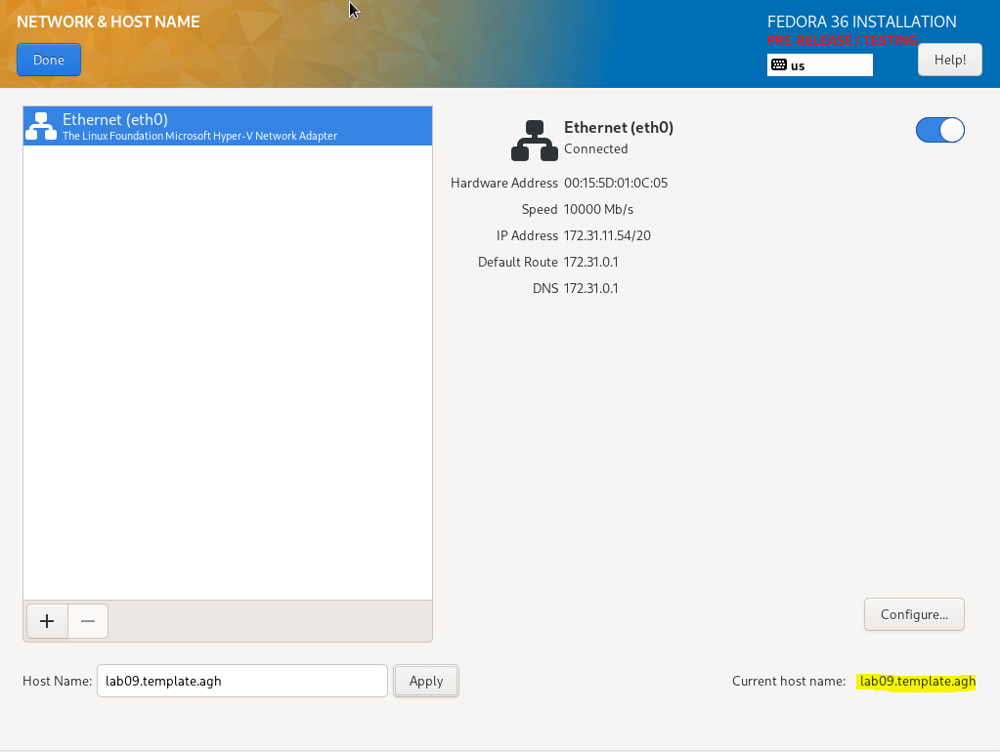

-   Przeprowadź drugą instalację systemu Fedora w VM - celem drugiego systemu będzie wyłącznie serwowanie repozytorium przez HTTP

Kolejnym krokiem była instalacja drugiego systemu operacyjnego. Postąpiono podobnie jak z pierwszym, jednak tym razem wybrano **Fedora Server Edition** jako podstawowe środowisko oraz nazwę hosta ustawiono na **lab09.http.agh**, by reprezentowało lepiej swoją funkcję.

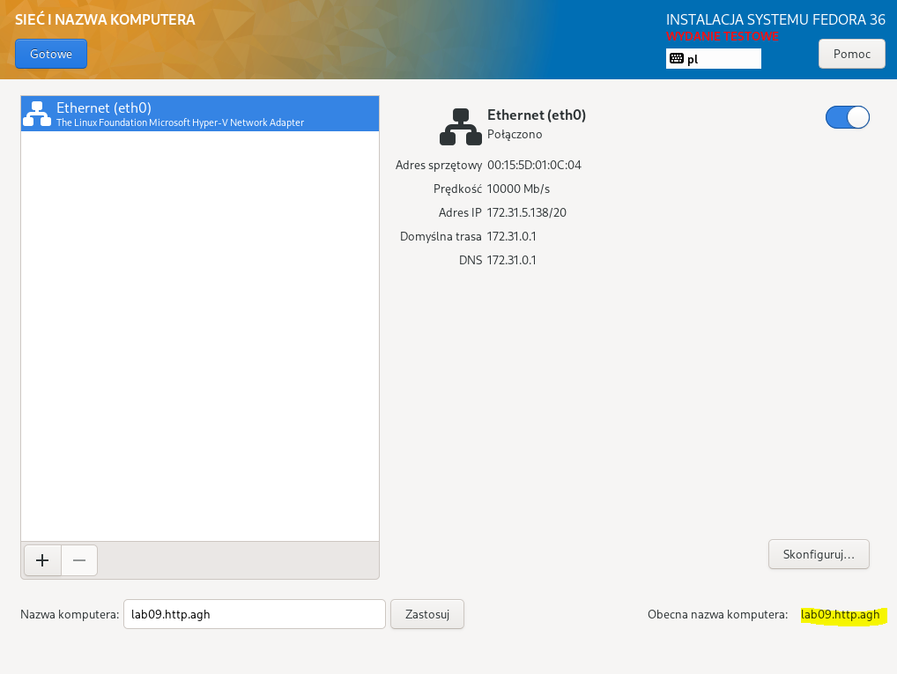

Mając pomyślnie skonfigurowany serwer wykonano polecenie:

```bash
dnf group install "Web Server"
```

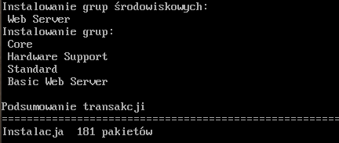

Aby działanie usługi było możliwe, należało uruchomić usługę HTTP i dodać do zapory. Posłużyły do tego poniższe polecenia:

```bash
systemctl enable httpd
firewall-cmd --add-service=http --add-server=https --permanent
```

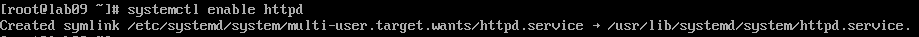

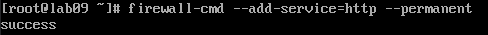

-   Umieść artefakty z projektu na serwerze HTTP

Po przetestowaniu połączenia i pomyślnym połączeniu się z serwerem ujrzano stronę testową.

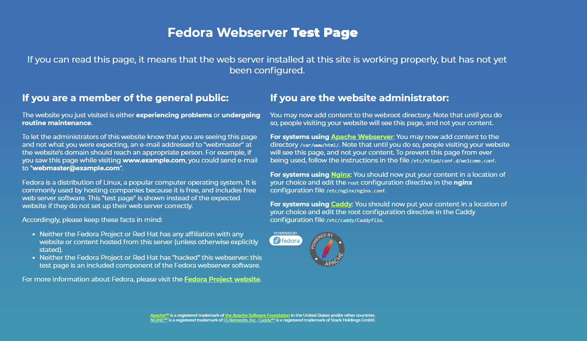

Wiedząc, że wszystko działa jak należy utworzono nowy katalog i wrzucono przykładowe archiwum reprezentujące artefakt z pipeline'a.

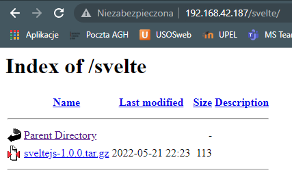

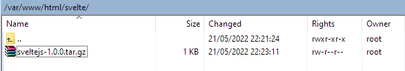

-   Na zainstalowanym systemie wykonaj zbiór poleceń umożliwiających pobranie artefaktu, zapisz polecenia

Następnie za pomocą poniższego polecenia możliwe było pobranie pliku.

```bash
scp root@192.168.42.18:/var/www/html/svelte/sveltejs-1.0.0.tar.gz ./svelte
```

### Instalacja nienadzorowana

Do przeprowadzenia instalacji nienadzorowanej konieczne było zdobycie pliku konfiguracyjnego. Otrzymano go z poprzedniej instalacji pod nazwą **anaconda-ks.cfg**. Dodano dodatkową klauzulę **%post %end**, w której umieszczono wcześniej użyte polecenie do zaciągniecia artefaktu.

Do instalacji utworzono nową maszynę i edytowano polecenie w menu głównym instalatora. Dodano następującą komendę:

```bash
inst.ks=https://raw.githubusercontent.com/InzynieriaOprogramowaniaAGH/MDO2022_S/AL400881/ITE/GCL05/AL400881/Lab09/anaconda-ks.cfg
```

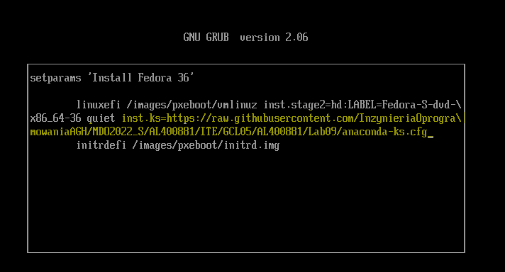

Pozwoliło to na wczytanie pliku konfiguracyjnego z repozytorium przedmiotu. Po kliknięciu **boot** rozpoczął się proces instalacji.

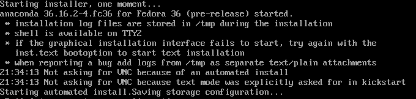

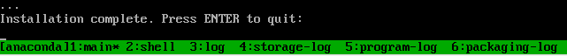

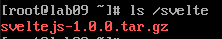
