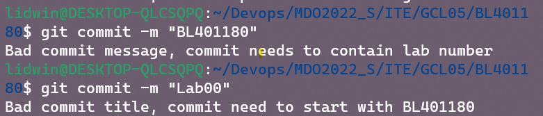
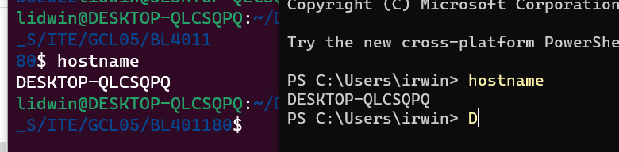
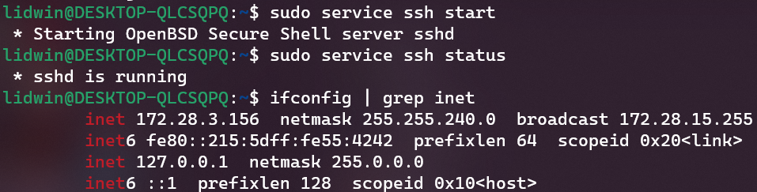
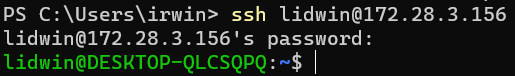
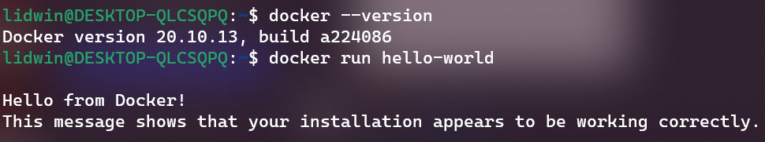
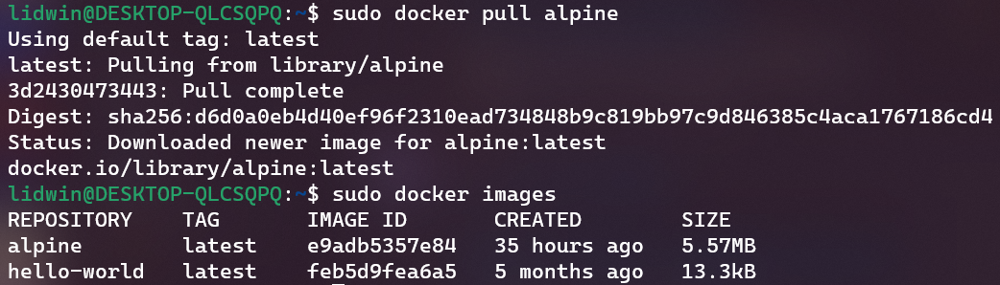
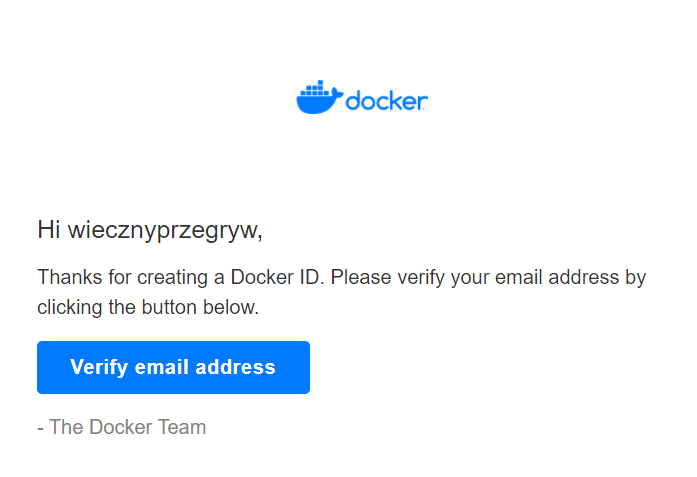

#Sprawozdanie 2

Bartosz Lidwin

1. Przygotowanie git hook, rozwiązujący problemy z commitami

- hook sprawdzający czy w tytule znajdują się inicjały i numer indeksu
- hook sprawdzający czy w treści jest numer laboratorium

Skrypt zmieniający commit-msg:
```bash
#!/usr/bin/env bash

INPUT\_FILE=$1

START\_LINE=`head -n1 $INPUT_FILE`

NAME=&quot;^(BL401180)&quot;

LAB=&quot;.\*(Lab)[0-9][0-9]\*.&quot;

if ! [[&quot;$START\_LINE&quot; =~ $NAME]]; then

echo &quot;Bad commit title, commit need to start with BL401180&quot;

exit 1

fi

while IFS= read -r line

do

if [[$line =~ $LAB]]; then

exit 0

fi

done \&lt; \&lt;(sed 1d $INPUT\_FILE)

echo &quot;Bad commit message, commit needs to contain lab number&quot;

exit 1
```


1. Przygotowanie środowiska Dockerowego

Wykazanie faktu korzystania z WSL2



Zapewnienie dostępu przez ssh po przez uruchomi 

Połączenie się z maszyną w PowerShell



Zainstalowanie dockera i sprawdzenie poprawności działania hello wordem



1. Pokazanie działania środowiska Dockerowego

Wykazanie działania w sposób praktyczny czyli pobranie dystrybucji linux
i wyświetlenie obrazu



1. Konto Docker Hub

-założenie konta Docker hub

