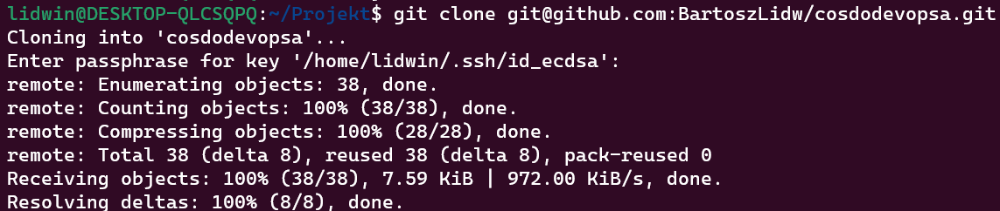
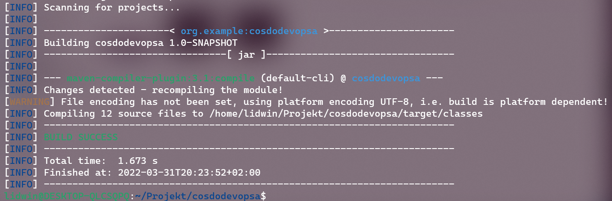
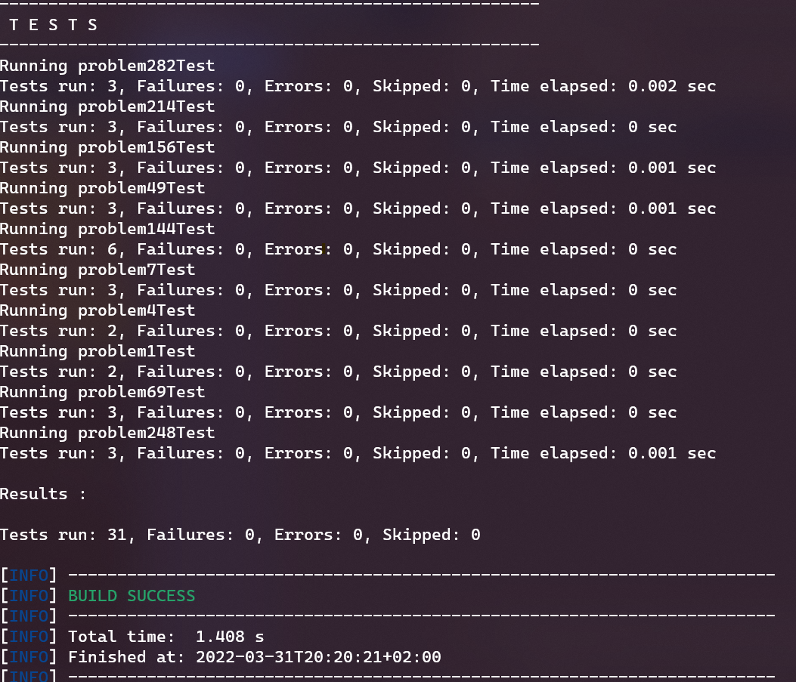
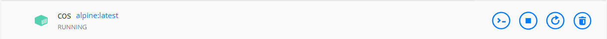
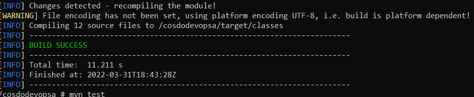
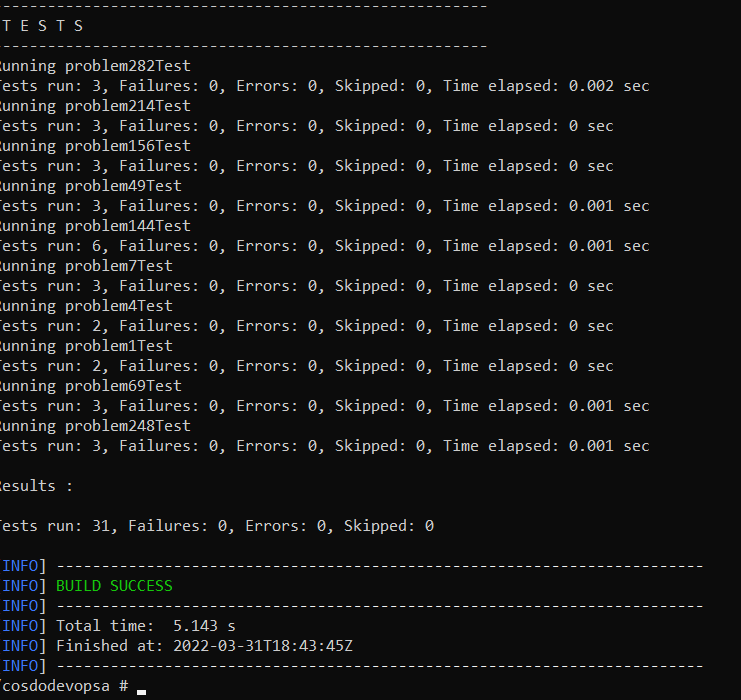
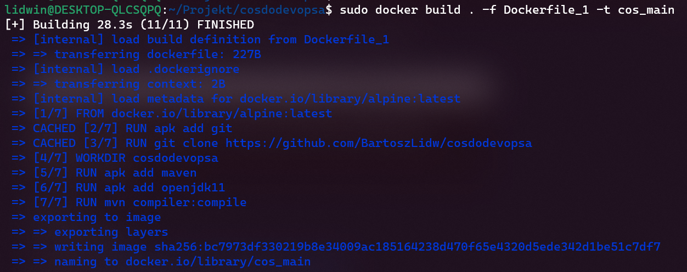
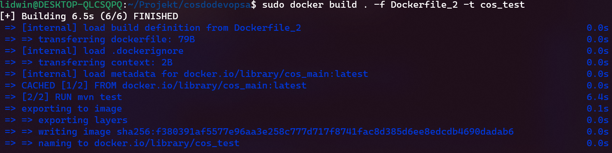
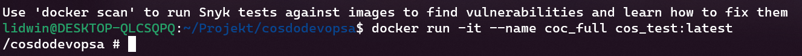
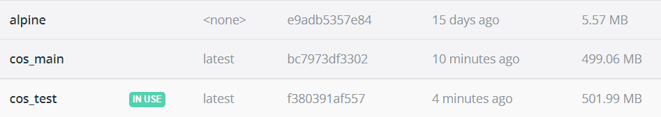

# Sprawozdanie 3
### Bartosz Lidwin
1. Przgotowanie repozytorium do testowania konteneryzacji 
[](https://github.com/BartoszLidw/cosdodevopsa "wykorzystane przezemnie repozytorium)



2. Przetestowanie budowania  `mvn compiler:compile`


3. Przetestowania budowania testów  `mvn test`


4. Przygotowanie kontenera i uruchomienie buildu z testemi


		przed uruchomieniuem należało dodać 
		#apt add git 
		#git clone https://github.com/BartoszLidw/cosdodevopsa
		#apt add maven
		#apt add openjdk11 
		następnie komendami mvn compiler:compile i mvn test odpaliłem
		buildy które po instalacjach własności powiodły się



5. Stworzenie docerfile 
```
FROM alpine:latest
RUN apk add git
RUN git clone https://github.com/BartoszLidw/cosdodevopsa
WORKDIR cosdodevopsa
RUN apk add maven
RUN apk add openjdk11
RUN mvn compiler:compile 

```
```
FROM cos_main:latest
RUN mvn test
```



6. Sprawdzenie działania 

jak widać mamy trzy obrazy 



