# Sprawozdanie 4
## Bartosz Lidwin
### 1. Zachowywanie stanu czyli tworzenie woluminów
Stworzenie dwóch woliumów wejściowego i wyjściowego
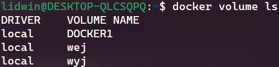
Zbudowanie ich na podstawie alpine 
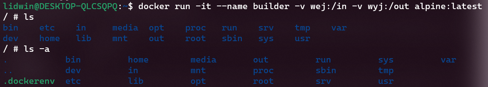
Pobranie na wejściowy wolium repozytorium
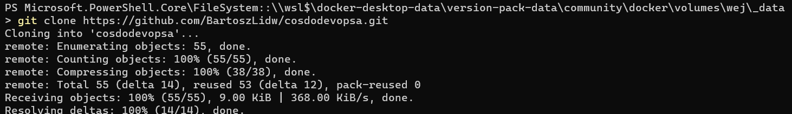
Uruchomienie buildu na kontenerze i przniesienie pliku jar na wolium wyjściowy
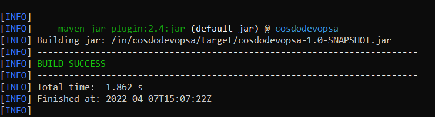
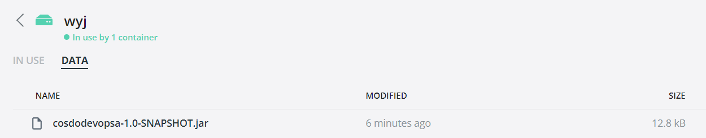

### 2. Eksponowanie portów czyli tworzenie komnikacji z kontenerami 
Stworzenie kontenera z zależnością iperf3 właczenie nasłuchiwania i połaczenie się po między dwoma kontenerami

```
apk add iperf3

iperf3 -c 172.17.0.2 -p 5050

```

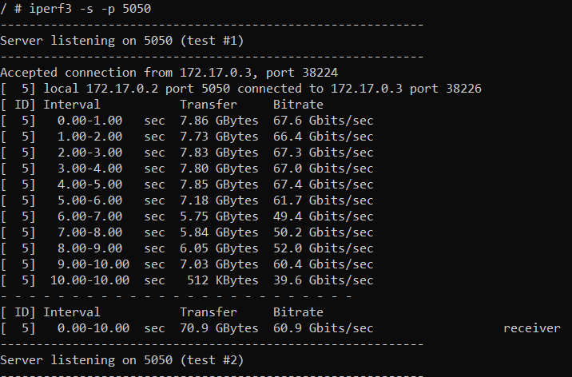
### kontener
```
 Accepted connection from 172.17.0.3, port 38224
[  5] local 172.17.0.2 port 5050 connected to 172.17.0.3 port 38226
[ ID] Interval           Transfer     Bitrate
[  5]   0.00-1.00   sec  7.86 GBytes  67.6 Gbits/sec
[  5]   1.00-2.00   sec  7.73 GBytes  66.4 Gbits/sec
[  5]   2.00-3.00   sec  7.83 GBytes  67.3 Gbits/sec
[  5]   3.00-4.00   sec  7.80 GBytes  67.0 Gbits/sec
[  5]   4.00-5.00   sec  7.85 GBytes  67.4 Gbits/sec
[  5]   5.00-6.00   sec  7.18 GBytes  61.7 Gbits/sec
[  5]   6.00-7.00   sec  5.75 GBytes  49.4 Gbits/sec
[  5]   7.00-8.00   sec  5.84 GBytes  50.2 Gbits/sec
[  5]   8.00-9.00   sec  6.05 GBytes  52.0 Gbits/sec
[  5]   9.00-10.00  sec  7.03 GBytes  60.4 Gbits/sec
[  5]  10.00-10.00  sec   512 KBytes  39.6 Gbits/sec
- - - - - - - - - - - - - - - - - - - - - - - - -
[ ID] Interval           Transfer     Bitrate
[  5]   0.00-10.00  sec  70.9 GBytes  60.9 Gbits/sec   receiver
```
### host
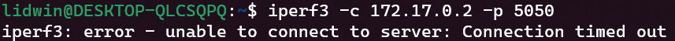
nie wiem jak to rozwiązać na wsl

### 3. Instalacja Jenkinsa
Instalacja za pomocą Dokumentacji Jenkinsa
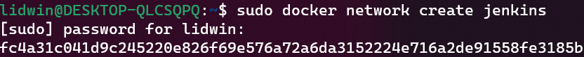
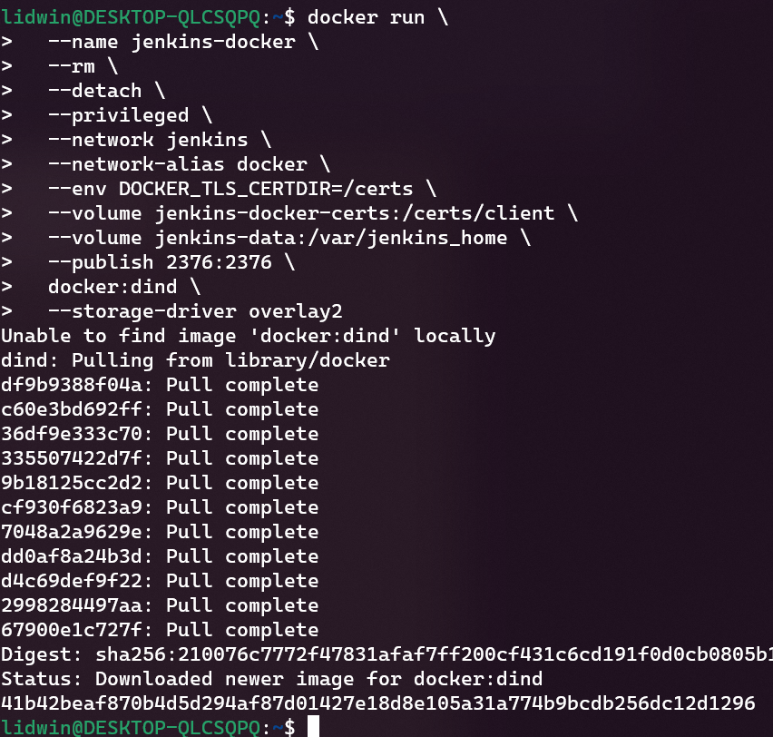
skopiowanie dockerfila z dokumentacji
```
FROM jenkins/jenkins:2.332.2-jdk11
USER root
RUN apt-get update && apt-get install -y lsb-release
RUN curl -fsSLo /usr/share/keyrings/docker-archive-keyring.asc \
  https://download.docker.com/linux/debian/gpg
RUN echo "deb [arch=$(dpkg --print-architecture) \
  signed-by=/usr/share/keyrings/docker-archive-keyring.asc] \
  https://download.docker.com/linux/debian \
  $(lsb_release -cs) stable" > /etc/apt/sources.list.d/docker.list
RUN apt-get update && apt-get install -y docker-ce-cli
USER jenkins
RUN jenkins-plugin-cli --plugins "blueocean:1.25.3 docker-workflow:1.28"
```
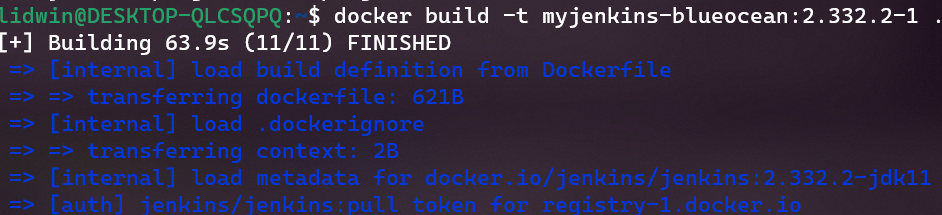
działające kontenery
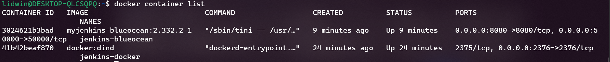
znalezienie hasła w logach i założenie konta
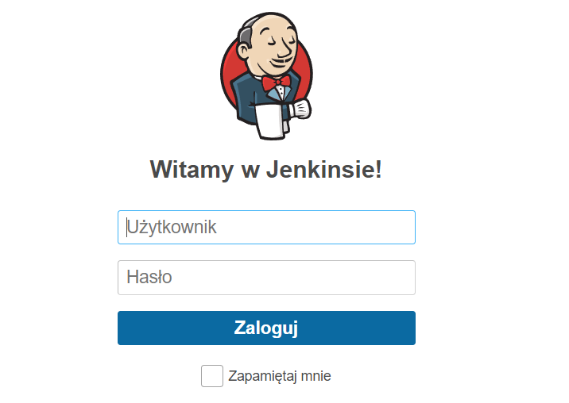


