# Sprawozdanie lab 11-12 
## Bartosz Lidwin

### Lab 11

 Pobrałem minikuba zgodnie z instrukcją na stronie  
 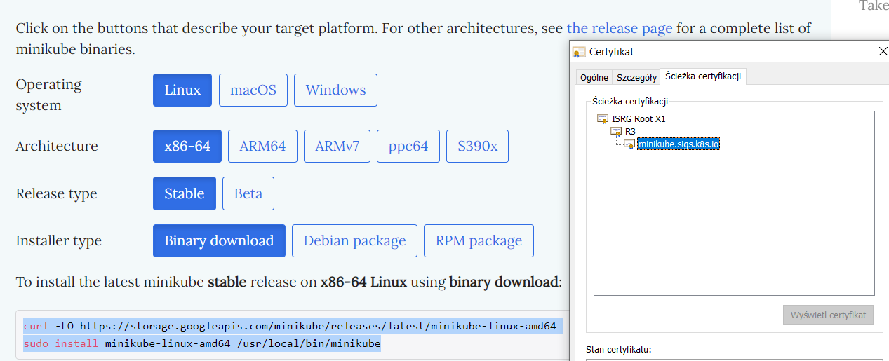
 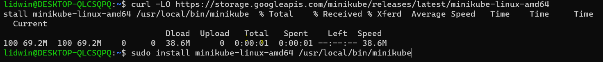
 
 W tes sam sposób postąpiłem z instalacją kubectl 
 
  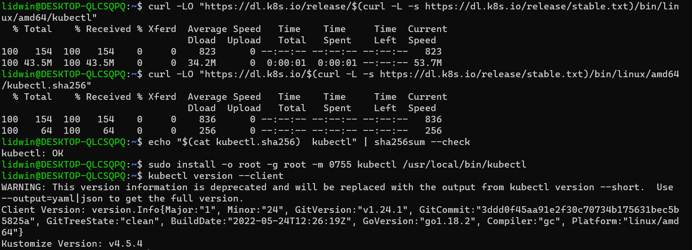

 Uruchomienie Kubernetesa i potwierdzenie jego działania po przez dockera i widać działający kontener minikuba o zablokowanej dla niego nazwie
 
  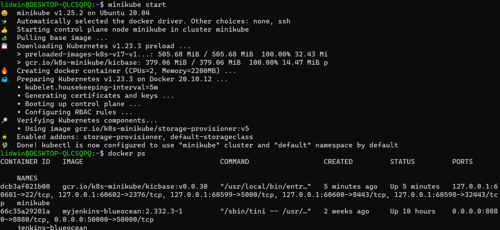
  
 Ilość zasobów potrzebnych do uruchomienia jest dość duża. Często tworząc maszyny wirtualne potrzeba dużo mniej a co dopiero zwykłe obrazy dockerowe czy obraz jenkinsa który jest mniejszy 0,5GB, lecz jest to dużo bardziej rozbudowane narzędzie.
 
  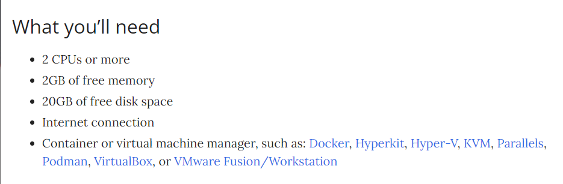
  
 Uruchomiłem Daskboard
 
  
  
 Jako, że mój krok deploy miał udostępniać deploy do chmury chyba nie muszę go modyfikować, lecz jako że nie wypuszczał on portu itp musiałem wykonać plan optimum i wybrać inną aplikację 
 
 ``` https://github.com/BartoszLidw/BoilAPI ```
 
 Uruchomienie aplikacji z udostępnionego przeze mnie obrazu i przetestowanie czy udostępniony port działa 
 
 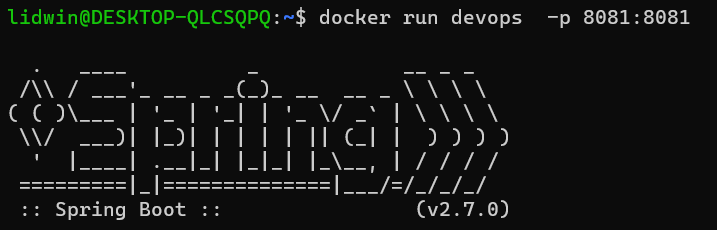
 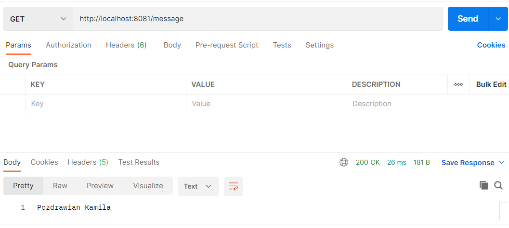
 
 Uruchomienie kontenera na stosie k8s i następnie wyeksponowanie portu żeby dotrzeć do chcianej dla nas zależności 
 
```
 minikube kubectl run -- boil --image=wiecznyprzegryw/boil:latest --port=8081 --labels app=boil
 kubectl port-forward boil 8082:8081

```
 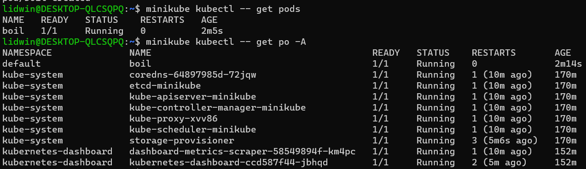 
 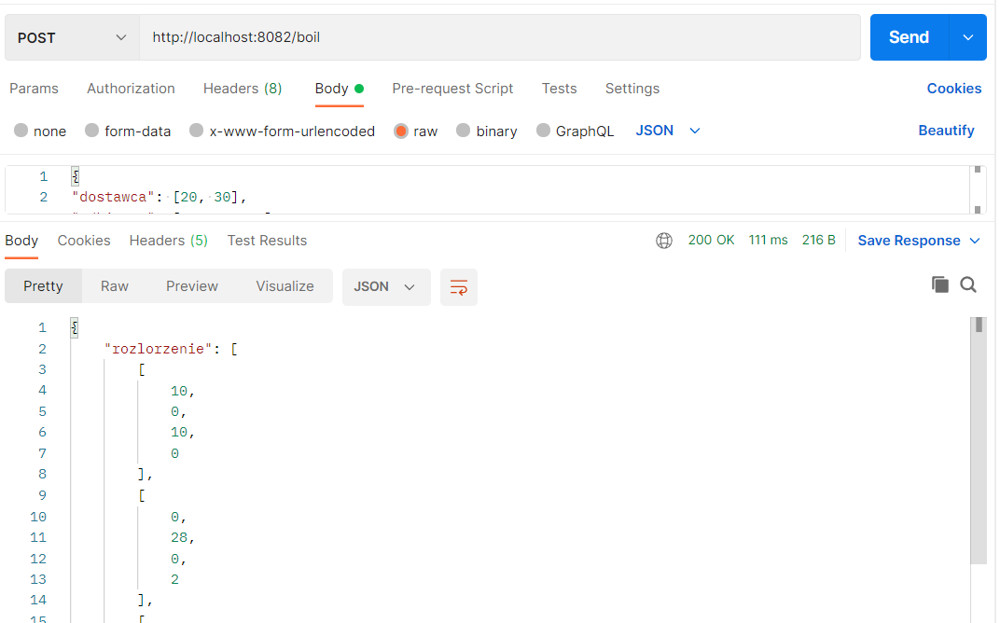 
 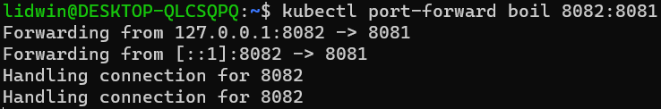
 
 
na powyszym screnie widać że port został użyty co potwierdza wyesponowanie i działanie wdrożenia

Teraz zostało stworzenie repliki na podstawie której będa tworzone podsy po przez zastosowanie apply na plik

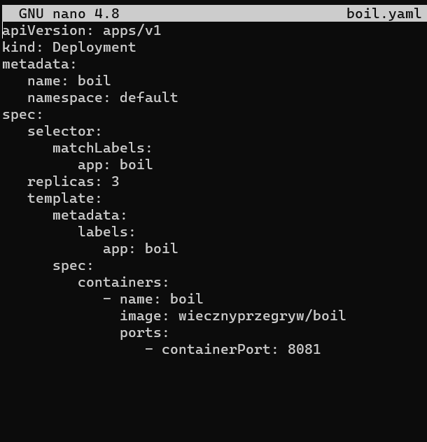 
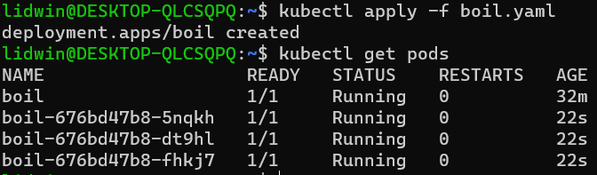 
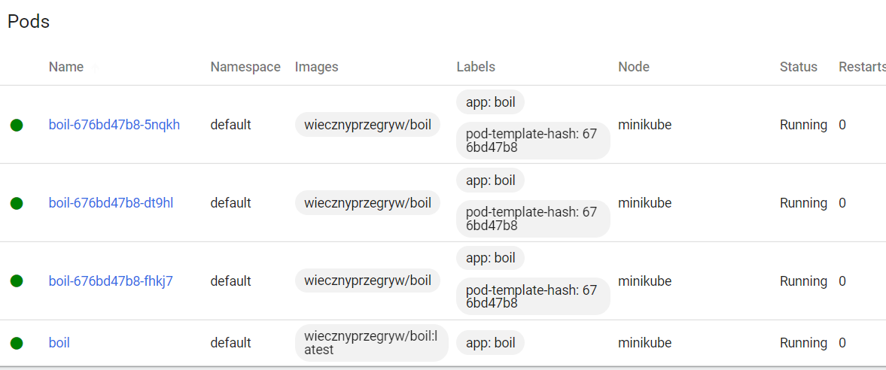

wszystko wyszło tak jak było trzeba

### Cześć 2


Przerobienie yaml, żeby tworzył większą liczbę podów. Jako że 3 pody już istnaiły wdrożenie zostało skonfigurowane a nie stworzone i następnie został zbadany stan rollout

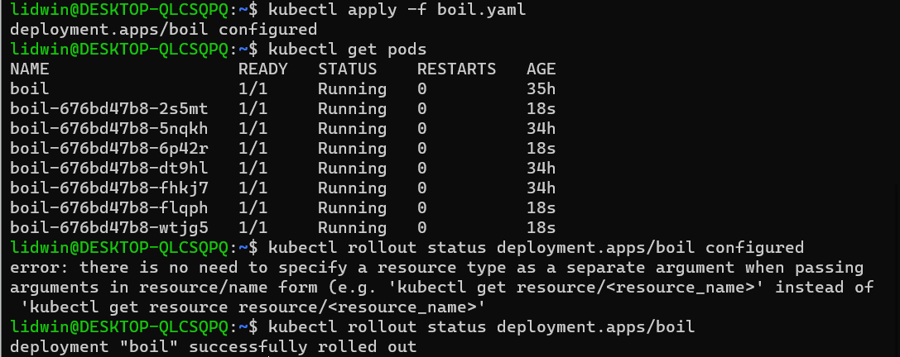


Stworzono dodatkowe wersje obrazu do testowania yamla

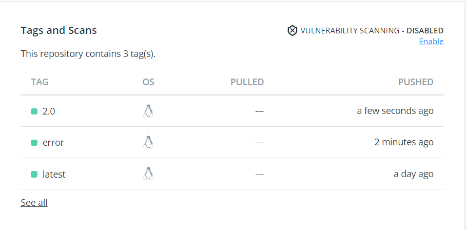

Testowanie różnych wariantów:
1 pod:

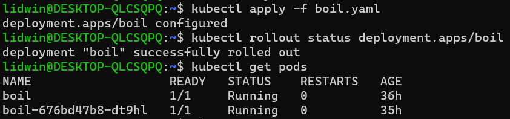
0 pod:

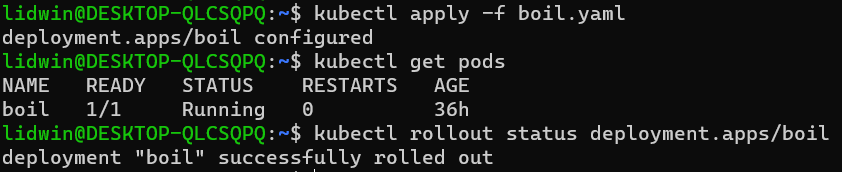
zastosowanie wersji 2.0:

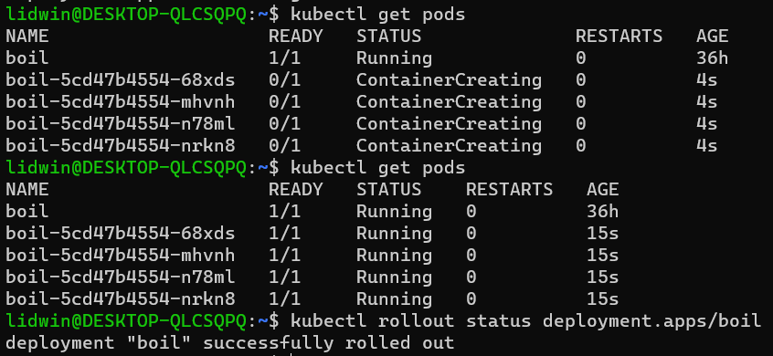

zastosowanie wersji z errorem:


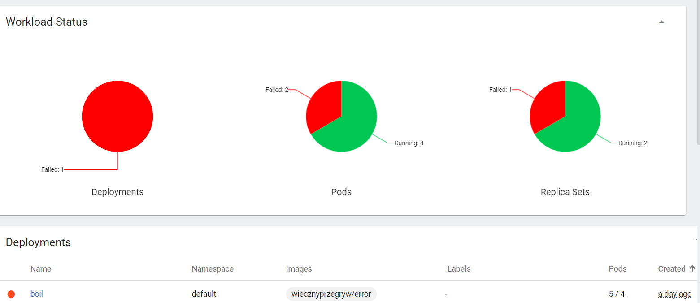
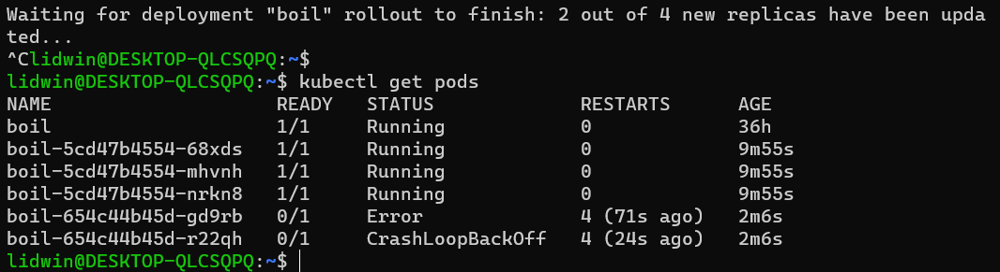

cofniecięcie zmian:

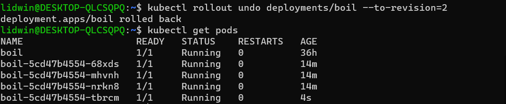


Skrytp sprawdzajacy czy się wdrożyło:
```
#!/bin/bash

appname=$1
kubectl wait --for=condition=Ready --timeout=60s deployments/boil
```

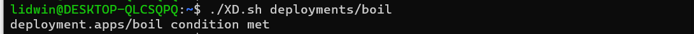

Dla wersji z errorem po 60s wyrzuca błąd:

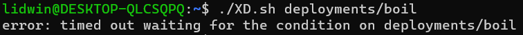

Sposoby wdrożeń 

Recreate:

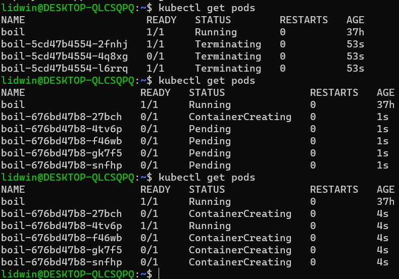

Rolling Update:

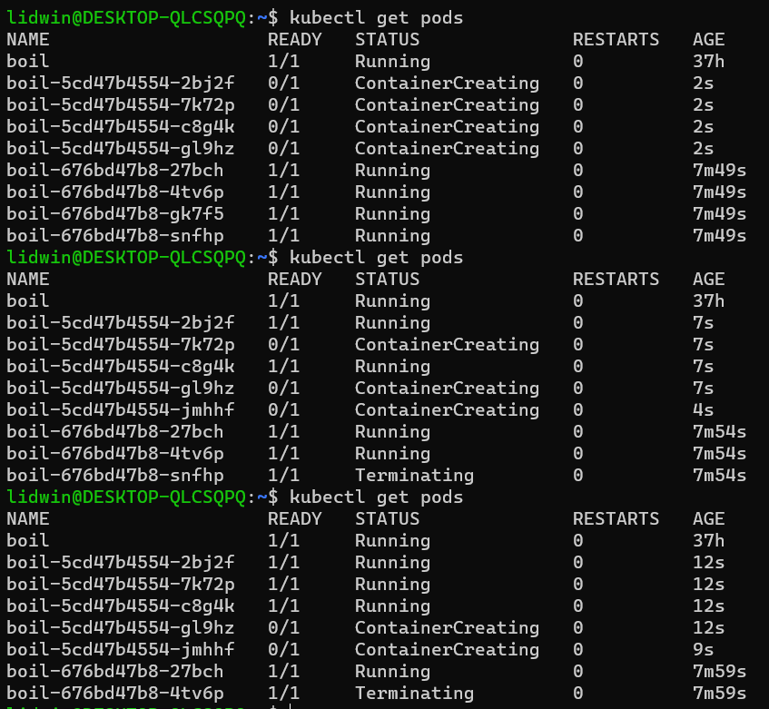

Przy recreate jak sama nazwa wskazuje zabija się wszystkie pody, żeby nateepnie je reaktywować gdzie w porównaniu z Rolling update są one podmieniane ze starych na nowe 


 


 
 
 
 
 
 
 
	
	
	
	
	
	
	
	
	
	
	