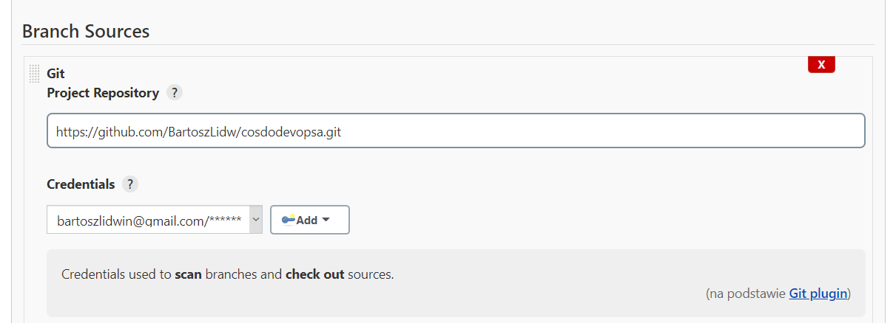
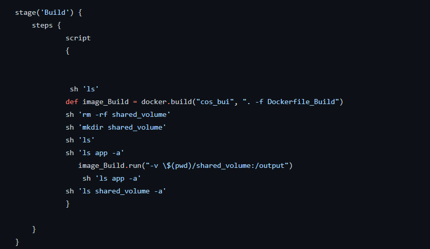
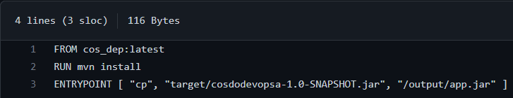
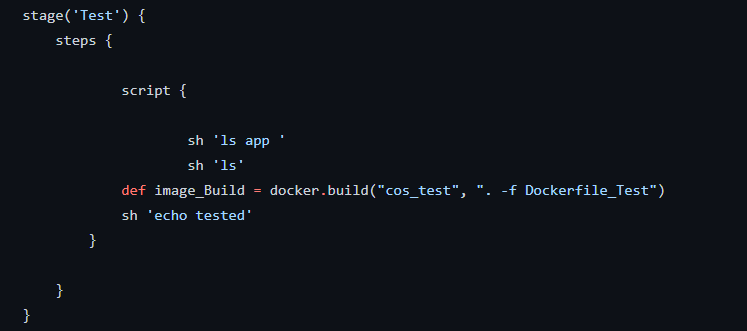
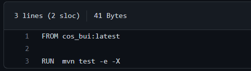
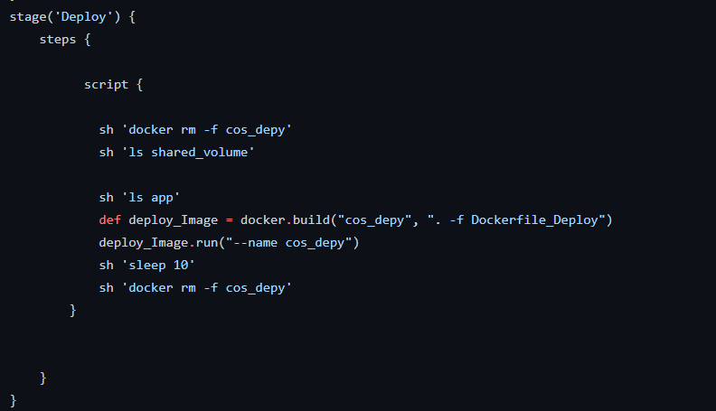
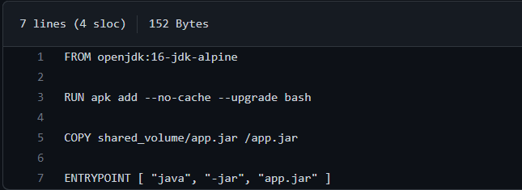
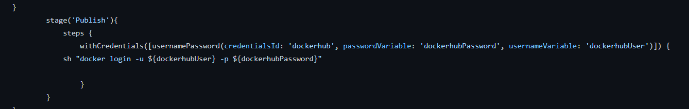
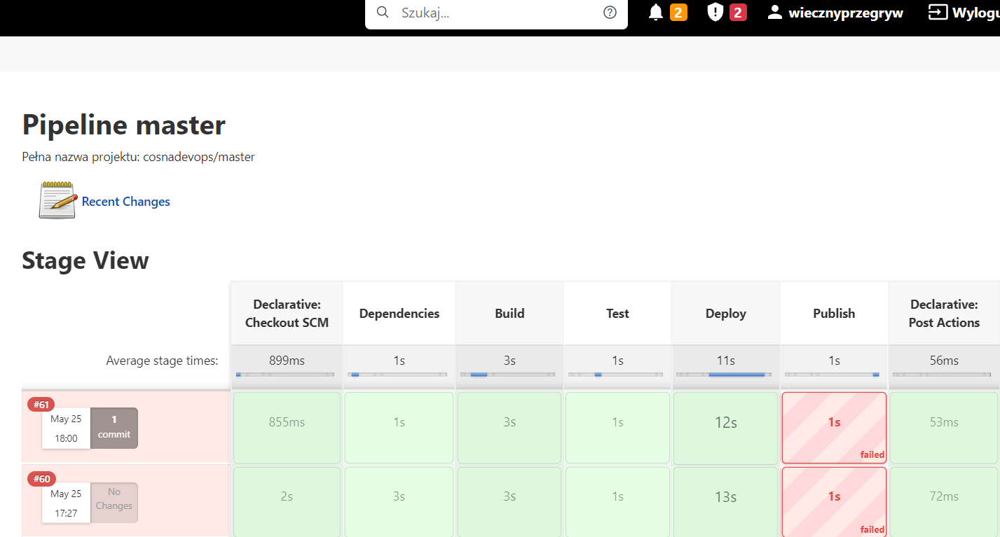

# Sprawozdanie 5-8
## Bartosz Lidwin
1. Założenie pipelinea 
Za pomocą dokerowego Jenkinsa stworzenie nowego projektu pipeline do którego podpiełem mój projekt razem z credentials czyli danymi logowania

2. Stworzenie Jenkinsfile i Docer file dla kojejnych faz dystrybujcji

	a. Docerfile_Dependencies
	
	
		pobranie dependecji potrzebnych do skompilowania programu takich jak jdk i maven z których tworzymy obraz. 
	b. Dockerfile_Build
	
	
	uruchomienie buildu aplikacji i stworzenie pliku typu jar, a następne przeniesienie go na wspólny volumen, który zostanie następnie użyty do udostępnienia aplikacji. Trzeba być uważnym na jakieś dodatkowe pliki oraz na poprawność ścieżki ponieważ można spędzić dużo czasu tak jak ja na problemie typu "czemu nie tworzy się plik target mimo poprawnego buildu lub czego nie widzi pom.xml"
	
	c. Dockerfile_Test
	
	
	uruchomienie Testów zawartych w programie
	
	d. Dockerfile_Deploy
	
	
	Po udanym buildzie i testach można przystąpić do sprawdzenia 		działania aplikacji na czystym obrazie 
	
	e. Faza publish
	
	
	 Publikacja miała polegać na zalogowaniu się na dockerhuba i następnym wypchnięciu, lecz mimo kilku różnych wariantów logowania
	 (ustawianie environment wewnętrznie i zewnętrznie, w fazie steps i jako script) zawsze dostawałem błąd logowania mimo na pewno dobrych danych wejściowych. Nawet kopiowanie od inny nie przyniosło efektu. Sprawdzałem czy nie jest to problem sieci ponieważ był on popularny, a sieć akademicka może nie być najlepsza, lecz zarówno na domowym jak i na 

