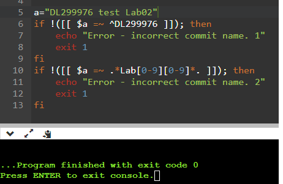
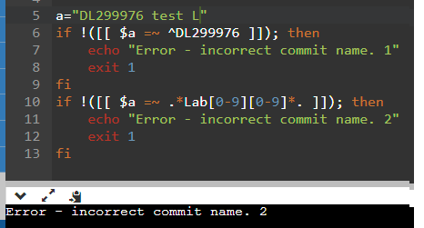
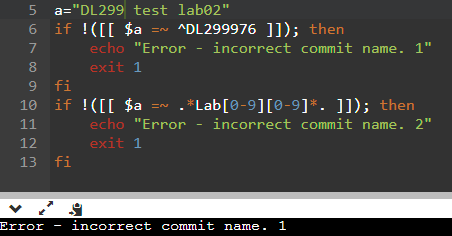
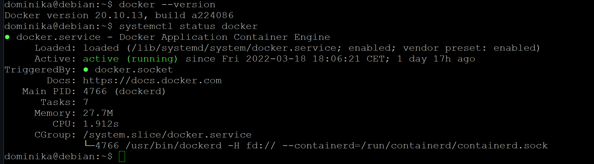
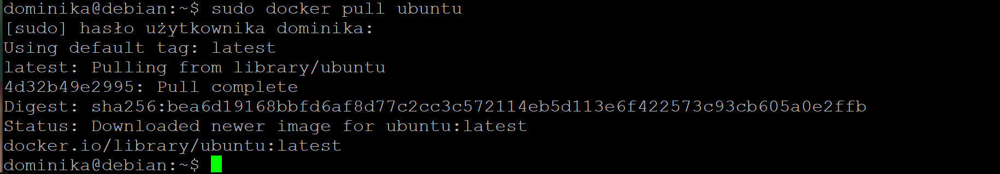
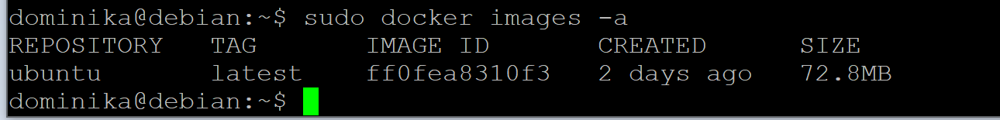
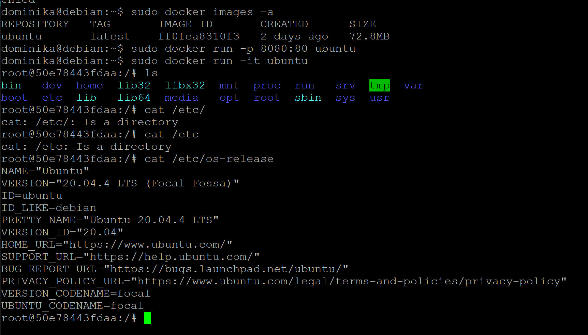
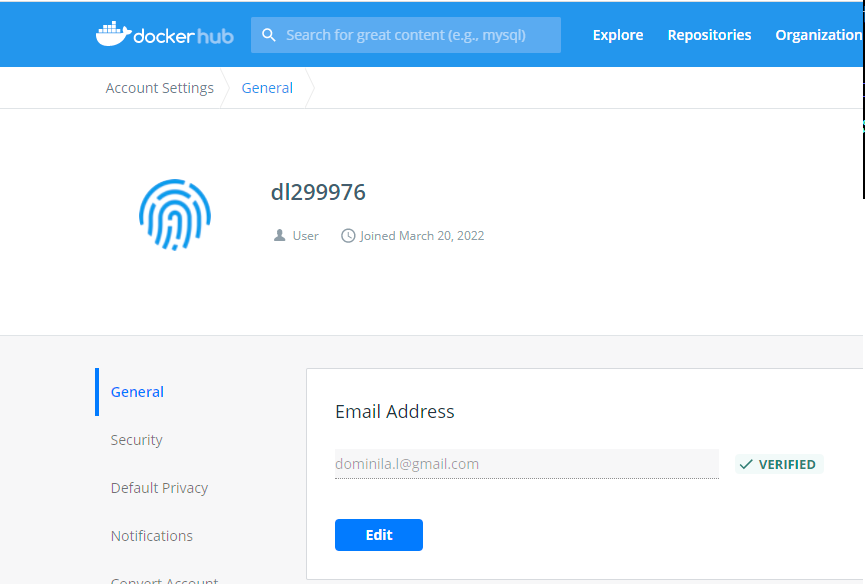

### Sprawozdanie  lab02

Do projektu zostały dodane 2 nowe hooki. W tym celu zmodyfikowany został plik commit-msg.sample gdzie został dodany skrypt sprawdzający commit message.


```
if !([[ $1 =~ ^DL299976 ]]); then
	echo "Error - incorrect commit name."
	exit 1
fi

if !([[ $1 =~ .*Lab[0-9][0-9]*. ]]); then
	echo "Error - incorrect commit name."
	exit 1
fi

```

Testy skryptu :







Następnie na maszynie wirualnej został zainstalowany docker.


Został pobrany obraz z najnowszą dystrybucją ubuntu.




Pobrany obraz został uruchomiony.


Ostatnik krokiem było założenie konta na stronie DockerHub.

