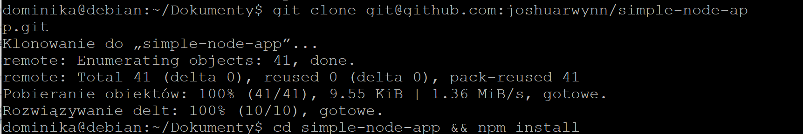
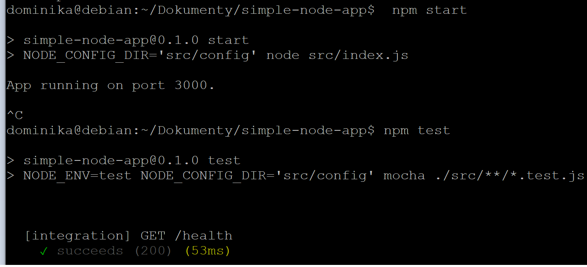
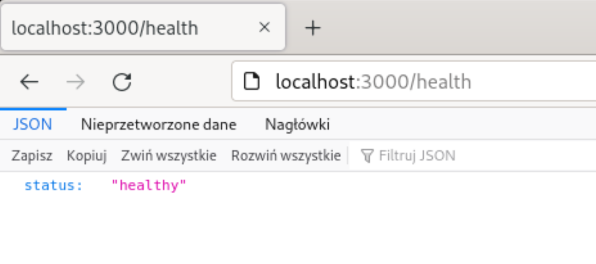
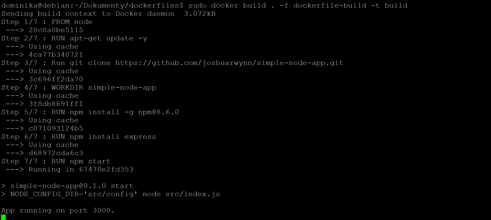
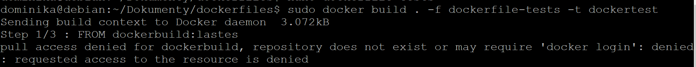
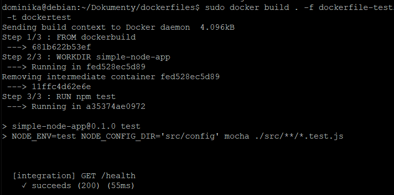
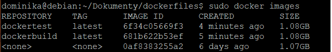

# Lab 03 - Dominika Lazarowicz
## 1 - skonowanie wybranego repozytorium
Link - https://github.com/joshuarwynn/simple-node-app



## 2 - Zbudowanie aplikacji włączenie testów




## 3 - Stworzenie plików dockerfile

Uruchominie
sudo docker build . -f dockerfile-build  -t dockerbuild
```
FROM node
RUN apt-get update -y
Run git clone https://github.com/joshuarwynn/simple-node-app.git
WORKDIR simple-node-app

RUN npm install -g npm@8.6.0
RUN npm install express
RUN npm start
```

Uruchominie
sudo docker build . -f dockerfile-tests -t dockertest
```
FROM dockerbuild:lastes
WORKDIR simple-node-app
RUN npm test
```

## 4 - Uruchomienie aplikacji w kontenerze


Niestety napotkałam problemy podczas uruchamiania testów, których nie udało mi się rozwiącać.



# UPDATE

Po przestudiowaniu dokumentacji node.js udało się rozwiązać problem.
https://nodejs.org/en/docs/guides/nodejs-docker-webapp/

Plik dockerfile po zmianach.
```
RUN apt-get update -y
Run git clone https://github.com/joshuarwynn/simple-node-app.git

WORKDIR simple-node-app

RUN npm install -g npm@8.6.0
RUN npm install express
COPY . .
EXPOSE 8080

CMD [ "node", "app.js" ]

```
Uruchomienie dockerfile z testami



Potwierdzenie działania


