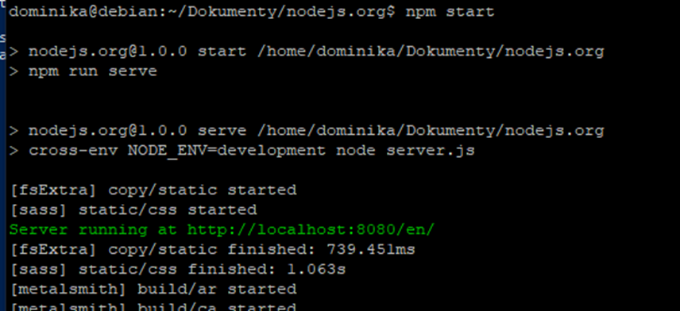
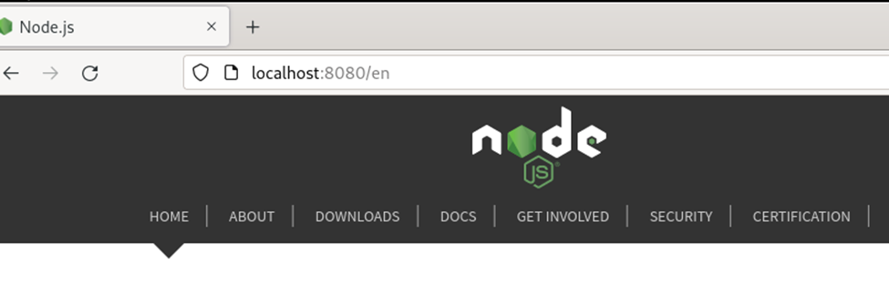
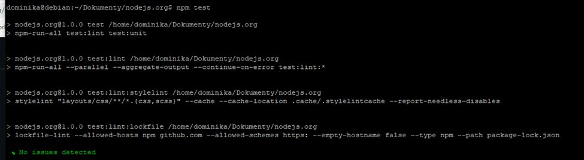

# LAB3 - Dominika Lazarowicz

#### **Wybór oraz uruchomienie projektu**

Repozytorium które zostało przeze mnie wybrane:

https://github.com/nodejs/nodejs.org 

Spełnia wszystkie wymagania postawione w zadaniu. Zostało ono zgodnie z instrukcją skopiowane na moje konto i z tego miejsca zaciągnięte.

Zostały również zainstalowane dodatkowe zależności. Niestety podczas instalacji wystąpił błąd, który udało się rozwiązać (wersja nodejs zainstalowana na maszynie była za niska)


Projekt został zbudowany poprawnie za pomocą poleceń

 `npm start`  i  `npm run serve`
 


Zbudowany projekt prawidłowo otwarty w przeglądarce `localhost:8080/en



Zostały uruchomione testy (`npm test`)- wszystkie zakończone sukcesem




#### **Stworzenie plików Dockerfile**

W celu zautomatyzowania procesu instalacji i konfiguracji obrazu Docker zostały stworzone poniższe pliki

```
FROM node

RUN git clone https://github.com/ldidil/nodejs.org.git
WORKDIR nodejs.org

RUN npm install
RUN npm run build
```

```
FROM build

WORKDIR /nodejs.org/
RUN npm test
```


Poprzez `FROM`wybierany jest obraz kontenera Node Następnie zaciągane jest repozytorium z githuba. Następnie zmieniana jest ścieżka robocza poprzez `WORKDIR`. Dalej instalowane są zależności i uruchamiany build.

W drugim przypadku wybierany jest obraz stworzonego wcześniej obrazu, zmieniana jest ścieżka i uruchamiane testy.


Komenda docker build odpowiedzialna jest za uruchomienie plików. Dodatkowo flaga`-f` została użyta w celu wyboru dockerfile, a `-t` wybrane w celu nadania nazwy końcowej. 


Oba skrypty działają prawidłowo. W celu potwierdzenia używam komendy `docker images`, która wyświetla powstałe obrazy oraz informacje o nich.


