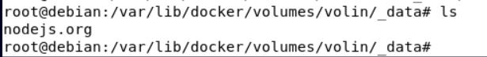
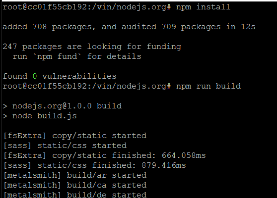
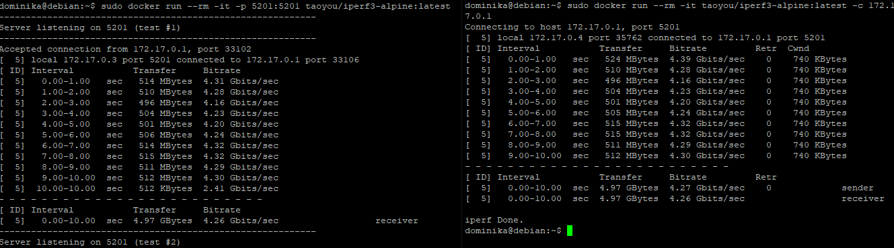
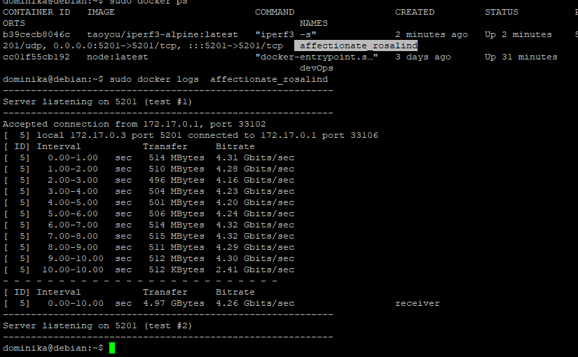
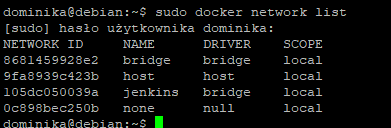
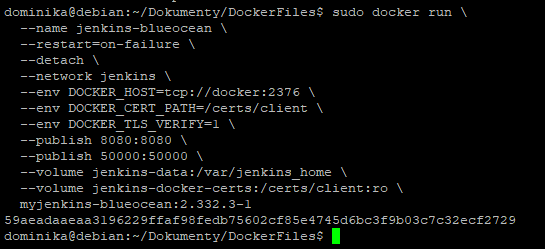
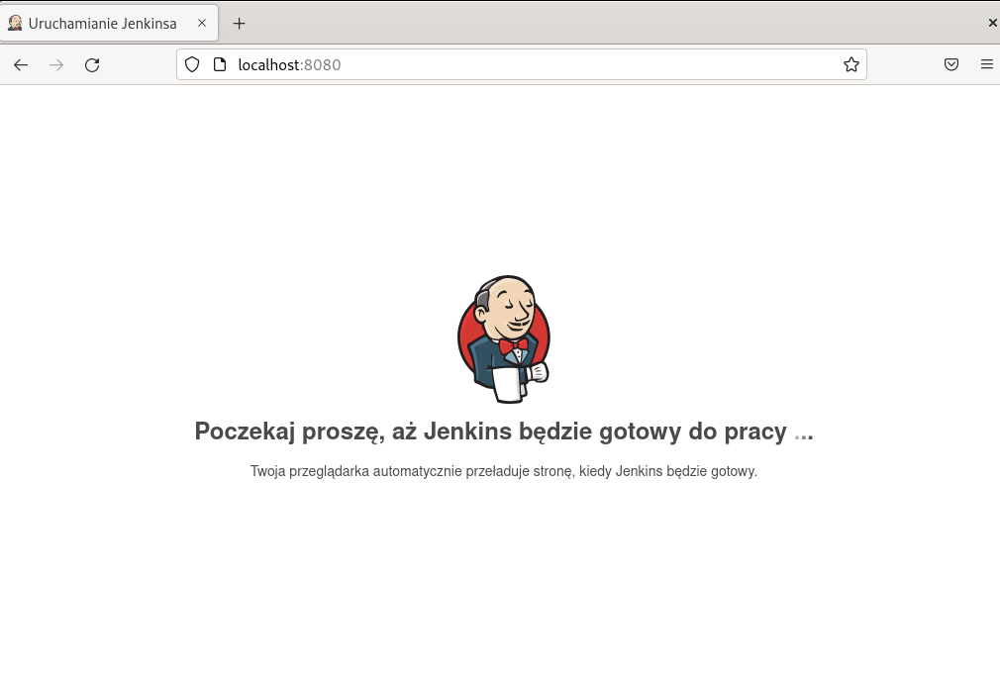

# LAB 4 - Dominika Lazarowicz

Niestety po wykonaniu ćwiczenia po raz pierwszy straciłam całe sprawozdanie i wykonuje je po raz drugi.  Dlatego nie w każdym przypadku wykonywana przeze mnie komenda podparta jest zrzutem ekranu.

##### 1.	Tworzenie voluminów

Zadanie zaczęłam od stworzenia dwóch woluminów:  `volin` i`volout`. 

W tym celu posługuje się komendą `docker volume create`. Przełącznik `--name` użyty w celu nadania nazwy.

 `Docker volume inspect` wyświetla informacje o stworzonym woluminie. Będą one potrzebne w późniejszej części zadania
 

W celu utworzenia kontenera z zamontowanymi voluminami należy posłużyć się poleceniem 

`sudo docker run -it --name <nazwaKontenera> -v <nazwa volumina wejściowego>:/vin -v  <nazwa volumina wyjściowego>:/vout node bash`

Z racji, że wykonałam to zadanie wcześniej to tym razem skorzystałam ze stworzonego wcześniej kontenera. Do uruchomienia urzyłam komendy

`sudo docker exec -it devOps bash`

gdzie devOps to nazwa kontenera.

Do volumina wejściowego zostało sklonowane moje repozytorium.

Widok z poziomu vm:

Z poziomu kontenera:

Instalacja i uruchomienie builda z poziomu kontenera (polecenie`npm run build`).

Pliki zostały przeniesione do volumina wyjściowego

##### 2.	Eksponowanie portu

Uruchamiam serwer obrazem od `taoyou`. Komenda której używam to 

`sudo docker run -p -it <port> <obraz>`

Aby połączyć się z drugiego kontenera uruchamiam go jako klient (flaga `-c` )  oraz dajemy czas w jakim połączenie ma się wykonać (flaga `--time`)

Działanie serwera i kleinta:

Dodatkowo komendą `sudo docker logs <name>` wyświetlam zapisane logi

##### 3.	Jenkins

W wykonaniu tego podpuktu korzystałam z instrukcji zawartej w oficjalnej dokumentacji  https://www.jenkins.io/doc/book/installing/docker/ 

Do utworzenia sieci użyłam polecenia `sudo docker network create jenkins`. 

Jako, iż moja sieć została już utworzona widnieje na liście

Dzięki wcześniej utworzonemu obrazowi Dockerfile mogę w prosty sposób użyć go do zbudowania Jenkinsa i uruchomienia obrazu.

Finalnie udało się uruchomić Jenkinsa w przeglądarce

