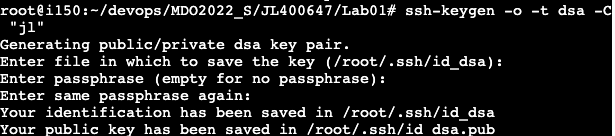
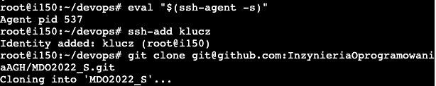
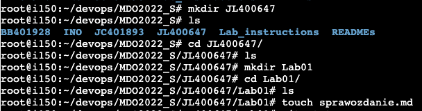
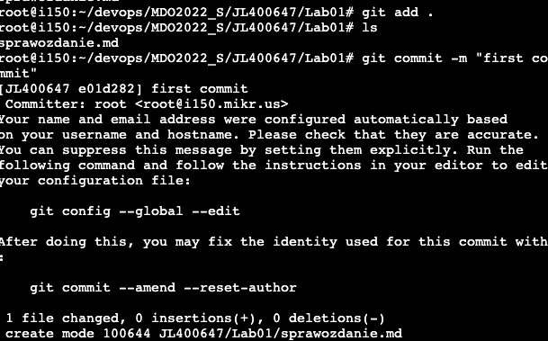
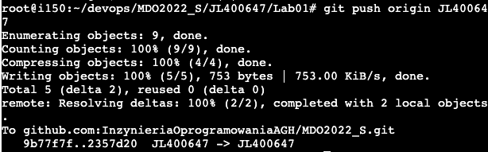

# Sprawozdanie - Lab 1
## Generowanie kluczy

Pierwszy sposób:
```
ssh-keygen -o -t dsa -C "jl"
```
Drugi sposób:
```
ssh-keygen -t ed25519
```

## Dodawanie klucza ssh oraz klonowanie 




Klonowanie przez ssh:
```
git clone git@github.com:InzynieriaOprogramowaniaAGH/MDO2022_S.git
```

## Operacje w git

Zmiana brancha na main:
```
git branch main
```
Zmiana brancha na brancha grupy lab:
```
git branch ITE-GCL05
```
Utworzenie brancha z istniejącego:
```
git checkout -b JL400647 ITE-GCL05
```

## Tworzenie folderu ze sprawozdaniem


## Przesłanie zmian

Git commit:


Git push:
