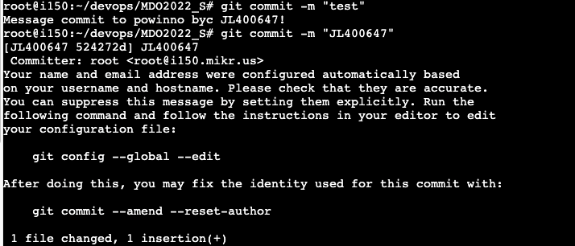
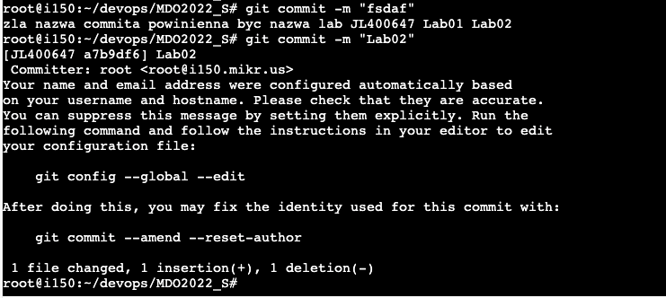
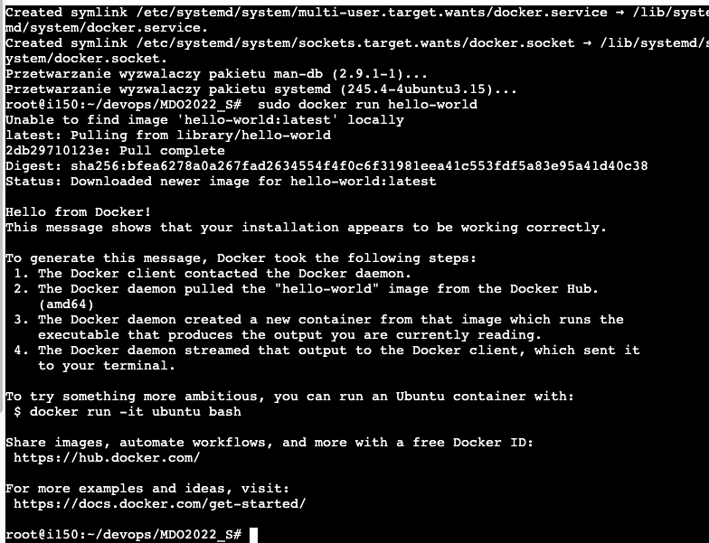
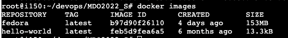
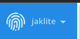

# Sprawozdanie - Lab 2

## 1. Przygotuj git hook, który rozwiąże najczęstsze problemy z commitami

-   hook sprawdzający, czy tytuł commita nazywa się  `<inicjały><numer indeksu>`

-   hook sprawdzający, czy w treści commita pada numer labu, właściwy dla zadania

## 2. Umieść hook w sprawozdaniu w taki sposób, aby dało się go przejrzeć
hook 1 
``` bash
title="JL400647"

if [ "$title" != "$(cat $1)" ]; then
echo >&1 "Message commit to powinno byc $title!"
exit 1
fi; find /root/devops/MDO2022_S/ITE/GCL05/JL400647 -maxdepth 1 -printf "%f\n
```
hook 2
``` bash
path=/root/devops/MDO2022_S/ITE/GCL05/JL400647

string="$(find $path -maxdepth 1 -printf "%f ")"

if [[ ! $string =~ "$(cat $1)" ]]; then
echo >&2 "zla nazwa commita powinienna byc nazwa lab $string"
exit 1
fi;
```

## 3. Rozpocznij przygotowanie środowiska Dockerowego
    -   zapewnij dostęp do maszyny wirtualnej przez zdalny terminal (nie "przez okienko")
    -   jeżeli nie jest stosowane VM (np. WSL, Mac, natywny linux), wykaż ten fakt  **dokładnie**
    -   zainstaluj środowisko dockerowe w stosowanym systemie operacyjnym
Zadania są wykonywane na VPS, docker został zainstalowany zgodnie z instrukcją na oficjalnej stronie dockera.
## 4.  Działanie środowiska
    -   wykaż, że środowisko dockerowe jest uruchomione i działa (z definicji)
    -   wykaż działanie z sposób praktyczny (z własności):
        -   pobierz obraz dystrybucji linuksowej i uruchom go
        -   wyświetl jego numer wersji







## 5.  Załóż konto na Docker Hub



