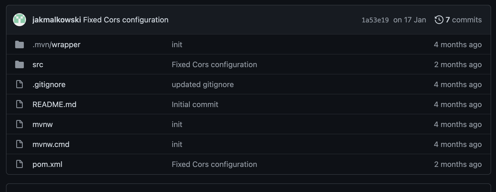
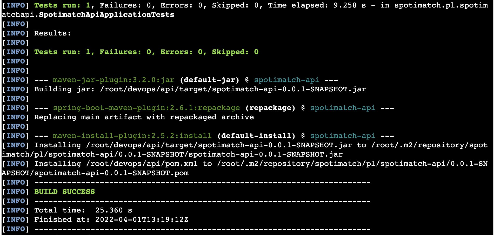
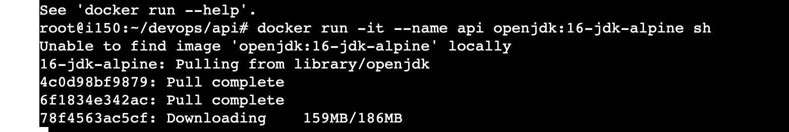
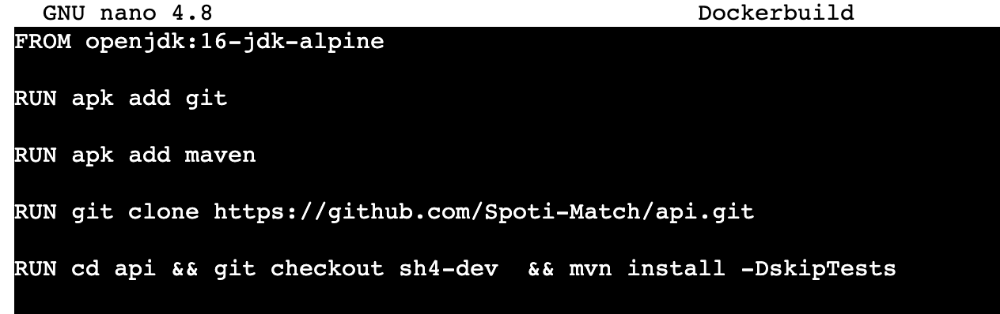
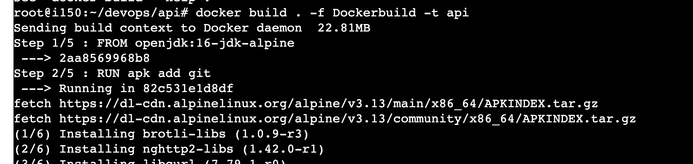
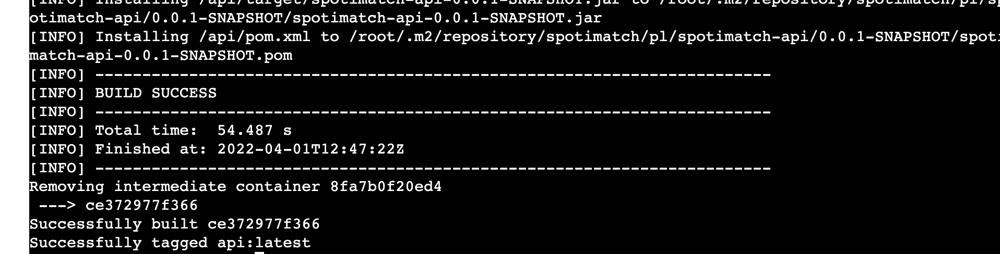
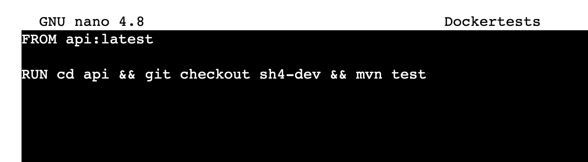
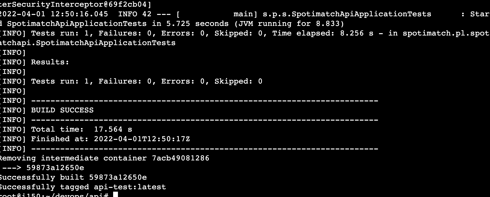
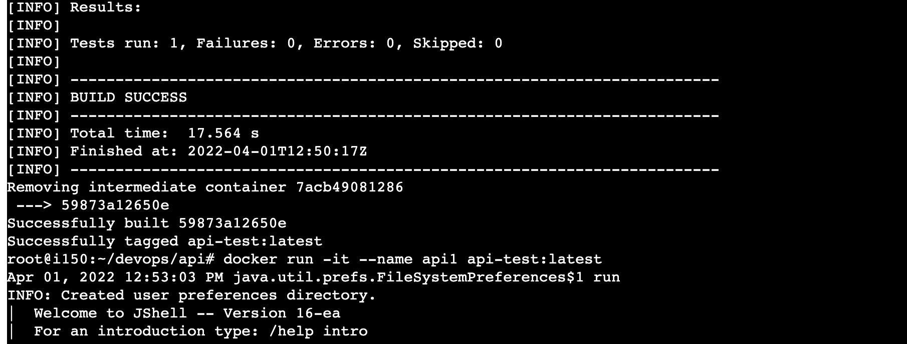

# Sprawozdanie - Lab 3

## Wybór oprogramowania na zajęcia

Do wykonania tego ćwiczenia użyję repozytorium "Spoti-Match"


Repozytorium się buduje oraz przechodzą testy
Wynik `mvn install`(zbudowanie i odpalenie testów):



## Operacje na dockerze

Ręczne uruchomienie openjdk:



Plik docker do automatyzacji operacji:



Uruchomienie pliku:




Plik automatyzujący testy:






Jak widać kontener nadal działa



Logi:

```
441  git clone https://github.com/Spoti-Match/api.git
  442  cd ls
  443  ls
  444  cd api/
  445  ls
  446  mvn install
  447  ./mvnw tests
  448  ./mvnw test
  449  sudo ./mvnw test
  450  sudomvn test
  451  mvn test
  452  docker run -it --name api openjdk:16-jdkalpine sh
  453  docker run -it --name api openjdk:16-jdk-alpine sh
  454  ls
  455  cd devops/
  456  ls
  457  cd api
  458  touch Dockerbuild
  459  nano Dockerbuild 
  460  ls
  461  docker build . -f Dockerbuild -t SpotiMatch
  462  docker build . -f Dockerbuild -t api
  463  touch Dockertests
  464  nano Docker
  465  nano Dockertests 
  466  docker build . -f Dockertests -t api-test
  467  docker run -it --name api1 api-test:latest
  468  git checkout sh4-dev
  469  git pull
  470  cd src/
  471  ls
  472  cd main/
  473  l
  474  cd java/
  475  ls
  476  cd spotimatch/
  477  ls
  478  cd pl/
  479  l
  480  cd spotimatchapi/
  481  l
  482  cd ...
  483  cd ..
  484  mvn install 
  485  ls
  486  nano Dockerbuild 
  487  la
  488  cat Dockerbuild 
  489  <img src="4t.png"  
  490  nano Dockertests 
  491  cd ..
  492  ls

```