# Sprawozdanie - Lab 4

### Zachowywanie stanu

-   Przygotuj woluminy wejściowy i wyjściowy, o dowolnych nazwach, i podłącz je do kontenera bazowego, z którego rozpoczynano poprzednio pracę
Tworzenie volumów 
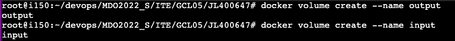
Połączenie do kontenera bazowego
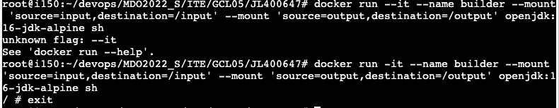
-   Uruchom kontener, zainstaluj niezbędne wymagania wstępne (jeżeli istnieją), ale  _bez gita_
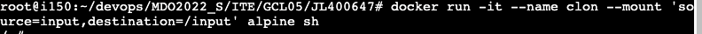
-   Sklonuj repozytorium na wolumin wejściowy
-   Uruchom build w kontenerze
Repozytorium zostało sklonowane w odpowiednim folderze oraz został odpalony build
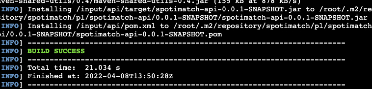
-   Zapisz powstałe/zbudowane pliki na woluminie wyjściowym

### Eksponowanie portu

-   Uruchom wewnątrz kontenera serwer iperf (iperf3)
-   Połącz się z nim z drugiego kontenera, zbadaj ruch
-   Połącz się spoza kontenera (z hosta i spoza hosta)
-   Przedstaw przepustowość komunikacji lub problem z jej zmierzeniem (wyciągnij log z kontenera)

Aby wykonać te kroki należało zainstalować iperf3, uzyskać ip a następnie na jednym kontenerze należało odpalić nasłuch a na drugim nadawanie.
- 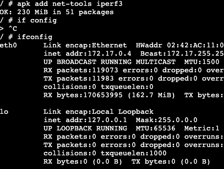
kontener -> kontener
- 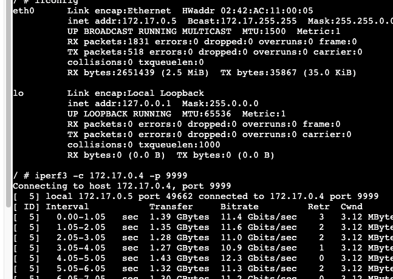
ubuntu -> kontener
- 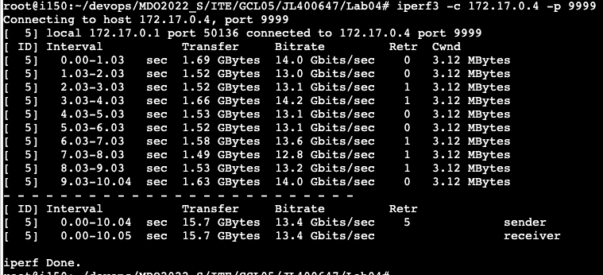

### Instancja Jenkins

-   Zapoznaj się z dokumentacją  [https://www.jenkins.io/doc/book/installing/docker/](https://www.jenkins.io/doc/book/installing/docker/)
-   Przeprowadź instalację skonteneryzowanej instancji Jenkinsa z pomocnikiem DIND

Jenkins został zainstalowany krok po kroku zgodnie z instrukcjami na stronie jenkinsa
- 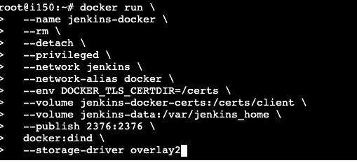
- 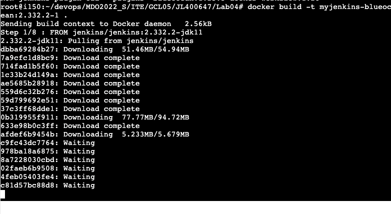
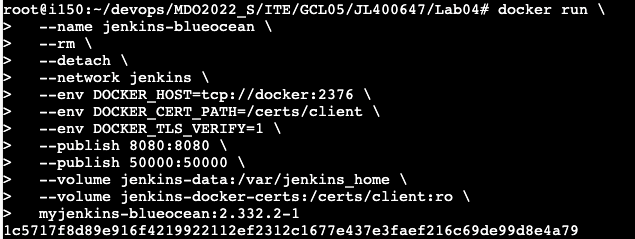
-   Zainicjalizuj instację, wykaż działające kontenery, pokaż ekran logowania

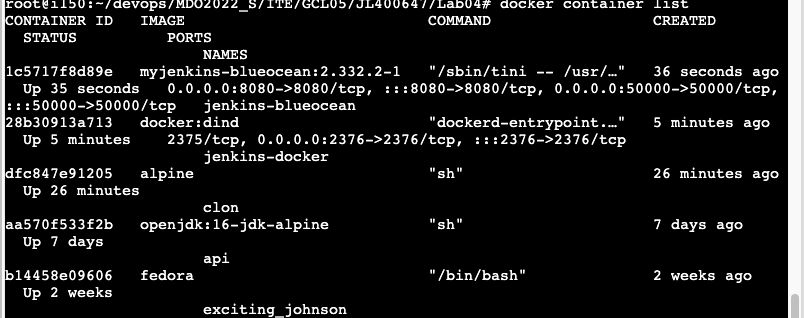

Niestety na ten moment nie mogę dostać się do ekranu logowania ponieważ laby rozwiązuje na VPS 
