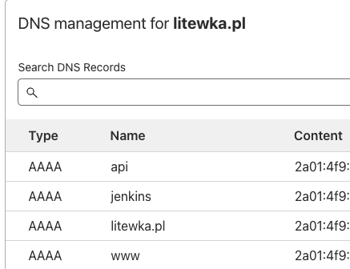
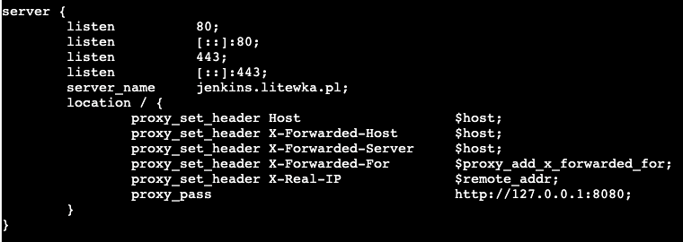
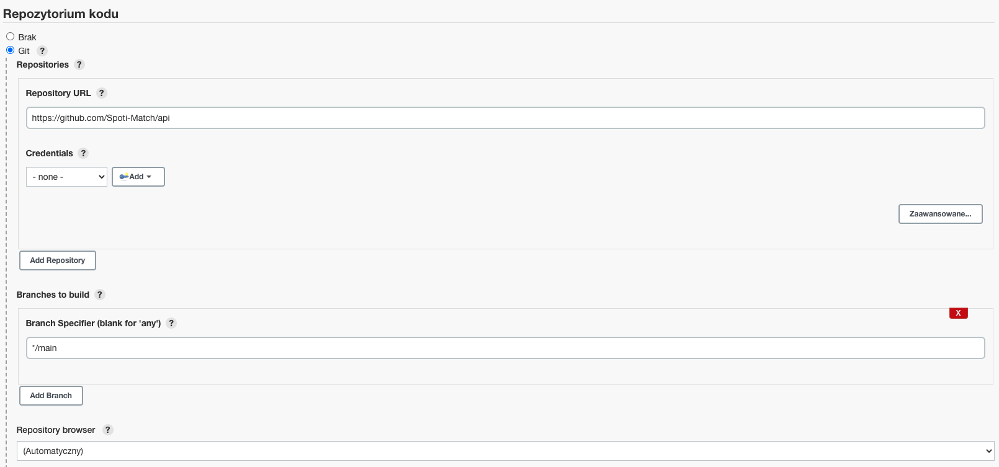
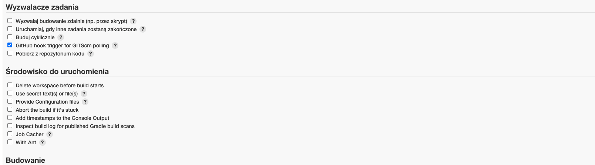
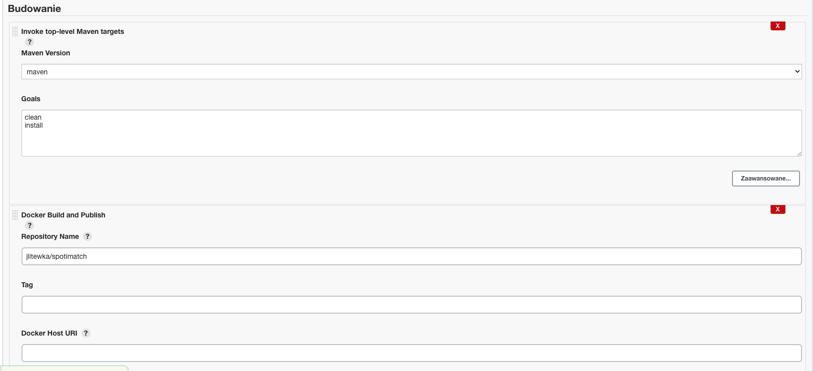
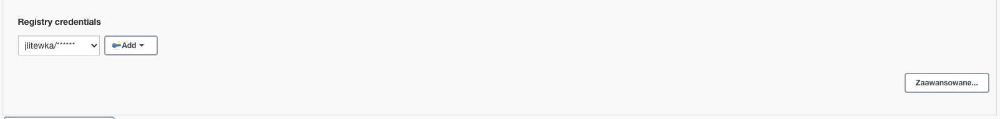
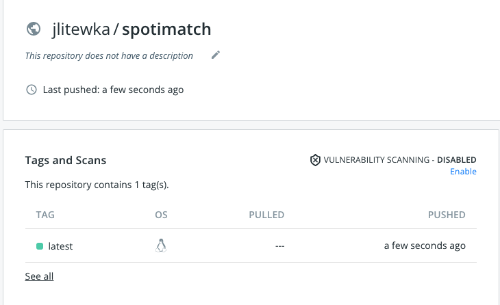

# Sprawozdanie - Lab 5

### VPS

Jenkins jest zainstalowany na VPS dlatego należało podpiąć serwer pod domenę. 

Do tego celu skorzystałem z CloudFlare:

Należało również zainstalować i skonfigurować nginx:

### Jenkins

Należało dodać URL repozytorium kodu oraz określić branch

Konfigurując budowanie Jenkinsa należało określić jak się powinien zachować, oraz gdzie powinien zostać przesłany obraz dockerowy. Do tego celu kopiowany jest utworzony jar.

Jak widać wszystko poprawnie jest przesyłane na dockerhub
