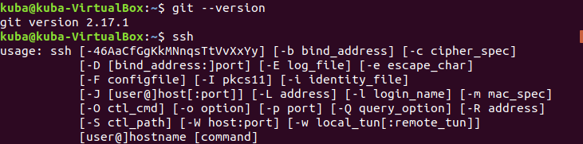
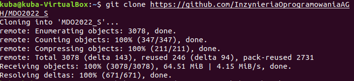
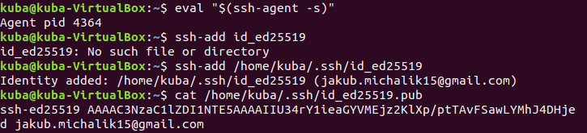
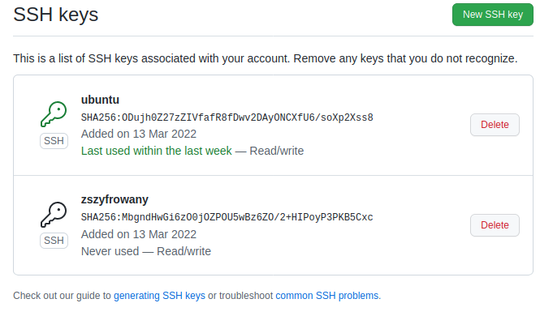
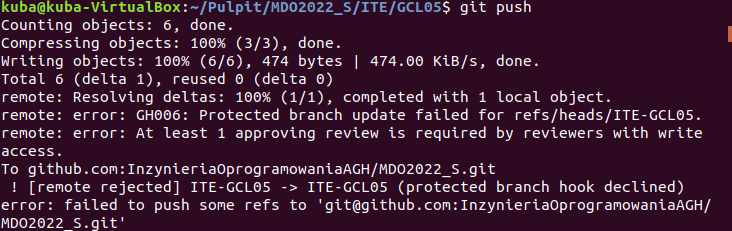

# Sprawozdanie z Laboratorium 01 z Metodyk DevOps

Na początku sprawdzono, czy narzędzie GIT jest zainstalowane, oraz sprawdzono, czy możliwa jest obsługa kluczy

Następnie sklonowano repozytorium za pomocą HTTPS, poleceniem git clone

Kolejnym krokiem było wygenerowanie klucza SSH. W tym przypadku, utworzono dwa klucze - jeden chroniony hasłem i drugi bez.
W tym celu użyto polecenia:

ssh-keygen -t ed25519 -C "tutaj_E-mail"

Potem uruchomiony został agent SSH, do którego dodano klucze

Dodano klucze w GitHubie co przedstawia poniższe ujęcie

Kolejnym zadaniem, było przełączenie się na branch main, a także na gałąź ITE-GCL05, poleceniem

git checkout main

oraz,

git checkout ITE_GCL05

Następnym krokiem było utworzenie nowego katalogu o nazwie zgodnej z założeniami laboratorium, w tym przypadku JM400165,
w którym utworzono sprawozdanie, oraz katalog z wykorzystywanymi screenshotami.

Potem wysłano pliki do źródła, poleceniami:

git add .
git commit -m "JM400165"
git push --set-upstream origin JM400165

Wynikiem czego, było:

Kolejnym krokiem było sprawdzenie, czy można wyciągnąć własną gałęź do gałęzi grupowej.
Okazało się, że nie można, skutkowało to następującym błędem:

